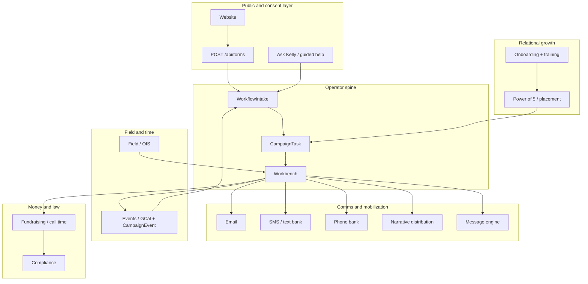

# Campaign tool-stack — operating system map (Manual Pass 5L)

**Lane:** `RedDirt/campaign-system-manual`  
**Type:** **Orientation** **map** for **builders** **and** **operators** **—** **not** **a** **claim** **that** **every** **row** **is** **production**-**complete** **at** **parity** **(see** `SYSTEM_READINESS_REPORT.md` **). **

**Ref:** `SYSTEM_CROSS_WIRING_REPORT.md` (RedDirt) · `workflows/TASK_QUEUE_AND_APPROVALS.md` · `MANUAL_TO_DEVELOPMENT_BLUEPRINT_AND_RETURN_TO_CODE_PLAN.md`

**Product honesty:** “**Development** **status** **”** is **a** **placeholder** **per** **system** **until** **engineering** **verifies** **in** **code** **and** **deploy;** **0**–**6** **grades** **are** **not** **revised** **by** **this** **manual** **pass** **. **

---

## Legend (columns)

| Column | Meaning |
|--------|--------|
| **Purpose** | **Why** **it** **exists** **. ** |
| **Inputs** | **What** **feeds** **it** **(data,** **content,** **human) **. ** |
| **Outputs** | **What** **it** **produces** **. ** |
| **Approval** **gate** | **LQA,** **MCE+,** **treasurer,** **counsel,** **RACI** **(see** **matrix) **. ** |
| **User** **role** | **Typical** **operator** **/ ** **audience** **. ** |
| **Data** **risk** | **PII,** **VFR,** **compliance,** **send**-**class** **. ** |
| **Workbench** **tie** | **`WorkflowIntake` **, **`CampaignTask` **, **open**-**work,** **briefs,** **triage** **. ** |
| **Ask** **Kelly** **tie** | **Public** **/ ** **beta** **/ ** **candidate** **paths** **(5F–5H) **. ** |
| **Dev** **status** | **Placeholder** **: ** *design* ** **/** *partial* ** **/** *integrated* ** **/** *verify* ** **. ** ** |

---

## Tool rows

| Tool | Purpose | Inputs | Outputs | Approval gate | User role | Data risk | Workbench tie | Ask Kelly tie | Dev status |
|------|---------|--------|---------|---------------|-----------|------------|--------------|-------------|------------|
| **Public** **website** | **Owned** **media,** **narrative,** **CTAs** | **Content,** **MCE,** **events** | **Pages,** **forms,** **trust** | **LQA+** **publish** | **Voters,** **vols,** **press** | **Med** (forms,** **PII) **| **Intake** **/ ** **triage** | **5H** **site** **review,** **explain**-**why** | *verify* |
| **Ask** **Kelly** **(Campaign** **Companion** **public** **/ ** **beta) **| **Guided** **help,** **suggestion** **path** | **A–D** **knowledge,** **packets,** **feedback** | **Answers,** **tickets,** **packets** | **2A+** **MCE+** **(see** **5F–5H) **| **Public,** **beta,** **candidate** | **High** if **mishandled;** **redact** **by** **default** | **Intake,** **queue** | **Core** | *design* **→** *partial* |
| **Workbench** | **Operator** **hub** | **Intakes,** **tasks,** **comms,** **events** | **Triage,** **tasks,** **sends,** **dashboards** | **Matrix+** **RACI** | **Staff,** **CM,** **admin** | **High** **(PII,** **VFR) **| **Core** | **Context** **for** **internal** **(not** **VFR** **in** **chat) **| *partial* **→** *integrated* |
| **WorkflowIntake** | **Spine** **for** **human**-**governed** **work** | **Forms,** **API,** **manual** **create** | **Queued** **work,** **metadata** | **2A,** **role** | **Admins,** **assignees** | **High** | **Spine** | **5H** **suggestion** **/ ** **beta** | *integrated* |
| **CampaignTask** | **Work** **units** | **Strategy,** **intake,** **manual** | **Claims,** **completions** | **LQA+** **outbound** | **R** **assignees** | **Varies** | **open**-**work** | **N/A** **public** | *integrated* |
| **Email** | **Relationship** **+** **comms** | **Lists,** **copy,** **consent** | **Sends,** **replies** | **MCE+** **/ ** **matrix** | **Comms,** **ops** | **High** (PII) | **Inbox+** **plans** | **5H** **templates** (draft) | *verify* |
| **SMS** **/ ** **text** **banking** | **1:1** **/ ** **approved** **broadcast** | **Opt**-**in,** **script,** **vendor** | **Sent** **messages,** **replies** | **MCE+** **+ ** **compliance** | **Vols,** **staff** | **High** (TCPA**-**class) **| **Task+** **audit** | **N/A** **in** **public** **brief** | *verify* **(MI** **§**49) ** |
| **Phone** **banking** | **Voice** **contact** | **List,** **script,** **dialer** | **Result** **codes,** **follow**-**ups** | **Script** **+** **audience** | **Vols,** **staff** | **High** | **Task+** **log** | **N/A** | *verify* **(MI** **§**49) ** |
| **Social** **media** | **Reach+** **listening** | **Content,** **inbound** | **Posts,** **tickets,** **tags** | **MCE+** | **Comms** | **Med**-**High** | **Social** **workbench** | **5E/5F** **inbound** **doctrine** | *partial* |
| **Message** **engine** | **Draft+** **intel** (internal) | **Signals,** **MCE,** **policies** | **Recs,** **drafts** (not** **auto**-**public) **| **LQA+** | **MCE,** **data** | **High** if **P**II | **Task** **suggestions** | **Not** **GOTV** **auto**-**ship** | *partial* |
| **Narrative** **distribution** | **Channel** **orchestration** | **Content** **plan,** **NDE** | **Shipped** **assets** | **LQA+** | **Comms,** **regional** | **Med** | **NDE** **admin** | **5H** **not** **a** **bypass** | *partial* |
| **Event** **system** | **Mobilize+** **track** | **GCal+** **CampaignEvent,** **venues** | **RSVP,** **brief** **lines** | **Legal+** **ops** as **needed** | **Field,** **ops** | **Med** | **Calendar+** **tasks** | **Event** **FAQs** | *integrated* **/ ** *verify* |
| **Google** **Calendar** **/ ** **CampaignEvent** | **Truth** **for** **time** | **GCal+** **ingest+** **human** | **Events,** **travel** | **MCE+** **public** **copy** | **CM,** **advance** | **Low**-**med** | **3G+** **pipeline** **doc** | **Public** **schedule** | *verify* |
| **Fundraising** **+ ** **call** **time** | **Raise+** **schedule** | **Donor** **(R2+),** **treasurer,** **scripts** | **Pledges,** **dials,** **tasks** | **Treasurer+** **MCE+** | **Candidate,** **bundlers** (governed) | **High** (donor) | **3G** **+ ** **3H** | **N/A** **in** **public** | *verify* |
| **Volunteer** **onboarding** | **Path+** **consent** | **Forms+** **email,** **Pathway** | **Profiles+** **tasks** | **V.C.+** **matrix** | **Vols+** **staff** | **Med**-**High** | **2A+** **P5** | **5H,** **5C** | *partial* |
| **Power** **of** **5** | **Relational** **tree** | **Rosters+** **consent+** **placement** | **Teams,** **intros** | **P5+** **training** (MI) **| **Leaders+** **members** | **Med** | **Tasks+** **OIS** **honesty** | **N/A** | *partial* |
| **Training** | **Readiness+** **unlocks** | **Modules+** **attestation** | **Cert** **/ ** **gate** | **Comms+** **compliance** (topic) | **Trainers+** **vols** | **Low**-**med** | **Readiness** | **5H** **explain**-**why** | *design* **→** *partial* |
| **Thank**-**you** **/ ** **appreciation** | **Dignity+** **retention** | **Trigger** **events,** **lists** (RACI) **| **Thanks,** **tasks** | **MCE+** **/** **treasurer+** as **topic** **| **Candidate+** **staff** | **High** (donor) | **`THANK_YOU_...` **+ **tasks** | **N/A** **raw** in **ingest** | *design* |
| **Dashboards** **/ ** **KPIs** | **Honest** **situational** **awareness** | **Aggregates,** **not** **row**-**level** in **public** | **Rollups+** **cards** | **CM+** **owner** **(what** **ships) **| **R2+** **/ ** **role** | **High** if **mis**-**scoped** | **5I+** **briefs** | **N/A** **0**-**6** on **public** | *partial* |
| **Data** **+ ** **privacy** | **Boundary** **enforcement** | **DPAs,** **RACI,** **retention** | **Access+** **audit** | **Counsel+** **owner** | **Stewards** | **Max** | **All** | **5F+** **no** **VFR** **in** **chat** | *policy* **+** *verify* |
| **Compliance** | **Rules** **+ ** **defensibility** | **Laws+** **counsel+** **finance** | **Flags,** **holds,** **docs** | **Counsel+** **treasurer** | **Staff** | **Max** | **Gates+** **intake** | **5D+** **election** | *verify* |
| **Field** **+ ** **OIS** | **Capacity+** **honest** **visibility** | **Field** **reporting+** **seed** | **Maps+** **tiles+** **brief** **lines** | **Field+** **MCE+** (public) **| **Field+** **region** | **Med**-**High** (overclaim) | **5I** **briefs** | **5F** **no** **fake** **heat** | *partial* |
| **Paid** **media** | **Paid** **reach** | **Plan+** **vendor+** **budget** | **Impressions+** **proof** | **MCE+** **treasurer+** | **Comms+** **finance** | **Med**-**High** (**) **$** + **compliance) **| **3C** **+ ** **workbench** | **N/A** | *verify* |
| **Postcards+** **signs+** **banners** | **Visibility+** **fundraise** | **3G+** **distro** **SOP+** **inventory** | **Shipped** **assets,** **tasks** | **MCE+** **/ ** **treasurer+** (fund) **| **Field+** **comms** | **Med** (ship** **+** **$) **| **3G** **manuals** + **tasks** | **N/A** | *operational* **/ ** *verify* |

---

## Mermaid — system map (high level)

---

**Last** **updated:** **2026-04-27** **(Pass** **5L** **) **
