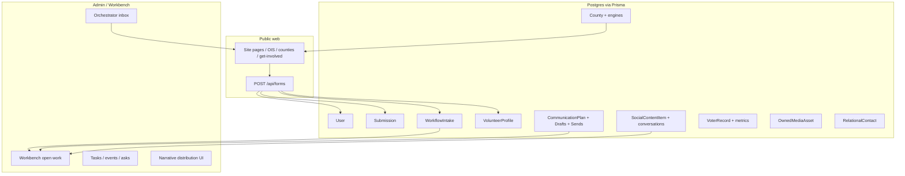
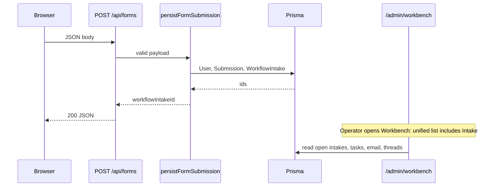

# System cross-wiring report — Manual Pass 2A

**Lane:** `RedDirt/`  
**Date:** 2026-04-27  
**Evidence:** `src/`, `prisma/schema.prisma`, `docs/`, `campaign-system-manual/` (Pass 1), `netlify.toml`, `docs/admin-orchestrator.md`, `docs/audits/DASHBOARD_HIERARCHY_COMPLETION_AUDIT.md`. **No runtime tests** in this pass; file and schema inspection only.

**Public language:** This report uses **Campaign Companion**, **Guided Campaign System**, **Organizing Guide**, **Field Intelligence**, **Message Engine**, **Campaign Operating System**, **Workbench**, **Pathway Guide** where describing user-facing concepts. Internal JSON keys in code (e.g. `metadata.ai` on intakes) are **implementation details** — do not mirror that key in public copy.

---

## 1. Executive findings

### 1.1 What the system is today

RedDirt is a **Next.js 15 App Router** application with **PostgreSQL** via **Prisma**, a **public Kelly Grappe campaign site**, an **admin Workbench** (`/admin/workbench` and related), a **unified open-work read model** (`src/lib/campaign-engine/open-work.ts`) that merges **WorkflowIntake**, **EmailWorkflowItem**, **CampaignTask**, **CommunicationThread**, and **festival ingest** into operator-facing lists, and **domain engines** for **county political intelligence**, **organizing intelligence (OIS) dashboards**, **comms workbench** (`CommunicationPlan` / drafts / sends / broadcasts), **social** monitoring and items, **owned media** pipeline, **voter file** reference models, **relational contacts (REL-2)**, **orchestrator** for inbound public content, **orchestration docs** for narrative distribution UI, and **scripts** for ingest and operations.

### 1.2 What is **real** (production-path with DB + env)

- **Public pages** under `src/app/(site)/` (home, about, get-involved, counties, messages, policy, events, blog, etc.).  
- **`POST /api/forms`** → **`persistFormSubmission`** (`src/lib/forms/handlers.ts`) → **`User` upsert**, **`Submission`** row, **`WorkflowIntake`** row (`status: PENDING`), optional **OpenAI classify** when `OPENAI_API_KEY` set; **volunteer** forms also upsert **`VolunteerProfile`** and create **`Commitment`**.  
- **Admin session** (cookie `ADMIN_SECRET` pattern per app) and **Workbench** pages with Prisma-backed data.  
- **Unified open work** merging multiple Prisma sources for CM view.  
- **County** data: `County`, metrics, public county pages, admin county tools, **Pope v2** sample.  
- **OIS** state + **8 region** pages with builders.  
- **Comms:** `CommunicationPlan`, `CommunicationDraft`, `CommunicationSend`, segments, email queue integration.  
- **Prisma schema** breadth: 100+ models (see `docs/database-table-inventory.md`).

### 1.3 What is **prototype** or **integrated demo**

- **Narrative distribution** admin UI (`/admin/narrative-distribution`) + `src/lib/narrative-distribution/` + panels that appear on OIS/county in **demo/seed** contexts — verify per panel before “live” claims.  
- **Message engine** helpers under `src/lib/message-engine/` (templates, recommendations, message intelligence for dashboards) — **not** a single end-user “Campaign Companion” product surface; **staff** and **dashboard** integration first.  
- **Power of 5** onboarding page + **Power of 5** integration components in narrative admin — **full P5 graph** per plan is **not** fully persisted as named P5 tables everywhere.  
- **Some** OIS KPI tiles and “message intelligence” strips: **builder/seed** depending on route.

### 1.4 What is **placeholder** (explicit in code or audit)

- **`/dashboard`** and **`/dashboard/leader`** — public layout shell; **no** full auth product, no live role-gated tiles documented as complete.  
- **`/admin/organizing-intelligence`** — stub that **links** to public OIS; not a second OIS data plane.  
- **`/organizing-intelligence/counties/[countySlug]`** — stub (validator + copy), not county v2 hydration.  
- **City / community / precinct** OIS routes — **patterns in docs**, not implemented as in `src/app/organizing-intelligence/.../cities/...`.  
- **Orchestrator** `insights` and some **publish** paths — **deferred** per `docs/admin-orchestrator.md`.

### 1.5 What is **documented only** (plans ahead of code)

- Full **Pathway Guide** automation (role-based next best action for every volunteer without human triage).  
- **MCE/NDE** complete convergence (metadata contracts across all channels).  
- **Campaign Strategy Adaptation** as closed-loop auto policy (chapter 21 describes **future**).  
- **Precinct sign holder** program as first-class Prisma models — **not** found as dedicated `SignHolder` model in schema grep; use **tasks**, **events**, **VolunteerAsk**, or future models.

### 1.6 What is **missing**

- **Member auth** product for `/dashboard*` and relational app with unified **role ACL** matrix.  
- **Geographic** depth: **City** model and **precinct** product routes as in OIS-1.  
- **Single** “county truth” view merging public command + OIS v2 + admin intel without drift (documented gap in county plan).  
- **Explicit** campaign-strategy router (human approval for major shifts).  
- **Election Day command** real-time ops center (admin `gotv` exists as **page** — verify depth vs placeholder in Pass 3).

### 1.7 Dangerous to call “production-ready” without evidence

- **Voter file** screens, **import**, **voter model** UI — **PII** and legal sensitivity; needs **access policy** + **training** + **audit** sign-off.  
- **Send** paths (email/SMS) — **consent** (`ContactPreference`), **compliance**, **content** review.  
- **Public** metrics on OIS — any number that could be **misread** as persuasion targeting.  
- **`metadata` on `WorkflowIntake`** includes optional **classification** stored under a key that should not be copy-pasted to public UI as “AI scores” — use **internal ops** labels or map to **Organizing Guide** categories.

---

## 2. Full system architecture map

### 2.1 Context diagram

### 2.2 System-by-system wiring

| System | Upstream | Core files / routes | Downstream |
|--------|----------|---------------------|------------|
| **Public site** | Content, `SiteSettings` | `src/app/(site)/*` | SEO, `AnalyticsEvent` |
| **P5 onboarding** | Nav, get-involved | `onboarding/power-of-5` | P5 plan; not full graph in DB |
| **Personal/leader dashboard** | — | `dashboard/*` | Placeholder — future auth + User |
| **OIS state** | Builders, seed | `organizing-intelligence/page.tsx` | Region drill, county links |
| **Region OI (×8)** | County registry, builders | `organizing-intelligence/regions/...` | County tables |
| **County command** | `County` + snapshots | `counties/[slug]` | Public hub |
| **Pope v2** | `buildPopeCountyDashboardV2` | `county-briefings/pope/v2` | Pattern for other counties |
| **County OIS stub** | — | `organizing-intelligence/counties/[slug]` | Links, no v2 |
| **Get involved** | Pathways, client forms | `get-involved` + `api/forms` | `WorkflowIntake` |
| **Messages / Conversations & Stories** | Editorial, narrative | `messages` + components | CTA to volunteer/OIS |
| **Message engine** | Plans, county context | `src/lib/message-engine/*` | OIS panels, comms (partial) |
| **Narrative distribution** | Plans, MCE types | `admin/narrative-distribution`, `lib/narrative-distribution` | Packets, channels (concept) |
| **Forms** | Browser JSON | `api/forms`, `formSubmissionSchema` | `handlers.ts` |
| **WorkflowIntake** | `Submission` optional | `WorkflowIntake` model | `EventRequest`, `WorkflowAction`, plans, opps, email workflow |
| **Workbench** | `open-work`, pages | `admin/workbench` | All queues |
| **Tasks** | Manual / workflow | `CampaignTask` | Workbench hrefs in `open-work` |
| **Comms plans** | Intake, CM | `workbench/comms/plans` | Drafts, sends, broadcasts |
| **Social** | Ingest, monitor | `workbench/social`, APIs | `SocialContentItem`, intakes |
| **Calendar / events** | Google sync, events | `workbench/calendar`, `admin/events` | `CampaignEvent` |
| **Volunteer intake** | Sheets | `volunteers/intake` | `SignupSheetDocument` chain |
| **Relational** | Staff | `relational-contacts` | `RelationalContact` |
| **Voter import** | File | `voter-import` | `VoterFileSnapshot`, `VoterRecord` |
| **Voter model** | Data | `voters/[id]/model` | `VoterModelClassification`, etc. |
| **GOTV** | — | `admin/.../gotv` | **Verify** implementation depth |
| **Finance** | Staff | `financial-transactions` | `FinancialTransaction` |
| **Compliance** | Staff | `compliance-documents` | `ComplianceDocument` |
| **Owned media** | Ingest | `owned-media` | `OwnedMediaAsset` |
| **Orchestrator** | Connectors | `orchestrator`, `inbox`, `review-queue` | `InboundContentItem`, `ContentDecision` |
| **Content board** | CMS | `content`, `homepage`, `pages` | `AdminContentBlock`, etc. |
| **Netlify** | Git push | `netlify.toml` + `scripts/netlify-build.sh` | Migrations at build, plugin Next |
| **Prisma DB** | All writes | `schema.prisma` | **Single** source of truth |

---

## 3. WorkflowIntake spine (detailed)

### 3.1 Happy path: public form

1. **Client** (Get Involved, pathways, story form, host gathering, etc.) builds JSON matching **`formSubmissionSchema`**.  
2. **`POST /api/forms`** (`src/app/api/forms/route.ts`): rate limit → parse → **honeypot** check → if no DB, **503** with `databaseUnavailableResponse()`.  
3. **`persistFormSubmission`**:
   - Builds **summary** text; optional **`classifyIntake`** if OpenAI configured.  
   - **Upsert `User`** by email.  
   - **Story** path: `Submission` type `story`; else types `join_movement` | `volunteer` | `local_team` | `direct_democracy_commitment` | `host_gathering` | `contact` per mapping.  
   - **Volunteer:** `VolunteerProfile` upsert + `Commitment` with `volunteer` type.  
   - **`createWorkflowIntakeForSubmission`:** `WorkflowIntake` with `status: PENDING`, `title` from form label + county/ZIP, `source` = formType string, `metadata` JSON including `formType`, county, optional **`ai` block** (classification) — **internal**.  
4. **Returns** `{ submissionId, userId, workflowIntakeId }`.

### 3.2 Operator path

- **`/admin/workbench`** loads **unified open work** (`getUnifiedOpenWork` in `open-work.ts`) with **hrefs** to email queue, **comms plan new with `intakeId`**, **tasks** (`/admin/tasks`), **threads**, festival queue.  
- **Status** progression: `WorkflowIntakeStatus` includes `PENDING`, `IN_REVIEW`, `AWAITING_INFO`, `READY_FOR_CALENDAR`, `CONVERTED`, `DECLINED`, `ARCHIVED` — **WorkflowAction** can log changes.  
- **Comms:** `CommunicationPlan` may reference **`sourceWorkflowIntakeId`** (relation `commsPlanSourceIntake` in schema).  
- **EventRequest:** 1:1 with intake for scheduling bridge when used.

### 3.3 When `DATABASE_URL` is missing

- **`/api/forms`** returns **503** and does not create rows (`isDatabaseConfigured()` path).  
- Local dev: use `dev:full` or compose per README.

### 3.4 Approvals: present vs missing

- **Present:** comms **draft** review fields on `User` relations; `FinancialTransaction` **CONFIRMED**; **EventApproval** pattern for events; **compliance** document upload.  
- **Not a single app-wide “approve everything”** — **Strategy routing** (what campaign prioritizes) is **human** (CM/owner) unless future packet adds explicit rules.  
- **Classification** in intake metadata: **suggest only** — **Volunteer coordinator** or **CM** should validate before automated volunteer asks.

### 3.5 Human role by step (default RACI)

| Step | Primary owner | Backup |
|------|---------------|--------|
| Triage new intake | Campaign manager or assigned admin | V.C. |
| Assign + status change | Admin / CM | — |
| Convert to comms plan | Comms / message lead | CM |
| Convert to event | Field / events | CM |
| Voter-touched work | Data lead (policy) | CM |
| Close / decline | CM | Owner |

---

## 4. Route-to-system and component notes

**Detail tables:** `inventories/ROUTE_INVENTORY.md` (Pass 2A updated) and `inventories/COMPONENT_INVENTORY.md`.

**Pattern:**  
- **`(site)`** → **public** (or future member — dashboard placeholders are **technical** + **public layout** but **no auth** = treat as **placeholder** in manual).  
- **`admin/*`** → **admin** (cookie), maturity varies **5** for workbench **shell**, **2–4** for stubs.  
- **`/api/author-studio/*`** → **technical/staff** — not **Guided Campaign System** for volunteers.

---

## 5. Data model cross-wiring (high value)

| Model | Privacy | Workflows | Notes |
|-------|---------|------------|--------|
| **User** | PII (email) | All intake, tasks, comms | `linkedVoterRecordId` optional, admin-approved |
| **County** | Public aggregate + admin | County pages, OIS, intake `countyId` | FIPS, slug |
| **VoterRecord** | **High** | Import, model UI, **not** for public | Match to User is controlled |
| **VolunteerProfile** | Medium | volunteer form, asks | `leadershipInterest` |
| **RelationalContact** | High | **REL-2** | Owner user scope |
| **WorkflowIntake** | Medium | **Spine** | Links submission, plans, opps, email |
| **Submission** | Medium | content + structuredData | PII in content — **redact** in logs (handlers redact email in `raw` dump) |
| **CampaignTask** | Medium | open-work | Links to workbench |
| **CommunicationPlan** | Internal strategy | MCE/NDE | `sourceWorkflowIntakeId` |
| **Broadcast** (via `CommunicationSend` + broadcast pages) | Internal | comms | Tier-2 `CommunicationCampaign` may exist parallel |
| **CampaignEvent** | Mixed | public events + admin | Approvals, sync |
| **FinancialTransaction** | **High** | finance | DRAFT vs CONFIRMED |
| **ComplianceDocument** | **High** | compliance | `approvedForAiReference` default false |
| **OwnedMediaAsset** | Media | owned media, brain | Ingest |
| **SocialContentItem** | Platform content | social workbench | Can link `workflowIntakeId` |
| **FieldUnit** / **FieldAssignment** | Ops | field structure | **Not** same as P5 team |

---

## 6. Mermaid: intake → workbench → comms

---

## 7. Integration with external systems (deployment)

- **Netlify:** `netlify.toml` — `bash scripts/netlify-build.sh`, **Prisma migrate** expectation, `DATABASE_URL` or `NETLIFY_DATABASE_URL` mapping per script, **Node 20**, **6144mb** heap, `@netlify/plugin-nextjs`.  
- **SendGrid / Twilio** — webhooks under `api/webhooks/*` (not re-audited line-by-line here).  
- **Google** — calendar, Gmail **staff** OAuth — env-driven.

---

## 8. Conclusion (Pass 2A)

The **Campaign Operating System** is **wiring-complete** for **intake → database → Workbench** and has **broad** admin coverage. **Member-facing** “Guided Campaign System” and **geographic** depth are **the largest product gaps** relative to the manual’s ambition. **Message Engine** and **Narrative distribution** are **real code paths** in admin and libs but need **maturity** confirmation panel-by-panel. **PII** domains remain **non-optional** for policy documentation before any “6” label.

**Next:** `MANUAL_PASS_2_COMPLETION_REPORT.md`, expanded lifecycle and role chapters, and **`MANUAL_INFORMATION_REQUESTS_FOR_STEVE.md`**.

**Last updated:** 2026-04-27 (Pass 2A).
