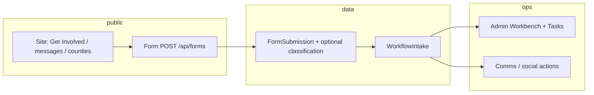
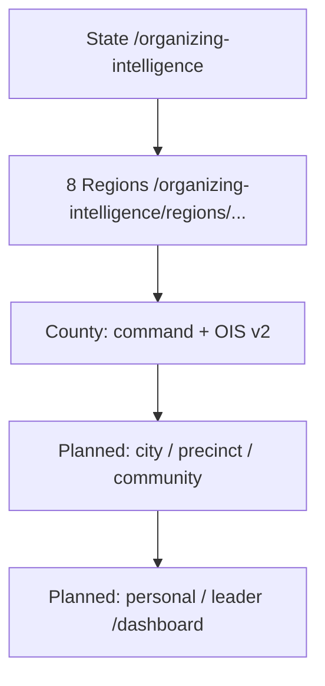
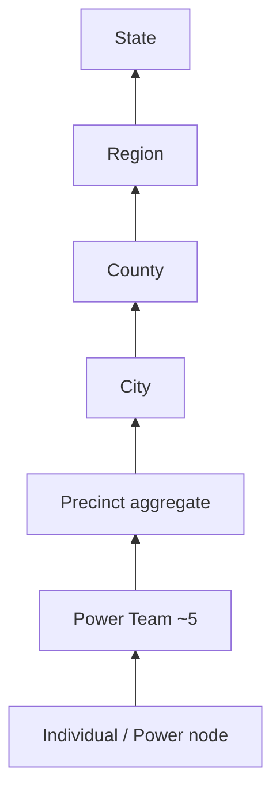
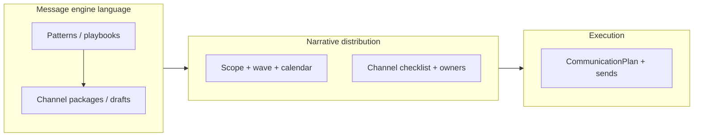
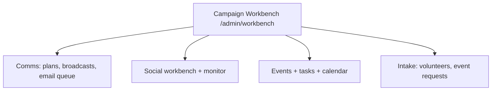

# System Map — Index

**Purpose:** High-level visual index for the Campaign Operating System. **Detailed** diagrams live in `maps/`. Mermaid is used here as in `docs/audits/DASHBOARD_HIERARCHY_COMPLETION_AUDIT.md`.

---

## 1. User journey (first touch → active organizing)



---

## 2. Dashboard hierarchy (drill down)

**Law:** Organizing **rolls up** bottom → top; UIs **drill** top → bottom (OIS-1, dashboard audit).



*Note: `/counties/*` and `/organizing-intelligence/*` are related but not identical product trees (see audit).*

---

## 3. Approval and open-work flow (operator)

```mermaid
flowchart LR
  WI[WorkflowIntake statuses]
  OW[open-work: unified queue]
  WB[/admin/workbench]
  T[Tasks + CampaignTask]
  WI --> OW
  OW --> WB
  WI --> T
```

**Code refs:** `src/lib/campaign-engine/open-work.ts`, `prisma` `WorkflowIntake`, `WorkflowIntakeStatus`.

---

## 4. Power of 5 rollup (conceptual)



**Document:** `docs/POWER_OF_5_RELATIONAL_ORGANIZING_SYSTEM_PLAN.md`. **Product** routes for full drill-down not complete.

---

## 5. Message and narrative (MCE + NDE)



**Docs:** `docs/MESSAGE_CONTENT_ENGINE_SYSTEM_PLAN.md`, `docs/NARRATIVE_DISTRIBUTION_ENGINE_SYSTEM_PLAN.md`.

---

## 6. Workbench flow map (simplified)



---

## See also

| Topic | File |
|--------|------|
| Full dashboard URL inventory | `maps/DASHBOARD_MAP.md` |
| Roles | `maps/ROLE_MAP.md` |
| Data movement | `maps/DATA_FLOW_MAP.md` |
| Power of 5 detail | `maps/POWER_OF_5_MAP.md` |
| MCE/NDE channels | `maps/MESSAGE_AND_DISTRIBUTION_MAP.md` |
