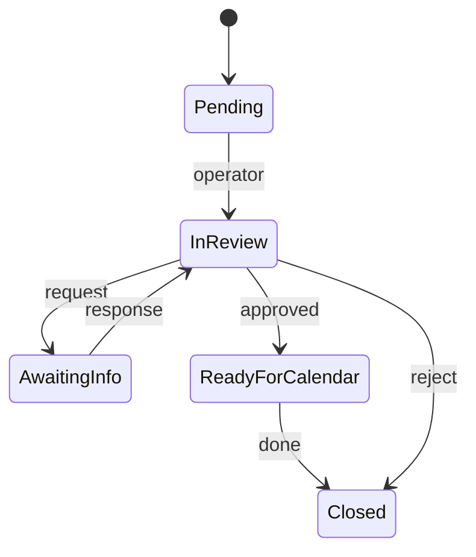

# Approval flow map

## WorkflowIntake (Prisma `WorkflowIntakeStatus`)

- States include pending, in review, awaiting info, ready for calendar (see `open-work.ts` and schema).  
- **Operator** triage: `/admin/workbench` and unified open-work queries.

## Comms and legal

- **Message lead / comms** own channel copy; **compliance** on sensitive; **counsel** when required.  
- **No** approval matrix is fully encoded in app rules — **human** SOPs required.

## Financial / compliance documents

- `admin/compliance-documents` + human workflow.

*Exact enum names — see Prisma; diagram is conceptual.*

**Last updated:** 2026-04-27
