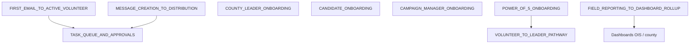

# Workflow map

**File-level workflows:** `../workflows/`

```mermaid
flowchart TB
  FE[FIRST_EMAIL_TO_ACTIVE_VOLUNTEER]
  P5[POWER_OF_5_ONBOARDING]
  VL[VOLUNTEER_TO_LEADER_PATHWAY]
  CL[COUNTY_LEADER_ONBOARDING]
  CA[CANDIDATE_ONBOARDING]
  CM[CAMPAIGN_MANAGER_ONBOARDING]
  TQ[TASK_QUEUE_AND_APPROVALS]
  MD[MESSAGE_CREATION_TO_DISTRIBUTION]
  FR[FIELD_REPORTING_TO_DASHBOARD_ROLLUP]
  FE --> TQ
  P5 --> VL
  MD --> TQ
  FR --> DASH[Dashboards OIS / county]
```

**Intake ID:** all public JSON forms → `/api/forms` (see `TASK` workflow).

**Last updated:** 2026-04-27
