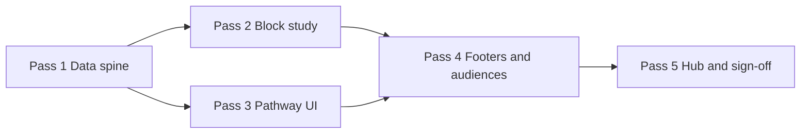

# Kelly debate prep — Day 2 five-pass build plan

**Doc ID:** KELLY-DP-D2-5PASS  
**Lane:** `RedDirt/` only  
**Status:** Day 1 **done on production** · Day 2 **Pass 1–3 done** · Pass 4 footers partial · Pass 5 hub polish pending  
**Created:** 2026-06-18  
**Goal:** Bring **Day 2 · Read the table** to the same Kelly-facing experience as Day 1 — one linear pathway, phased block study, Continue footers, evening check, Day 3 teaser.

---

## How to use this doc

Work **one pass at a time**. Do not start Pass N+1 until Pass N exit criteria are met. After each pass:

1. Run `npm run typecheck` from `RedDirt/`.
2. Walk the Day 2 pathway in browser (election-plan password).
3. Append a one-line note under **Pass log** at the bottom.
4. Commit with message prefix `debate-prep day2 pass N:`.

---

## Day 1 production baseline (the bar)

Day 1 is **finished** when Kelly can open the hub, tap **Start**, and move step-by-step without staff navigation.

| Layer | What exists (Day 1) |
|-------|---------------------|
| **Day identity** | `DAY1_ID` in `debatePrepDayDrillDown.ts`; `dayHasDrillDownPages` returns true only for Day 1 |
| **Canonical plan** | `debateWeekIntensive2026.ts` — blocks, examples, `rehearsalOutLoud`, success check |
| **Deep overlay** | `debateWeekIntensive2026Deep.ts` — evening review, command drills, micro-lessons |
| **Theory / lanes** | `debateWeekIntensive2026V3.ts` — block expansions, stretch lanes |
| **Drill-down registry** | `debatePrepDayDrillDown.ts` — concepts, blocks, rehearsals, examples, drills, micro-lessons |
| **Block study guides** | `debatePrepDay1BlockStudy.ts` — phased 45–60 min guides, sample lines, claims gate |
| **Example study** | `debatePrepDay1OpponentExampleStudy.ts` — optional Hammer pivot deep dive |
| **Linear pathway** | `day1-learning-pathway.ts` — ordered steps, next/prev, minimum blocks, Day 2 teaser |
| **Kelly UI flags** | `kelly-facing-ui.ts` — streamlined path, collapsed operator chrome |
| **Hub** | `ElectionPlanDebatePrepHubPanel` — `ElectionPlanDay1StartCard`, Kelly summary, reference collapsed in `
` |
| **Day landing** | `days/[dayId]/page.tsx` — Start now CTA, streamlined overview |
| **Pathway UI** | `ElectionPlanDay1PathwayPanel` — step list, evening check, Day 2 preview link |
| **Step chrome** | `ElectionPlanDay1StepFooter` + `ElectionPlanDay1ContinueButton` on block / rehearsal / drill / example pages |
| **Child routes** | `blocks/`, `rehearsal/`, `drills/`, `examples/`, `micro-lessons/`, `concepts/` — all `generateStaticParams` for Day 1 |
| **Audiences** | `VoterAudienceSpeakToBanner` on day overview + rehearsal (hooks: `lane-2`, `county-champion`, `author-vs-administrator`) |

**Kelly success test (Day 1):** Posture + author/administrator minimum is explicit; full pathway ~10 steps; every step page has **Continue**; evening check names three questions; Day 2 teaser motivates tomorrow without overwhelm.

---

## Day 2 current state (gap analysis)

### Already in repo (content — not Election Plan wired)

| Asset | Location | Notes |
|-------|----------|-------|
| Day plan (5 blocks) | `debateWeekIntensive2026.ts` → `day-2-read-the-table` | Film, trap 1–2, Pakko, coaching, opponent bios |
| 2 opponent examples | same file | `ex2-hammer-rank`, `ex2-pakko-split` |
| 2 rehearsal scripts | `rehearsalOutLoud` | Hammer bait 60s; Pakko acknowledge + pivot |
| Deep overlay | `debateWeekIntensive2026Deep.ts` | Evening review, 2 drills, 2 micro-lessons, reflection prompts |
| Block theory | `debateWeekIntensive2026V3.ts` | `b2-film`, `b2-opponent-bios` expansions; lanes `lane-d2-film-deep`, `lane-d2-trap-deep`, `lane-d2-geometry-stretch` |
| Opponent bio cadence | `opponentBioDrillDown.ts` | Day 2 first-read phases for Hammer + Pakko |
| Hub preview link | `ElectionPlanDebatePrepHubPanel` | “After Day 1” card only — no Day 2 start card |
| Day 1 → Day 2 teaser | `day1-learning-pathway.ts` | `DAY1_DAY2_TEASER` |
| Route map | `debate-prep-route-map.ts` | Admin film-room → forum transcript lab (weak fit for “watch clips”) |

### Missing vs Day 1 bar

| Gap | Impact |
|-----|--------|
| `dayHasDrillDownPages` excludes Day 2 | Day 2 landing shows generic blocks card, **no pathway** |
| No `DAY2_ID` / `day2-learning-pathway.ts` | No ordered steps, no Continue chain |
| No `debatePrepDay2BlockStudy.ts` | Blocks would render thin drill-down only |
| `debatePrepDayDrillDown.ts` Day-1-only guards | Child routes 404 for Day 2 |
| No Day 2 step footer / pathway panel | Kelly loses linear guidance mid-day |
| No Day 2 voter audience hooks | Missing “who is in the room” for observation day |
| No Day 3 teaser at end of Day 2 | No motivation handoff to superiority map |
| Film room block points at admin / forum lab | No Kelly-facing clip + tell worksheet in pathway |
| Hub still Day-1-primary only | Day 2 not discoverable as “tonight” after Day 1 |

### Day 2 content spine (from intensive plan)

**Title:** Read the table — watch opponents  
**Goal:** Learn Hammer’s three tells (authorship, ranking, mandate) and Pakko’s libertarian split — so nothing on stage surprises you.  
**Success check:** Kelly names three Hammer tells and one Pakko pivot without reading.  
**Minimum viable tonight (mirror Day 1 minimum):** Film tells worksheet + trap lane 1 pivot — stop if tired; bios can roll to morning.

**Blocks (pathway order — recommended):**

| Order | Block ID | ~min | Election Plan destination |
|-------|----------|------|---------------------------|
| 1 | `b2-film` | 90 | New: film tell worksheet page **or** forum lab + embedded ACCA/Hammer panel |
| 2 | `b2-trap1` | 75 | `/election-plan/debate-prep/trap-lanes` (lanes 1–2) |
| 3 | `b2-packo` | 45 | Opposition research / Pakko section + respect-line study |
| 4 | `b2-coaching` | 45 | Tutor / three-way geometry micro-lesson |
| 5 | `b2-opponent-bios` | 60 | `/election-plan/debate-prep/opponent-bios` (Hammer then Pakko) |

**Pathway tail (mirror Day 1):**

| Step kind | ID | Label |
|-----------|-----|-------|
| rehearsal | `rehearse-hammer-bait-60s` | Staff reads Hammer bait → 60s rebuttal |
| rehearsal | `rehearse-pakko-pivot-30s` | Pakko acknowledge + pivot phrase |
| drill | `d2-authorship-pivot` | Quick drill · authorship pivot |
| drill | `d2-ranking-pivot` | Quick drill · ranking → clerk service |
| example | `ex2-hammer-rank` | Optional · Heritage ranking pivot |
| example | `ex2-pakko-split` | Optional · libertarian split steal |
| close | `evening-close` | Evening success check |

**Voter audience hooks (Day 2):**

- `county-champion` (Carol W.) — clerk jury watching pivot quality  
- `integrity` / `anxious-audience` — ranking cites scare this voter  
- `three-way`, `pakko`, `reform` — geometry / third-candidate respect  

---

## Five passes (version plan)

Each pass is a **shippable increment** — deployable to production without breaking Day 1.

---

### Pass 1 — Data spine & route unlock

**Theme:** Day 2 exists in the drill-down registry; child routes resolve; pathway data defined.

**Files to add**

- `src/lib/election-plan/day2-learning-pathway.ts` — mirror `day1-learning-pathway.ts` API:
  - `buildDay2PathwaySteps()`, `getDay2PathwayStep()`, `getNextDay2PathwayStep()`, `getFirstDay2PathwayStep()`
  - `DAY2_MINIMUM_BLOCK_IDS` = `["b2-film", "b2-trap1"]`
  - `DAY2_EVENING_REVIEW` (from deep overlay)
  - `DAY2_DAY3_TEASER` → `day-3-superiority-map`

**Files to edit**

- `src/lib/election-plan/debatePrepDayDrillDown.ts`
  - Export `DAY2_ID = "day-2-read-the-table"`
  - `dayHasDrillDownPages` → Day 1 **or** Day 2
  - `buildDay2Blocks()`, `DAY2_CONCEPTS`, `DAY2_REHEARSAL`, examples, drills from intensive + deep overlay
  - Relax all `if (dayId !== DAY1_ID) return []` to handle Day 2
- `src/app/election-plan/(portal)/debate-prep/days/[dayId]/**/page.tsx` (all 6 child routes)
  - Extend `generateStaticParams` to include Day 2 entries
- `src/lib/election-plan/debate-prep-links.ts` — verify `epDebatePrepDayBlockHref(DAY2_ID, …)` works (no change expected)

**Href policy (Pass 1)**

- Map block `relatedLinks` through `debate-prep-route-map.ts` — **election-plan URLs only** on Kelly pathway.
- `b2-film` → forum transcript lab + ACCA embed path (interim); Pass 4 improves film UX.

**Exit criteria**

- [ ] `npm run typecheck` green  
- [ ] `listDayBlocksDrillDown(DAY2_ID)` returns 5 blocks  
- [ ] Direct URLs load (no 404):  
  - `/election-plan/debate-prep/days/day-2-read-the-table/blocks/b2-film`  
  - `…/rehearsal/rehearse-hammer-bait-60s`  
  - `…/drills/d2-authorship-pivot`  
  - `…/examples/ex2-hammer-rank`  
- [ ] Day 2 landing still generic (OK for Pass 1 — pathway UI is Pass 3)

**Do not in Pass 1:** Hub redesign, block study phases, Continue footers.

---

### Pass 2 — Block study guides (Day 1 depth)

**Theme:** Each Day 2 block has a phased study guide like Day 1’s `debatePrepDay1BlockStudy.ts`.

**Files to add**

- `src/lib/election-plan/debatePrepDay2BlockStudy.ts`
  - `getDay2BlockStudy(blockId)` → `Day2BlockStudyDeep` (reuse Day 1 types or shared `BlockStudyDeep` type extracted to `debatePrepBlockStudyTypes.ts` if clean)
  - Guides for all 5 blocks:

| Block | Study guide focus |
|-------|-------------------|
| `b2-film` | Tell extraction worksheet: 3 Hammer tells + 1 Pakko tell; clip pause points; voice/jaw signals from V3 lane |
| `b2-trap1` | Trap lanes 1–2 speak-order; staff bait script; “pivot until boring” reps |
| `b2-packo` | Respect line + contrast gate; one sentence acknowledge without ceding SOS |
| `b2-coaching` | Three-way eye-line geometry; moderator-centered scan; pile-on stillness |
| `b2-opponent-bios` | 30+30 read cadence; link to `opponentBioDrillDown` Day 2 phases; memory lines preview |

- `src/lib/election-plan/debatePrepDay2OpponentExampleStudy.ts` (optional in Pass 2, required by Pass 4)
  - Deep study for `ex2-hammer-rank` and `ex2-pakko-split`

**Files to edit**

- `src/app/election-plan/(portal)/debate-prep/days/[dayId]/blocks/[blockId]/page.tsx`
  - `getDay2BlockStudy` when `dayId === DAY2_ID`
  - Pathway step eyebrow for Day 2 blocks
- `src/app/election-plan/(portal)/debate-prep/days/[dayId]/examples/[exampleId]/page.tsx`
  - Day 2 example study hook (if file added)

**Exit criteria**

- [ ] Every Day 2 block page shows `ElectionPlanBlockStudyPanel` with phased steps  
- [ ] `professorLead` uses Kelly label (“Start here”) via `kellyStudyLeadLabel()`  
- [ ] Claims gate present on ranking / authorship blocks  
- [ ] Related links stay inside election-plan surface  

---

### Pass 3 — Linear pathway UI & day landing

**Theme:** Kelly sees the same “one pathway” experience as Day 1 on the Day 2 hub and landing page.

**Files to add**

- `src/components/election-plan/ElectionPlanDay2PathwayPanel.tsx`  
  **OR** refactor to `ElectionPlanDayPathwayPanel.tsx` parameterized by `dayId` (prefer refactor if diff stays small)

**Files to edit**

- `src/components/election-plan/ElectionPlanDayDrillDownOverview.tsx`
  - Day 2 streamlined branch: summary, audience banner, pathway list, evening check, Day 3 teaser
  - Extract shared `ElectionPlanDayStepFooter` accepting `dayId` + `currentStepId`
- `src/app/election-plan/(portal)/debate-prep/days/[dayId]/page.tsx`
  - Day 2: `getFirstDay2PathwayStep()`, Start now CTA, streamlined copy
- `src/lib/election-plan/kelly-facing-ui.ts`
  - `isKellyDay2StreamlinedPath()` (same flag as Day 1 today — do not use `use*` prefix)

**Copy anchors**

- Landing summary: “Watch before you counter. Three Hammer tells tonight — trap lanes 1–2 until boring.”
- Minimum tonight callout: film worksheet + trap lane 1 (2 blocks).

**Exit criteria**

- [x] `/election-plan/debate-prep/days/day-2-read-the-table` shows full step list + Start CTA  
- [x] Step N of M visible when `activeStepId` passed to pathway panel  
- [x] Evening review card matches `DAY2_EVENING_REVIEW`  
- [x] Day 3 teaser card links to `day-3-superiority-map`  
- [x] Day 1 pathway unchanged (regression spot-check)

---

### Pass 4 — Step footers, rehearsals, drills, audiences

**Theme:** Every pathway step page has **Continue**; observation content feels Kelly-native.

**Files to edit**

- All Day 2 child route pages — append `ElectionPlanDayStepFooter` with correct `currentStepId`
- `rehearsal/[scriptId]/page.tsx` — Day 2 scripts + voter audiences (`county-champion`, `integrity`, `three-way`)
- `drills/[drillId]/page.tsx` — Day 2 drills from deep overlay; `thenScan` presence notes prominent
- `examples/[exampleId]/page.tsx` — example study panels; mark optional steps in pathway list
- `micro-lessons/[lessonId]/page.tsx` — wire `d2-watch-hammer`, `d2-three-way` if in pathway or linked from blocks
- `concepts/[conceptId]/page.tsx` — Day 2 concepts (see below)

**Day 2 concepts (add in `debatePrepDayDrillDown.ts`)**

| Concept ID | Label |
|------------|-------|
| `scan-before-speak` | Scan before speak |
| `observational-learning` | Observational learning |
| `goal-for-kelly-d2` | Goal for Kelly (Day 2) |
| `success-check-d2` | Success check |
| `three-way-geometry` | Three-way geometry |

**Film block upgrade (Pass 4 scope)**

- Add `ElectionPlanFilmTellWorksheetPanel.tsx` OR extend block study with embedded `AccaForumYoutubeEmbed` + tell checklist
- Do **not** require admin film-room login on Kelly pathway

**Exit criteria**

- [ ] Full pathway walk: Start → block 1 → … → evening close without dead ends  
- [ ] Continue button label shows next step name + minutes  
- [ ] Optional examples clearly labeled Optional in pathway list  
- [ ] Voter audience banner on overview + at least rehearsals  
- [ ] Hammer ranking example has claims gate visible  

---

### Pass 5 — Hub integration, polish, production sign-off

**Theme:** Debate prep hub treats Day 2 as the natural “tonight” after Day 1; production ready.

**Files to edit**

- `src/components/election-plan/ElectionPlanDebatePrepHubPanel.tsx`
  - Add `ElectionPlanDay2StartCard` (or shared start card) — secondary primary below Day 1
  - Update `KellyPageSummary` to mention Day 2 when appropriate
  - Optional: collapse Day 1 start card behind “Day 1 complete?” `
` if Steve wants hub focus on Day 2
- `src/components/election-plan/ElectionPlanDebatePrepSubnav.tsx` — Day 2 entry if missing
- `src/lib/election-plan/debate-prep-system-v8.ts` — `todayFocus` string for Day 2 calendar date (if env `DEBATE_WEEK_TODAY` supports)
- `docs/KELLY_SOS_BUILD_LOG.md` — append verification note

**QA script (Kelly-facing)**

1. Hub → Day 2 start card → first block  
2. Complete minimum path (film + trap1) → evening check  
3. Trap lane links open in election-plan  
4. Opponent bios open Hammer → Pakko with Day 2 reading phase callouts  
5. Mobile: pathway list tappable, Continue full-width  
6. `npm run typecheck` + Netlify preview build  

**Exit criteria**

- [ ] Hub surfaces Day 2 with same visual weight pattern as Day 1 start card  
- [ ] Day 1 regression: start card, pathway, deploy still green  
- [ ] No admin-only URLs in Day 2 pathway without election-plan mirror  
- [ ] Steve sign-off: “Day 2 feels as finishable as Day 1”  

---

## Pass dependency graph

Passes 2 and 3 can run in parallel after Pass 1 if two builders coordinate; **Pass 4 requires both**.

---

## File checklist (all passes)

| File | P1 | P2 | P3 | P4 | P5 |
|------|:--:|:--:|:--:|:--:|:--:|
| `day2-learning-pathway.ts` | ✓ | | | | |
| `debatePrepDayDrillDown.ts` | ✓ | | | ✓ | |
| `debatePrepDay2BlockStudy.ts` | | ✓ | | | |
| `debatePrepDay2OpponentExampleStudy.ts` | | ✓ | | ✓ | |
| `ElectionPlanDay2PathwayPanel.tsx` | | | ✓ | | |
| `ElectionPlanDayDrillDownOverview.tsx` | | | ✓ | ✓ | |
| `days/[dayId]/page.tsx` | | | ✓ | | |
| `days/.../blocks/.../page.tsx` | ✓ | ✓ | | ✓ | |
| `days/.../rehearsal|drills|examples/...` | ✓ | | | ✓ | |
| `ElectionPlanDebatePrepHubPanel.tsx` | | | | | ✓ |
| `kelly-facing-ui.ts` | | | ✓ | | |

---

## Constraints (carry every pass)

- **Lane:** `RedDirt/` only — no sos-public / admin-only requirements leaking into Kelly copy without EP mirror  
- **No deletes** of Day 1 content  
- **No `use*` prefix** on non-hook helpers (`isKellyDay2StreamlinedPath`, not `useKelly…`)  
- **No unsourced opponent claims** — claims gate on ranking, authorship, forum quotes  
- **No real PII** in smoke tests  
- **Election Plan auth** — Kelly uses `ELECTION_PLAN_PASSWORD`, not `ADMIN_SECRET`  

---

## Pass log

| Pass | Date | Commit | Notes |
|------|------|--------|-------|
| 1 | 2026-06-18 | b64b60e1 | Data spine: DAY2_ID, pathway, drill-down, static params |
| 2 | 2026-06-19 | cbe30d19 | Block study guides + Day 2 example study panels on all 5 blocks |
| 3 | 2026-06-20 | (pending push) | Linear Day 2 pathway UI, Continue footers, hub start cards, evening check + Day 3 teaser |
| 4 | | | |
| 5 | | | |

---

## After Day 2

Day 3 (**Superiority map**) reuses this same five-pass template:

1. Data spine (`day3-learning-pathway.ts`, `DAY3_ID`)  
2. `debatePrepDay3BlockStudy.ts`  
3. Pathway UI + landing  
4. Footers + qualifications stack + claims integration  
5. Hub + Day 4 teaser  

Keep this doc updated; clone structure to `KELLY_DEBATE_PREP_DAY_3_FIVE_PASS_PLAN.md` when Day 2 Pass 5 is signed off.
