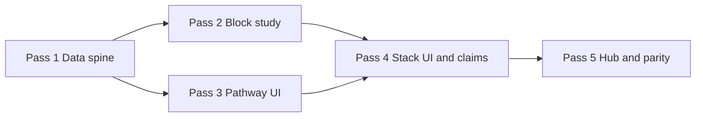

# Kelly debate prep — Day 3 five-pass build plan

**Doc ID:** KELLY-DP-D3-5PASS  
**Lane:** `RedDirt/` only  
**Status:** Day 1/2 **production parity signed** (`0.60.0` / `day-2-read-the-table-v1.1.0`) · Day 3 **not wired**  
**Created:** 2026-06-20  
**Goal:** Bring **Day 3 · Superiority map** to the same Kelly-facing experience as Days 1–2 — one linear pathway, phased block study, timed phase drill-downs, Continue footers, claims-gated qualification stack, Day 4 teaser.

---

## How to use this doc

Work **one pass at a time**. Do not start Pass N+1 until Pass N exit criteria are met. After each pass:

1. Run `npm run typecheck` from `RedDirt/`.
2. Walk the Day 3 pathway in browser (election-plan password).
3. Append a one-line note under **Pass log** at the bottom.
4. Commit with message prefix `debate-prep day3 pass N:`.

---

## Day 1/2 bar (what Day 3 must match)

| Layer | Day 1/2 pattern | Day 3 target |
|-------|-----------------|--------------|
| Day identity | `DAY1_ID` / `DAY2_ID` in `debatePrepDayDrillDown.ts` | `DAY3_ID = "day-3-superiority-map"` |
| Linear pathway | `day1-learning-pathway.ts` / `day2-learning-pathway.ts` | `day3-learning-pathway.ts` |
| Block study | `debatePrepDay{N}BlockStudy.ts` — phases, deepSections, claimsGate | `debatePrepDay3BlockStudy.ts` (4 blocks) |
| Example study | `debatePrepDay{N}OpponentExampleStudy.ts` | `debatePrepDay3OpponentExampleStudy.ts` (`ex3-hammer-admin`) |
| Pathway UI | `ElectionPlanDay{N}PathwayPanel.tsx` | `ElectionPlanDay3PathwayPanel.tsx` (or shared parameterized panel) |
| Step footers | `ElectionPlanDayStepFooter` + Continue on every step | Same — all Day 3 child routes |
| Timed phases | `/blocks/{blockId}/phases/{phaseIndex}` (Day 2 `b2-film` model) | All 4 Day 3 blocks get phase routes |
| Supplement anchors | `day{N}-supplement-anchors.ts` | `day3-supplement-anchors.ts` |
| Parity test | `scripts/test-debate-prep-day-parity.ts` | Extend to Day 3 |
| Release tag | `debate-prep-day{N}-release.ts` | `debate-prep-day3-release.ts` |
| Hub primary day | `debatePrepHubPrimaryDayId()` calendar-driven | Include Day 3 on `2026-06-21` |

**Kelly success test (Day 3):** Kelly picks **three** verified qualification beats, recites them in 90s without bill numbers, passes claims gate on every stat she plans to use, and names one clerk-funding research question — without sounding like a résumé dump.

---

## Day 3 content spine (already in repo)

Source of truth: `debateWeekIntensive2026.ts` + `debateWeekIntensive2026Deep.ts` + `debateWeekIntensive2026V3.ts`.

| Field | Value |
|-------|-------|
| **dayId** | `day-3-superiority-map` |
| **Calendar** | Saturday · 2026-06-21 |
| **Title** | Superiority map — qualifications overwhelm |
| **Subtitle** | Organization history · expertise · scare with competence |
| **Command mode** | Speak from evidence stacks — calm, stacked, unhurried |
| **Psychology** | Self-efficacy through mastery — list what you have done until the list feels boring |
| **Goal** | Mental stack of Kelly advantages: SOS desk experience, clerk relationships, direct democracy organizing, nonprofit administration |
| **Hours** | ~4 |
| **Success check** | Kelly recites three verified superiority points from memory |
| **Minimum tonight** | Manual/framework + claims gate (2 blocks) — stop if tired; offense/funding roll to morning |

### Blocks (pathway order)

| Order | Block ID | ~min | Admin href (canonical) | Election Plan mirror |
|-------|----------|------|------------------------|----------------------|
| 1 | `b3-manual` | 75 | `/admin/intelligence/kelly-strategic-plan/framework` | `/election-plan/executive-book` (+ platform / path-to-victory chapters) |
| 2 | `b3-opposition` | 60 | `/admin/intelligence/opposition-strategy` | `/election-plan/opposition-research` (themes + offense sequence) |
| 3 | `b3-funding` | 60 | `/admin/intelligence/election-funding` | `/election-plan/opposition-research/election-funding` (or dedicated module) |
| 4 | `b3-claims` | 45 | `/admin/intelligence/claims` | `/election-plan/opposition-research/claims-ledger` |

### Pathway tail (mirror Day 1/2)

| Step kind | ID | Label |
|-----------|-----|-------|
| rehearsal | `rehearse-qualified-90s` | 90s “why I’m qualified” — three jobs, no bill numbers |
| rehearsal | `rehearse-clerk-funding-60s` | 60s clerk funding — research frame only |
| drill | `d3-qual-stack` | Quick drill · qualification stack (three beats) |
| example | `ex3-hammer-admin` | Optional · Hammer bill-list vs administrator |
| micro-lesson | `d3-overwhelm` | Overwhelm with competence, not volume |
| close | `evening-close` | Evening success check |

### V3 stretch lanes (linked from block study, not separate pathway steps)

| Lane ID | Tier | Block tie-in |
|---------|------|--------------|
| `lane-d3-stack` | essential | `b3-manual` |
| `lane-d3-funding-deep` | deeper | `b3-funding` |
| `lane-d3-offense-stretch` | stretch | `b3-opposition` |

### Voter audience hooks (Day 3)

| Profile / hook | Where |
|----------------|-------|
| `carol-whitfield` · county clerks | Funding block + clerk funding rehearsal |
| `marcia-truman` · skeptical administrator | Qualification stack + Hammer admin example |
| `robert-kessler` · business services | Manual / SOS platform implementation |
| `frank-donnelly` · integrity without fear-mongering | Claims gate — no invented stats |
| `coach-pat-nolan` · rural clerk jury | Funding research question frame |

---

## Day 3 current state (gap analysis)

### Already in repo (content — not Election Plan wired)

| Asset | Location |
|-------|----------|
| Day plan (4 blocks) | `debateWeekIntensive2026.ts` → `day-3-superiority-map` |
| 1 opponent example | `ex3-hammer-admin` |
| 2 rehearsal scripts | `rehearsalOutLoud` |
| Deep overlay | evening review, reflection prompts, `d3-qual-stack`, `d3-overwhelm` |
| Block theory + lanes | `debateWeekIntensive2026V3.ts` — `b3-claims` expansion + 3 lanes |
| Forum lab bridge | `forumLabIntegrationDrillDown.ts` Day 3 section |
| Route map | Admin hrefs → EP opposition / executive book |
| Day 2 → Day 3 teaser | `DAY2_DAY3_TEASER` in `day2-learning-pathway.ts` |
| Hammer enrolled sections | `hammerBillEnrolledSections.ts` + opposition panels (Pass 4 integration) |
| Phase drill-down infra | `debatePrepBlockPhase.ts` + `phases/[phaseIndex]/page.tsx` (from Day 2) |

### Missing vs Day 1/2 bar

| Gap | Impact |
|-----|--------|
| No `DAY3_ID` / `dayHasDrillDownPages` excludes Day 3 | Day 3 landing = generic blocks card, **no pathway** |
| No `day3-learning-pathway.ts` | No ordered steps, no Continue chain |
| No `debatePrepDay3BlockStudy.ts` | Blocks render thin drill-down only |
| No Day 3 pathway panel / start card | Hub still Day 1/2 only |
| No step footers on Day 3 routes | Kelly loses linear guidance |
| No `day3-supplement-anchors.ts` | Concepts/micro-lessons lack Continue back-links |
| No parity test / release version for Day 3 | Regressions undetected |
| `debatePrepHubPrimaryDayId` stops at Day 2 | Calendar 6/21 does not promote Day 3 |
| Block hrefs still admin-first in intensive JSON | Must map through study guides + route map |
| No Kelly-native qualification worksheet | “Three notecards” activity only in copy, not UI |
| No claims-gate superiority checklist UI | Claims block needs interactive red/green pass |

---

## Five passes (version plan)

Each pass is a **shippable increment** — deployable without breaking Days 1–2.

---

### Pass 1 — Data spine & route unlock

**Theme:** Day 3 exists in the drill-down registry; child routes resolve; pathway data defined.

**Files to add**

- `src/lib/election-plan/day3-learning-pathway.ts` — mirror Day 2 API:
  - `buildDay3PathwaySteps()`, getters, `DAY3_MINIMUM_BLOCK_IDS = ["b3-manual", "b3-claims"]`
  - `DAY3_EVENING_REVIEW` (from deep overlay)
  - `DAY3_DAY4_TEASER` → `day-4-forum-intelligence`
- `src/lib/election-plan/debate-prep-day3-release.ts` — `DEBATE_PREP_DAY3_RELEASE_VERSION`

**Files to edit**

- `src/lib/election-plan/debatePrepDayDrillDown.ts`
  - Export `DAY3_ID`
  - Extend `DrillDownDayId`, `DRILL_DOWN_DAY_ID_SET`, `dayHasDrillDownPages`
  - `buildDay3Blocks()`, `DAY3_CONCEPTS`, `DAY3_REHEARSAL`, `buildDay3Examples()`, `buildDay3Drills()`, `buildDay3MicroLessons()`
  - Relax all Day-2-only guards to handle Day 3
- All 7 child route folders under `days/[dayId]/`:
  - Extend `generateStaticParams` for Day 3 entries
- `src/lib/election-plan/debatePrepBlockPhase.ts`
  - `staticParamsForDayBlockPhases(DAY3_ID)` — predeclare phase counts per block (target: 4–5 phases × 4 blocks)

**Day 3 concepts (Pass 1 registry)**

| Concept ID | Label |
|------------|-------|
| `overwhelm-with-competence` | Overwhelm with competence |
| `three-beats-only` | Three beats only |
| `administrator-vs-author` | Administrator vs author |
| `research-question-frame` | Research question frame |
| `goal-for-kelly-d3` | Goal for Kelly (Day 3) |
| `success-check-d3` | Success check |

**Href policy**

- Block `relatedLinks` use election-plan URLs only (`mapAdminHrefToElectionPlan`).
- Interim: opposition/funding/claims → existing EP modules; refine in Pass 4.

**Exit criteria**

- [ ] `npm run typecheck` green
- [ ] `listDayBlocksDrillDown(DAY3_ID)` returns 4 blocks
- [ ] Direct URLs load (no 404):
  - `/election-plan/debate-prep/days/day-3-superiority-map/blocks/b3-manual`
  - `…/rehearsal/rehearse-qualified-90s`
  - `…/drills/d3-qual-stack`
  - `…/examples/ex3-hammer-admin`
  - `…/micro-lessons/d3-overwhelm`
- [ ] Day 3 landing still generic (OK — pathway UI is Pass 3)

**Do not in Pass 1:** Block study prose, pathway UI, hub cards, qualification worksheet panel.

---

### Pass 2 — Block study guides & example depth

**Theme:** Each Day 3 block has a phased study guide at Day 1/2 depth (phases, deepSections, claimsGate).

**Files to add**

- `src/lib/election-plan/debatePrepDay3BlockStudy.ts`
- `src/lib/election-plan/debatePrepDay3OpponentExampleStudy.ts` — `ex3-hammer-admin`

**Block study focus**

| Block | Study guide focus | Phases (target) | Claims gate |
|-------|-------------------|-----------------|-------------|
| `b3-manual` | Pick 3 Kelly jobs from executive book / platform; one notecard per pillar; 90s stack without bill numbers | 5 × ~15 min | No unsourced job titles or org stats |
| `b3-opposition` | Skim six offensive moves; pick two natural; contrast on job fit not smear; link Hammer enrolled sections for **implementation** contrast | 4 × ~15 min | Offense moves must pass claims ledger |
| `b3-funding` | Election funding traps; CVSGF/HAVA research questions only; clerk mandate burden frame | 4 × ~15 min | **No invented dollar amounts** |
| `b3-claims` | Mark every superiority stat green/red; three points cleared for stage | 4 × ~11 min | Full claims gate — red line = do not stage |

**deepSections target:** ≥4 per block (parity: Day 2 has ~5 avg; Day 3 has 4 blocks so total deepSections ≥16).

**Files to edit**

- `blocks/[blockId]/page.tsx` — `getDay3BlockStudy` when `dayId === DAY3_ID`
- `examples/[exampleId]/page.tsx` — Day 3 example study
- Wire phase drill-down links from each phase row (reuse `epDebatePrepDayBlockPhaseHref`)

**Exit criteria**

- [ ] Every Day 3 block shows `ElectionPlanBlockStudyPanel` with phased steps + “Open phase drill-down →”
- [ ] `ex3-hammer-admin` example study ≥4 phases + claims gate
- [ ] All four blocks have non-empty `claimsGate` (parity test requirement)
- [ ] Professor lead uses `kellyStudyLeadLabel()` (“Start here”)

---

### Pass 3 — Linear pathway UI & day landing

**Theme:** Kelly sees the same “one pathway” experience on Day 3 hub and landing page.

**Files to add**

- `src/components/election-plan/ElectionPlanDay3PathwayPanel.tsx`  
  **OR** refactor `ElectionPlanDayPathwayPanel.tsx` parameterized by `dayId` (preferred if diff ≤ ~200 lines)

**Files to edit**

- `ElectionPlanDayDrillDownOverview.tsx` — Day 3 streamlined branch
- `days/[dayId]/page.tsx` — Day 3 Start now CTA, minimum tonight callout
- `kelly-facing-ui.ts` — `isKellyDay3StreamlinedPath()` if not unified
- Extract/shared: `ElectionPlanDayStepFooter` accepts `dayId` + step getters from day1/2/3 pathway modules

**Copy anchors**

- Landing summary: “Stack three qualifications until the list feels boring — organization history beats bill lists.”
- Minimum tonight: manual/framework + claims gate (2 blocks).
- Strength / watch-out chips from deep overlay (`kellyStrengthToday`, `kellyWatchOut`).

**Exit criteria**

- [ ] `/election-plan/debate-prep/days/day-3-superiority-map` shows full step list + Start CTA
- [ ] Step N of M visible when `activeStepId` passed
- [ ] Evening review card matches `DAY3_EVENING_REVIEW`
- [ ] Day 4 teaser card links to `day-4-forum-intelligence`
- [ ] Days 1–2 pathway unchanged (regression spot-check)

---

### Pass 4 — Step footers, qualification stack UI, claims integration

**Theme:** Every pathway step has **Continue**; superiority content is Kelly-native and claims-safe.

**Files to add (UI)**

- `src/components/election-plan/ElectionPlanQualificationStackPanel.tsx`  
  Three-notecard worksheet: Job · Who depended on you · Clerk-relevant beat (no PII fields — Kelly types locally or prints)
- `src/components/election-plan/ElectionPlanClaimsSuperiorityChecklist.tsx`  
  Pulls claims-ledger **categories** only (counts + needs-research flags) — no secret values; red/green checklist for three superiority lines

**Files to edit**

- All Day 3 child routes — `ElectionPlanDayStepFooter` with correct `currentStepId`
- `rehearsal/[scriptId]/page.tsx` — Day 3 scripts + voter audiences (clerks, business, integrity)
- `drills/[drillId]/page.tsx` — `d3-qual-stack` with prominent `thenScan` (“stop at three beats”)
- `micro-lessons/[lessonId]/page.tsx` — `d3-overwhelm` + supplement footer
- `concepts/[conceptId]/page.tsx` — Day 3 concepts + anchors
- `blocks/b3-manual/page.tsx` — embed `ElectionPlanQualificationStackPanel`
- `blocks/b3-claims/page.tsx` — embed claims checklist + link to claims-ledger module
- `blocks/b3-opposition/page.tsx` — cross-link Hammer enrolled sections panel (in-app, not Arkleg)
- `blocks/b3-funding/page.tsx` — research-question template (no numbers unless verified)
- `src/lib/election-plan/day3-supplement-anchors.ts` — micro-lesson + concept Continue targets
- `debate-prep-route-map.ts` — verify/fine-tune EP mirrors for funding module slug

**V3 lane integration**

- Each block study `relatedLinks` includes its lane href: `/election-plan/debate-prep/lanes/lane-d3-*`

**Exit criteria**

- [ ] Full pathway walk: Start → block 1 → … → evening close without dead ends
- [ ] Continue button shows next step name + minutes
- [ ] Optional example labeled Optional in pathway list
- [ ] Voter audience banner on overview + both rehearsals
- [ ] Qualification stack + claims checklist render without admin login
- [ ] Hammer admin example shows claims gate + enrolled-section contrast links

---

### Pass 5 — Hub integration, parity test, production sign-off

**Theme:** Debate prep hub treats Day 3 as “tonight” on calendar 6/21; production ready.

**Files to edit**

- `debate-prep-hub-tonight.ts` — `debatePrepHubPrimaryDayId` returns `DAY3_ID` when `calendarDate === "2026-06-21"`
- `ElectionPlanDebatePrepHubPanel.tsx` — `ElectionPlanDay3StartCard` + pathway hub card
- `ElectionPlanDebatePrepSubnav.tsx` — Day 3 entry
- `debate-prep-system-v8.ts` — version string bump; `todayFocus` for Day 3
- `scripts/test-debate-prep-day-parity.ts` — extend assertions for Day 3 (see below)
- `scripts/test-debate-prep-block-phases.ts` — add Day 3 phase route counts
- `package.json` — `agents:test-debate-prep-day3-pathway` if narrow test helps CI
- `docs/KELLY_SOS_BUILD_LOG.md` — verification note

**Parity assertions (Day 3 vs Day 1/2)**

| Check | Rule |
|-------|------|
| Block count | 4 (allowed — intensive plan has 4) |
| Pathway steps | Within ±2 of Day 2 step count |
| Pathway minutes | ≥85% of Day 2 total minutes |
| Evening review | Same length as Day 1/2 (3 questions) |
| Minimum blocks | 2 IDs defined |
| Block study phases | ≥90% of Day 2 phase total (adjust for 4 vs 5 blocks) |
| deepSections | ≥85% of Day 2 deep section count |
| claimsGates | All 4 blocks + example study |
| Concepts / micro-lessons | All have supplement anchors |
| Release version | `DEBATE_PREP_DAY3_RELEASE_VERSION` set |

**QA script (Kelly-facing)**

1. Hub → Day 3 start card → first block (`b3-manual`)
2. Complete minimum path (manual + claims) → evening check
3. Qualification stack: three beats saved/spoken aloud
4. Claims checklist: zero red lines in planned stage lines
5. Opposition block opens enrolled-section contrast (in-app)
6. Funding block: research question only — no invented stats
7. Mobile: pathway tappable, Continue full-width
8. `npm run typecheck` + `npm run agents:test-debate-prep-day-parity` + Netlify preview

**Exit criteria**

- [ ] Hub surfaces Day 3 with same visual weight as Day 1/2 start cards
- [ ] Days 1–2 regression green
- [ ] No admin-only URLs in Day 3 pathway without EP mirror
- [ ] Steve sign-off: “Day 3 feels as finishable as Day 1/2”
- [ ] Tag: `debate-prep-day3-v1.0.0` on `main` → Netlify production

---

## Pass dependency graph

Passes 2 and 3 can run in parallel after Pass 1 if two builders coordinate; **Pass 4 requires both**.

---

## File checklist (all passes)

| File | P1 | P2 | P3 | P4 | P5 |
|------|:--:|:--:|:--:|:--:|:--:|
| `day3-learning-pathway.ts` | ✓ | | | | |
| `debate-prep-day3-release.ts` | ✓ | | | | |
| `debatePrepDayDrillDown.ts` | ✓ | | | ✓ | |
| `debatePrepDay3BlockStudy.ts` | | ✓ | | | |
| `debatePrepDay3OpponentExampleStudy.ts` | | ✓ | | ✓ | |
| `day3-supplement-anchors.ts` | | | | ✓ | |
| `ElectionPlanDay3PathwayPanel.tsx` | | | ✓ | | |
| `ElectionPlanQualificationStackPanel.tsx` | | | | ✓ | |
| `ElectionPlanClaimsSuperiorityChecklist.tsx` | | | | ✓ | |
| `ElectionPlanDayDrillDownOverview.tsx` | | | ✓ | ✓ | |
| `days/[dayId]/page.tsx` | | | ✓ | | |
| `days/.../blocks|rehearsal|drills|examples|micro-lessons|concepts|phases` | ✓ | ✓ | | ✓ | |
| `debate-prep-hub-tonight.ts` | | | | | ✓ |
| `ElectionPlanDebatePrepHubPanel.tsx` | | | | | ✓ |
| `test-debate-prep-day-parity.ts` | | | | | ✓ |

---

## Constraints (carry every pass)

- **Lane:** `RedDirt/` only
- **No deletes** of Day 1/2 content
- **No unsourced superiority stats** — claims gate on every block + example
- **No invented funding numbers** — research-question frame only unless claims-verified
- **No admin login** on Kelly pathway — EP mirrors only
- **Hammer contrast** = job fit / implementation, not unsourced motive claims
- **Election Plan auth** — `ELECTION_PLAN_PASSWORD`, not `ADMIN_SECRET`
- **Phase drill-downs** — every timed phase in block study links to its own page (Day 2 standard)

---

## Pass log

| Pass | Date | Commit | Notes |
|------|------|--------|-------|
| 1 | | | |
| 2 | | | |
| 3 | | | |
| 4 | | | |
| 5 | | | |

---

## After Day 3

Day 4 (**Forum intelligence lab**) reuses this template with forum upload/transcript pipeline as Pass 4 centerpiece. Teaser already defined in `DAY3_DAY4_TEASER`.
