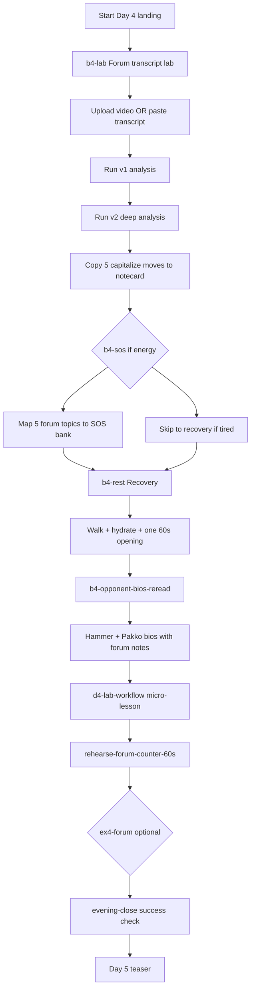
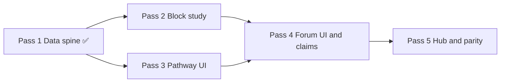

# Kelly debate prep — Day 4 five-pass build plan

**Doc ID:** KELLY-DP-D4-5PASS  
**Lane:** `RedDirt/` only  
**Status:** Day 1–3 **production parity signed** · Day 4 **Pass 1–4 shipped** (`day-4-forum-intelligence-v1.0.0-pass4`) · Pass 5 next (hub promotion + parity sign-off)  
**Created:** 2026-06-21  
**Goal:** Bring **Day 4 · Forum intelligence lab** to the same Kelly-facing experience as Days 1–3 — one linear pathway, phased block study, forum-lab pipeline UI, claims-gated quote handling, Continue footers, Day 5 teaser.

---

## How to use this doc

Work **one pass at a time**. Do not start Pass N+1 until Pass N exit criteria are met. After each pass:

1. Run `npm run typecheck` from `RedDirt/`.
2. Walk the Day 4 pathway in browser (election-plan password).
3. Append a one-line note under **Pass log** at the bottom.
4. Commit with message prefix `debate-prep day4 pass N:`.

---

## Day 1–3 bar (what Day 4 must match)

| Layer | Day 1–3 pattern | Day 4 target |
|-------|-----------------|--------------|
| Day identity | `DAY{N}_ID` in `debatePrepDayDrillDown.ts` | `DAY4_ID = "day-4-forum-intelligence"` ✓ |
| Linear pathway | `day{N}-learning-pathway.ts` | `day4-learning-pathway.ts` ✓ |
| Block study | `debatePrepDay{N}BlockStudy.ts` — phases, deepSections, claimsGate | `debatePrepDay4BlockStudy.ts` (4 blocks) ✓ |
| Example study | `debatePrepDay{N}OpponentExampleStudy.ts` | `debatePrepDay4OpponentExampleStudy.ts` (`ex4-forum`) ✓ |
| Pathway UI | `ElectionPlanDay{N}PathwayPanel.tsx` | `ElectionPlanDay4PathwayPanel.tsx` ✓ |
| Step footers | `ElectionPlanDayStepFooter` + Continue on every step | Extend for `DAY4_ID` ✓ (Pass 3) |
| Timed phases | `/blocks/{blockId}/phases/{phaseIndex}` | All 4 Day 4 blocks get phase routes ✓ |
| Supplement anchors | `day{N}-supplement-anchors.ts` | `day4-supplement-anchors.ts` |
| Parity test | `scripts/test-debate-prep-day-parity.ts` | Extend to Day 4 |
| Release tag | `debate-prep-day{N}-release.ts` | `debate-prep-day4-release.ts` → `v1.0.0` |
| Hub primary day | `debatePrepHubPrimaryDayId()` calendar-driven | Include Day 4 on `2026-06-22` |

**Kelly success test (Day 4):** Forum artifact exists (upload or pasted transcript); v1 + v2 analysis run; Kelly copies **five** capitalize moves to a notecard (claims-verified only); one 60s counter to a predicted Hammer line; bios re-read with forum notes if energy allows — **without** memorizing the full transcript or staging unverified quotes.

---

## Day 4 content spine (already in repo)

Source of truth: `debateWeekIntensive2026.ts` + `debateWeekIntensive2026Deep.ts` + `debateWeekIntensive2026V3.ts`.

| Field | Value |
|-------|-------|
| **dayId** | `day-4-forum-intelligence` |
| **Calendar** | Sunday · 2026-06-22 |
| **Title** | Forum intelligence lab |
| **Subtitle** | Upload three-way forum video · transcript · AI breakdown |
| **Command mode** | Listen like an analyst first — extract their scripts before writing yours |
| **Psychology** | Concrete examples beat abstract fear — the forum transcript is your Rosetta stone |
| **Goal** | Upload (or paste) the three-candidate forum recording; transcribe and analyze what Hammer and Pakko actually said — then map predicted debate lines |
| **Hours** | ~4 |
| **Success check** | Forum lab shows transcript + analysis artifact; Kelly reviews predicted lines list |
| **Minimum tonight** | Forum lab ingest only (`b4-lab`) — stop if tired; SOS map + bios re-read roll to Monday morning |

### Blocks (pathway order)

| Order | Block ID | ~min | Admin href (canonical) | Election Plan mirror |
|-------|----------|------|------------------------|----------------------|
| 1 | `b4-lab` | 120 | `/admin/intelligence/forum-transcript-lab` | `/election-plan/debate-prep/forum-lab` |
| 2 | `b4-sos` | 60 | `/admin/intelligence/sos-debate-questions` | `/election-plan/debate-prep/debate-questions` |
| 3 | `b4-rest` | 60 | (no href — recovery) | Day 4 recovery block page |
| 4 | `b4-opponent-bios-reread` | 45 | opponent bios admin | `/election-plan/opposition-research/opponent-bios` |

### Pathway tail (mirror Day 1–3)

| Step kind | ID | Label |
|-----------|-----|-------|
| micro-lesson | `d4-lab-workflow` | Forum lab workflow (upload → v1 → v2 → Day 5 feed) |
| rehearsal | `rehearse-forum-counter-60s` | 60s counter to predicted Hammer line from lab |
| example | `ex4-forum` | Optional · forum integrity one-liner |
| close | `evening-close` | Evening success check |

### V3 stretch lanes (linked from block study, not separate pathway steps)

| Lane ID | Tier | Block tie-in |
|---------|------|--------------|
| `lane-d4-lab-deep` | essential | `b4-lab` — upload → Whisper → v1 → v2 → capitalize |
| `lane-d4-sos-map` | deeper | `b4-sos` — forum topics → SOS bank questions |

### Voter audience hooks (Day 4)

| Profile / hook | Where |
|----------------|-------|
| `frank-donnelly` · integrity without fear-mongering | Forum lab + `ex4-forum` integrity one-liner |
| `carol-whitfield` · county clerks | Capitalize moves — clerk funding / equipment beats |
| `marcia-truman` · skeptical administrator | SOS mapping — concrete implementation vs abstract forum answers |
| `coach-pat-nolan` · rural clerk jury | Bios re-read — forum reality vs forecast sections |
| `robert-kessler` · business services | Deep analysis executive brief — SOS desk operator frame |

### Cross-lane integrations (read-only links — no imports)

| Asset | Day 4 use |
|-------|-----------|
| Opposition research v2 · debate-night card | Evening optional — predicted lines vs export-ready rebuttals |
| Day 2/3 Norris coalition drill | Optional sidebar on Day 4 landing — geography context only, not pathway step |
| Forum lab integration map · day 4 | `/forum-lab/integration/4` — home base for capitalize + mock moderator |
| Claims ledger | Every verbatim forum quote before notecard / stage |

---

## Kelly learning process — full arc (Sunday)

Day 4 is **ingest day**. Cognitive load comes from transcript analysis, not new trap lanes (those are Day 5).

### Learning modes by block

| Block | Learning mode | Kelly does | Kelly does NOT |
|-------|---------------|------------|----------------|
| `b4-lab` | **Elaborative rehearsal** — connect real words to trap lanes | Upload/paste; skim themes; run v1/v2; pick 5 capitalize moves | Memorize full transcript; stage `needs_review` quotes |
| `b4-sos` | **Transfer** — forum themes → moderator questions | Match 5 topics to SOS bank; note Hammer repeat lines | Invent new stats; full timed SOS sprint (Day 5) |
| `b4-rest` | **Spacing / recovery** | Walk, hydrate, one opening rep | New trap content; funding numbers research |
| `b4-opponent-bios-reread` | **Comparison** — forecast vs transcript | Re-read Hammer/Pakko bios; adjust memory lines | Re-read before lab completes; unverified forum quotes on notecard |

### Minimum vs full vs stretch

| Path | Steps | ~minutes | When |
|------|-------|----------|------|
| **Minimum** | `b4-lab` → evening close | ~125 | Kelly exhausted; staff can run upload |
| **Standard** | All 4 blocks + micro-lesson + rehearsal | ~300 | Normal Sunday |
| **Stretch** | Standard + `ex4-forum` + lanes `lane-d4-lab-deep` + `lane-d4-sos-map` + opposition debate-night card | ~360+ | High energy; forum artifact ready early |

### Evening review (Kelly speaks aloud)

1. Forum uploaded or transcript pasted?
2. Deep analysis run?
3. Five capitalize moves copied to notecard?

### Day 5 handoff

Forum intel feeds Day 5 (`day-5-anticipate-and-capitalize`): capitalize sheet export, when-X-say-Y timed pairs, trap lanes 3–6, SOS sprint, AI tutor moot court. Day 4 must persist artifact state forum lab already writes — no duplicate storage.

---

## Day 4 current state (gap analysis)

### Already in repo (Pass 1 + forum lab ecosystem)

| Asset | Location |
|-------|----------|
| Day plan (4 blocks) | `debateWeekIntensive2026.ts` → `day-4-forum-intelligence` |
| Pathway data | `day4-learning-pathway.ts` |
| Registry (6 concepts, 1 rehearsal, 1 example, 0 command drills) | `debatePrepDay4Registry.ts` |
| Drill-down routing | `debatePrepDayDrillDown.ts` — `DAY4_ID` wired |
| Release Pass 1 | `debate-prep-day4-release.ts` |
| Deep overlay | `debateWeekIntensive2026Deep.ts` — evening review, `d4-lab-workflow` |
| V3 block theory + 2 lanes | `debateWeekIntensive2026V3.ts` |
| Forum lab EP routes (14 pages) | `src/app/election-plan/.../forum-lab/**` |
| Forum lab drill-down registries | `forumLab*DrillDown.ts`, lesson banks |
| Integration map day 4 | `forumLabIntegrationDrillDown.ts` |
| Basic pathway test | `scripts/test-debate-prep-day4-pathway.ts` |
| Landing stub | ~~inline list~~ → `ElectionPlanDay4PathwayPanel` (Pass 3) |
| Day 3 → Day 4 teaser | `DAY3_DAY4_TEASER` in `day3-learning-pathway.ts` |

### Missing vs Day 1–3 bar (Pass 5 remaining)

| Gap | Impact |
|-----|--------|
| No parity test extension in `test-debate-prep-day-parity.ts` | Pass 5 |
| `debatePrepHubPrimaryDayId` no Day 4 | Calendar 6/22 does not promote Day 4 — Pass 5 |
| Hub `ElectionPlanDay4StartCard` | Pass 5 hub promotion |

---

## Five passes (version plan)

Each pass is a **shippable increment** — deployable without breaking Days 1–3.

---

### Pass 1 — Data spine & route unlock ✅ (shipped)

**Theme:** Day 4 exists in the drill-down registry; child routes resolve; pathway data defined.

**Shipped files**

- `day4-learning-pathway.ts`
- `debate-prep-day4-release.ts` → `day-4-forum-intelligence-v1.0.0-pass1`
- `debatePrepDay4Registry.ts`
- `debatePrepDayDrillDown.ts` — `DAY4_ID`, builders, static params

**Exit criteria (met)**

- [x] `DAY4_ID` in drill-down set
- [x] `buildDay4PathwaySteps()` — 4 blocks + tail
- [x] `DAY4_MINIMUM_BLOCK_IDS = ["b4-lab"]`
- [x] Child routes generate for Day 4 entries
- [x] `scripts/test-debate-prep-day4-pathway.ts`

**Remaining Pass 1 gap:** `debatePrepBlockPhase.ts` — declare Day 4 phase counts (can finish at start of Pass 2).

---

### Pass 2 — Block study guides & example depth ✅ (shipped)

**Theme:** Each Day 4 block has a phased study guide at Day 1/3 depth (phases, deepSections, claimsGate).

**Shipped files**

- `src/lib/election-plan/debatePrepDay4BlockStudy.ts` — 4 blocks, 17 phases total (6+4+3+4)
- `src/lib/election-plan/debatePrepDay4OpponentExampleStudy.ts` — `ex4-forum` (4 phases)
- `src/lib/election-plan/debate-prep-day4-forum-intelligence-copy.ts` — shared claims-gate + Kelly minimum copy

**Forum intelligence labeling (non-negotiable)**

- Transcript language = **internal tactical intelligence** until source + timestamp + claims review
- Kelly notecard (Pass 4 UI) = **claims-gated lines only**
- Raw forum analysis may stay richer behind the scenes for staff

**Exit criteria (met)**

- [x] Every Day 4 block shows `ElectionPlanBlockStudyPanel` with phased steps
- [x] `ex4-forum` example study ≥4 phases + claims gate
- [x] All four blocks have non-empty `claimsGate` (shared + block-specific lines)
- [x] Phase routes load for each block (17 phase static params)

---

### Pass 3 — Linear pathway UI & day landing ✅ (shipped)

**Theme:** Kelly sees the same "one pathway" experience on Day 4 hub and landing page.

**Shipped files**

- `src/components/election-plan/ElectionPlanDay4PathwayPanel.tsx`
- `src/components/election-plan/ElectionPlanDay4PathwayProgressBar.tsx`
- `src/components/election-plan/ElectionPlanDay4ContinueButton.tsx`
- `src/lib/election-plan/day4-pathway-progress.ts`
- `ElectionPlanDayDrillDownOverview.tsx` — Day 4 streamlined panel
- `days/[dayId]/page.tsx` — Day 4 Start now CTA
- `ElectionPlanDebatePrepSubnav.tsx` — Day 4 compact tab
- `kelly-facing-ui.ts` — `isKellyDay4StreamlinedPath()`

**Exit criteria (met)**

- [x] `/election-plan/debate-prep/days/day-4-forum-intelligence` matches Day 3 visual weight
- [x] Step N of M when `activeStepId` passed
- [x] Continue footers on blocks, phases, rehearsal, examples, micro-lessons
- [x] Days 1–3 pathway unchanged

**Remaining Pass 3 gap:** Hub `ElectionPlanDay4StartCard` — deferred to Pass 5 with hub promotion.

---

### Pass 4 — Forum pipeline UI & claims integration ✅ (shipped)

**Theme:** Clean mobile chain: **forum artifact → reviewed evidence → green notecard line → rehearsal → Day 5 drill**.

**Shipped files**

- `load-day4-forum-pipeline-surface.ts` — claims-gated Kelly surface builder
- `ElectionPlanDay4ForumPanels.tsx` — pipeline checklist, block embed, Day 5 handoff
- `ElectionPlanCapitalizeMovesNotecard.tsx` — five green lines, copy/print, no staff clutter
- `ElectionPlanForumSosMappingWorksheet.tsx` — 5 card rows (mobile-first)
- `ElectionPlanBiosForumRereadPanel.tsx` — forecast confirmed/changed/contradicted
- `ElectionPlanForumPredictedLinePicker.tsx` — verified Hammer quotes only for rehearsal
- `day4-supplement-anchors.ts` + `ElectionPlanDay4SupplementFooter.tsx`
- Block/rehearsal/concept/micro-lesson/forum-lab wiring

**Exit criteria (met)**

- [x] No quote in notecard/picker without source + timestamp + approved claims status
- [x] Pipeline checklist shows artifact · v1 · v2 · verified capitalize count
- [x] Kelly copies/prints five green lines without staff analysis clutter
- [x] SOS worksheet: forum theme → SOS question → Hammer line → clerk sketch
- [x] Bios panel: forecast vs forum verdict + verified lines
- [x] Every surface returns to Day 4 pathway; Day 5 handoff on lab/bios/rehearsal
- [x] Mobile-first card stacks — no dense tables, no admin detour

---

### Pass 5 — Hub integration, parity test, production sign-off (NEXT)

**Theme:** Debate prep hub treats Day 4 as "tonight" on calendar 2026-06-22; production ready.

**Files to edit**

- `debate-prep-hub-tonight.ts` — `debatePrepHubPrimaryDayId` returns `DAY4_ID` when `calendarDate === "2026-06-22"`
- `ElectionPlanDebatePrepHubPanel.tsx` — `ElectionPlanDay4StartCard` + pathway hub card
- `ElectionPlanDebatePrepSubnav.tsx` — Day 4 entry parity
- `debate-prep-system-v8.ts` — version string bump; `todayFocus` for Day 4
- `debate-prep-day4-release.ts` — bump to `day-4-forum-intelligence-v1.0.0`
- `scripts/test-debate-prep-day-parity.ts` — extend assertions for Day 4
- `scripts/test-debate-prep-block-phases.ts` — add Day 4 phase route counts
- `scripts/test-debate-prep-day4-pathway.ts` — expand beyond Pass 1 sanity
- `package.json` — `agents:test-debate-prep-day4-pathway` if helpful for CI
- `docs/KELLY_SOS_BUILD_LOG.md` — verification note

**Parity assertions (Day 4 vs Day 1–3)**

| Check | Rule |
|-------|------|
| Block count | 4 |
| Pathway steps | Within ±2 of Day 3 step count |
| Pathway minutes | ≥85% of Day 3 total (forum lab block is long) |
| Evening review | 3 questions (same as Days 1–3) |
| Minimum blocks | 1 ID defined (`b4-lab`) |
| Block study phases | ≥90% of Day 3 phase total (adjust for 4 blocks) |
| deepSections | ≥85% of Day 3 deep section count |
| claimsGates | All 4 blocks + example study |
| Concepts / micro-lessons | All have supplement anchors |
| Release version | `DEBATE_PREP_DAY4_RELEASE_VERSION` = `v1.0.0` |

**QA script (Kelly-facing)**

1. Hub → Day 4 start card → first block (`b4-lab`)
2. Complete minimum path (forum lab only) → evening check
3. Upload or paste transcript → v1 + v2 run (or staff fallback state)
4. Five capitalize moves on notecard — claims green only
5. One 60s forum counter from predicted line picker
6. SOS mapping worksheet — 5 rows if full path
7. Bios re-read — one adjusted memory line per opponent
8. Mobile: pathway tappable, Continue full-width
9. `npm run typecheck` + parity test + Netlify preview

**Exit criteria**

- [ ] Hub surfaces Day 4 with same visual weight as Days 1–3
- [ ] Days 1–3 regression green
- [ ] No admin-only URLs in Day 4 pathway without EP mirror
- [ ] Steve sign-off: "Day 4 feels as finishable as Day 1–3"
- [ ] Tag: `debate-prep-day4-v1.0.0` on `main` → Netlify production

---

## Pass dependency graph

Passes 2 and 3 can run in parallel after Pass 1 if two builders coordinate; **Pass 4 requires both**.

---

## File checklist (all passes)

| File | P1 | P2 | P3 | P4 | P5 |
|------|:--:|:--:|:--:|:--:|:--:|
| `day4-learning-pathway.ts` | ✓ | | | | |
| `debate-prep-day4-release.ts` | ✓ | | | | ✓ |
| `debatePrepDay4Registry.ts` | ✓ | | | | |
| `debatePrepDayDrillDown.ts` | ✓ | | | ✓ | |
| `debatePrepDay4BlockStudy.ts` | | ✓ | | | |
| `debatePrepDay4OpponentExampleStudy.ts` | | ✓ | | ✓ | |
| `debate-prep-day4-forum-intelligence-copy.ts` | | ✓ | | ✓ | |
| `day4-supplement-anchors.ts` | | | | ✓ | |
| `ElectionPlanDay4PathwayPanel.tsx` | | | ✓ | | |
| `ElectionPlanDay4PathwayProgressBar.tsx` | | | ✓ | | |
| `ElectionPlanDay4ContinueButton.tsx` | | | ✓ | | |
| `day4-pathway-progress.ts` | | | ✓ | | |
| `ElectionPlanForumLabPipelineChecklist.tsx` | | | | ✓ | |
| `ElectionPlanCapitalizeMovesNotecard.tsx` | | | | ✓ | |
| `ElectionPlanForumSosMappingWorksheet.tsx` | | | | ✓ | |
| `ElectionPlanBiosForumRereadPanel.tsx` | | | | ✓ | |
| `ElectionPlanDayDrillDownOverview.tsx` | ✓ | | ✓ | ✓ | |
| `days/[dayId]/page.tsx` | | | ✓ | | |
| `days/.../blocks|rehearsal|examples|micro-lessons|concepts|phases` | ✓ | ✓ | | ✓ | |
| `debate-prep-hub-tonight.ts` | | | | | ✓ |
| `ElectionPlanDebatePrepHubPanel.tsx` | | | | | ✓ |
| `test-debate-prep-day-parity.ts` | | | | | ✓ |

---

## Constraints (carry every pass)

- **Lane:** `RedDirt/` only
- **No deletes** of Day 1–3 content
- **Forum intelligence labeling:** transcript text = internal tactical intelligence until source + timestamp + claims review; Kelly notecard = claims-gated lines only; staff raw analysis may stay richer behind the scenes
- **No invented stats** from forum summaries — verify before notecard
- **No admin login** on Kelly pathway — EP forum lab + mirrors only
- **Sunday = ingest** — no trap lane marathon; one 60s counter max in standard path
- **Staff fallback** — paste transcript OK; Kelly still reviews predicted lines
- **Election Plan auth** — `ELECTION_PLAN_PASSWORD`, not `ADMIN_SECRET`
- **Phase drill-downs** — every timed phase links to its own page (Day 2 standard)
- **Forum artifact** — reuse `loadForumTranscriptLab()` / existing API; no duplicate ingest storage

---

## Pass log

| Pass | Date | Commit | Notes |
|------|------|--------|-------|
| 1 | 2026-06-21 | | Data spine + pathway + registry shipped |
| 2 | 2026-06-21 | | Block study (4 blocks, 17 phases) + ex4-forum + claims-gate copy constants |
| 3 | 2026-06-21 | cae71fb1 | Pathway panel, progress bar, Continue, landing, subnav Day 4 tab |
| 4 | 2026-06-21 | | Forum pipeline UI — notecard, SOS worksheet, bios reread, predicted-line picker, Day 5 handoff |
| 5 | | | |

---

## After Day 4

Day 5 (**Anticipate & capitalize**) reuses this template with when-X-say-Y timed pairs and trap lanes 3–6 as Pass 4 centerpiece. Teaser already defined in `DAY4_DAY5_TEASER`.
