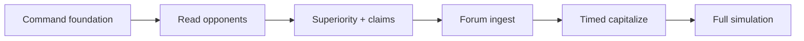
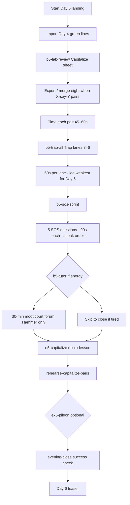

# Kelly debate prep — Day 5 five-pass build plan

**Doc ID:** KELLY-DP-D5-5PASS  
**Lane:** `RedDirt/` only  
**Status:** Day 1–4 **production parity signed** · Day 5 **not started** (data exists in intensive week sources; no EP pathway spine yet)  
**Created:** 2026-06-21  
**Goal:** Bring **Day 5 · Anticipate & capitalize** to the same Kelly-facing experience as Days 1–4 — one linear pathway, phased block study, when-X-say-Y timed pairs UI, claims-gated capitalize sheet, trap lanes 3–6 sprint, SOS timed sprint, moot-court handoff, Day 6 teaser.

---

## How to use this doc

Work **one pass at a time**. Do not start Pass N+1 until Pass N exit criteria are met. After each pass:

1. Run `npm run typecheck` from `RedDirt/`.
2. Walk the Day 5 pathway in browser (election-plan password).
3. Append a one-line note under **Pass log** at the bottom.
4. Commit with message prefix `debate-prep day5 pass N:`.

---

## Days 1–4 arc (what Day 5 completes)

Day 5 is the **conversion day**: forum intel (Day 4) becomes **muscle memory under time pressure**. Days 1–3 built posture, opponent reading, and qualification stack; Day 4 ingested real forum words. Day 5 turns green notecard lines into **implementation intentions** — when Hammer says X, Kelly says Y — before full simulation on Day 6.

| Day | dayId | Calendar | Cognitive mode | Primary output |
|-----|-------|----------|----------------|----------------|
| **1** | `day-1-command-foundation` | Wed 6/18 | **Embodied foundation** — breath, posture, agree-but-never-only-agree | 90s opening; Command Mode vocabulary |
| **2** | `day-2-read-the-table` | Thu 6/19 | **Observation** — film room, trap lanes **1–2**, first bio read | Opponent tells; authorship vs administrator frame |
| **3** | `day-3-superiority-map` | Fri 6/20 | **Qualification stack** — manual, funding, claims gate | Verified superiority lines; competence-over-scare |
| **4** | `day-4-forum-intelligence` | Sun 6/22 | **Ingest** — transcript lab, SOS map, bios re-read | Five green capitalize moves; predicted Hammer lines (claims-gated) |
| **5** | `day-5-anticipate-and-capitalize` | Mon 6/23 | **Retrieval under pressure** — timed pairs, lanes 3–6, SOS sprint | ≥8 when-X-say-Y pairs rehearsed; pile-on pivot cold |

### Learning progression (pedagogy)



| Layer | Days 1–3 | Day 4 | Day 5 |
|-------|----------|-------|-------|
| Evidence | Briefings, film room, manual | Forum transcript + v1/v2 analysis | **Same quotes** — no new stats |
| Trap lanes | 1–2 introduced | Forum fills lane predictions | **3–6 timed sprint** (60s each) |
| SOS bank | Reference / map | 5-topic worksheet | **5 timed 90s answers** |
| Rehearsal | Opening, agree-contrast | One 60s forum counter | **Eight timed pairs + moot court** |
| Claims | Gate superiority lines | Green notecard only | **Every pair claims-green** |

### Day 4 → Day 5 handoff (already specified)

From `day4-learning-pathway.ts` (`DAY4_DAY5_TEASER`) and Day 4 Pass 4 surfaces:

- **Input:** `loadDay4ForumPipelineSurface()` — green notecard lines, verified Hammer quotes, SOS mapping rows, bio reread verdicts.
- **Day 5 job:** Export capitalize moves → merge into **when-X-say-Y sheet** → time eight pairs → trap lanes 3–6 → SOS sprint → AI tutor moot on forum Hammer lines only.
- **Non-negotiable:** No quote in timed pairs without source + timestamp + approved claims status (same gate as Day 4 notecard).

---

## Day 1–3 bar (what Day 5 must match)

| Layer | Day 1–4 pattern | Day 5 target |
|-------|-----------------|--------------|
| Day identity | `DAY{N}_ID` in `debatePrepDayDrillDown.ts` | `DAY5_ID = "day-5-anticipate-and-capitalize"` |
| Linear pathway | `day{N}-learning-pathway.ts` | `day5-learning-pathway.ts` |
| Block study | `debatePrepDay{N}BlockStudy.ts` — phases, deepSections, claimsGate | `debatePrepDay5BlockStudy.ts` (4 blocks) |
| Example study | `debatePrepDay{N}OpponentExampleStudy.ts` | `debatePrepDay5OpponentExampleStudy.ts` (`ex5-pileon`) |
| Registry | `debatePrepDay{N}Registry.ts` | `debatePrepDay5Registry.ts` |
| Pathway UI | `ElectionPlanDay{N}PathwayPanel.tsx` | `ElectionPlanDay5PathwayPanel.tsx` |
| Step footers | `ElectionPlanDayStepFooter` + Continue on every step | Extend for `DAY5_ID` |
| Timed phases | `/blocks/{blockId}/phases/{phaseIndex}` | All 4 Day 5 blocks get phase routes |
| Supplement anchors | `day{N}-supplement-anchors.ts` | `day5-supplement-anchors.ts` |
| Parity test | `scripts/test-debate-prep-day-parity.ts` | Extend to Day 5 |
| Release tag | `debate-prep-day{N}-release.ts` | `debate-prep-day5-release.ts` → `v1.0.0` |
| Hub primary day | `debatePrepHubPrimaryDayId()` calendar-driven | Include Day 5 on `2026-06-23` |

**Kelly success test (Day 5):** Capitalize sheet shows **≥8** when-X-say-Y pairs (all claims-green); each pair timed at 45–60s once; trap lanes **3–6** each get one cold 60s rep; five SOS questions answered in 90s each (speak order 1·2·3); one pile-on pivot (`ex5-pileon`) cold; optional 30-min moot court on forum-derived Hammer lines — **without** adding new stats, staging `needs_review` quotes, or agree-only closes.

---

## Day 5 content spine (already in repo)

Source of truth: `debateWeekIntensive2026.ts` + `debateWeekIntensive2026Deep.ts` + `debateWeekIntensive2026V3.ts`.

| Field | Value |
|-------|-------|
| **dayId** | `day-5-anticipate-and-capitalize` |
| **Calendar** | Monday · 2026-06-23 |
| **Title** | Anticipate & capitalize |
| **Subtitle** | From forum intel to debate traps |
| **Command mode** | Pre-load responses — when you hear the first three words, answer is ready |
| **Psychology** | Spaced retrieval — pull yesterday's forum intel forward under time pressure |
| **Goal** | Turn forum transcript analysis into a personal cheat sheet: when Hammer says X, Kelly says Y — all claims-verified |
| **Hours** | ~4.5 |
| **Success check** | Capitalize sheet has ≥8 when-X-say-Y pairs; all green in claims |
| **Minimum tonight** | `b5-lab-review` + eight timed pairs — stop if tired; trap sprint rolls to Tuesday AM |

### Blocks (pathway order)

| Order | Block ID | ~min | Admin href (canonical) | Election Plan mirror |
|-------|----------|------|------------------------|----------------------|
| 1 | `b5-lab-review` | 60 | `/admin/intelligence/forum-transcript-lab` | `/election-plan/debate-prep/forum-lab` + capitalize export |
| 2 | `b5-trap-all` | 90 | `/admin/intelligence/trap-lanes` | `/election-plan/debate-prep/trap-lanes` (lanes 3–6 only) |
| 3 | `b5-sos-sprint` | 75 | `/admin/intelligence/sos-debate-questions` | `/election-plan/debate-prep/questions` |
| 4 | `b5-tutor` | 45 | `/admin/intelligence/debate-prep-tutor` | `/election-plan/debate-prep/tutor` |

**Trap lanes 3–6 (Day 5 scope — Day 2 did 1–2):**

| Lane # | laneId | Name |
|--------|--------|------|
| 3 | `county-champion` | County champion |
| 4 | `integrity-without-participation` | Integrity without participation |
| 5 | `fraud-data-dare` | Fraud data dare |
| 6 | `culture-war-escalation` | Culture-war escalation |

### Pathway tail (mirror Day 1–4)

| Step kind | ID | Label |
|-----------|-----|-------|
| micro-lesson | `d5-capitalize` | Capitalize vs counter (from deep overlay) |
| command-drill | `d5-pileon-pivot` | Pile-on pivot — clerks bridge (from deep overlay + `ex5-pileon`) |
| rehearsal | `rehearse-capitalize-pairs` | Five forum-derived Q&A pairs timed |
| example | `ex5-pileon` | Optional · Hammer + Pakko pile-on |
| close | `evening-close` | Evening success check |

### V3 stretch lanes (linked from block study, not separate pathway steps)

| Lane ID | Tier | Block tie-in |
|---------|------|--------------|
| `lane-d5-capitalize` | essential | `b5-lab-review` — eight timed when-X-say-Y pairs |
| `lane-d5-trap-sprint` | deeper | `b5-trap-all` — lanes 3–6, 60s × 3 rounds |
| `lane-d5-moot-stretch` | stretch | `b5-tutor` — 30-min moot on forum Hammer lines |

### Voter audience hooks (Day 5)

| Profile / hook | Where |
|----------------|-------|
| `frank-donnelly` · integrity without fear-mongering | `fraud-data-dare` lane + SOS sprint integrity questions |
| `carol-whitfield` · county clerks | Capitalize pairs — clerk funding / equipment beats |
| `marcia-truman` · skeptical administrator | SOS sprint — concrete implementation vs abstract answers |
| `coach-pat-nolan` · rural clerk jury | `county-champion` lane timed rep |
| `rev-james-holloway` · pile-on survival | `ex5-pileon` — rise above, pivot to clerks |
| `susan-ellis` · culture-war discipline | `culture-war-escalation` lane |

### Cross-lane integrations (read-only links — no imports)

| Asset | Day 5 use |
|-------|-----------|
| Day 4 forum pipeline surface | Seed when-X-say-Y rows from green notecard + capitalize lesson bank |
| Forum lab capitalize moves | `/forum-lab/capitalize-moves` — export triggers for pairs |
| Forum lab deep analysis · mock moderator | Timed rehearsal block in `b5-lab-review` |
| Forum lab integration map · day 5 | `/forum-lab/integration/5` — home base for capitalize + trap sprint |
| Day 6 simulation | Teaser only — no simulation UI on Day 5 |

---

## Kelly learning process — full arc (Monday)

Day 5 is **retrieval day**. Cognitive load is **speed and timing**, not new content.



### Learning modes by block

| Block | Learning mode | Kelly does | Kelly does NOT |
|-------|---------------|------------|----------------|
| `b5-lab-review` | **Implementation intentions** — if X then Y | Export Day 4 green lines; build 8 pairs; time each | New forum upload; unverified quotes |
| `b5-trap-all` | **Interleaved practice** — lanes 3–6 under clock | 60s per lane; note weakest for Day 6 sim | Re-teach lanes 1–2 (Day 2 homework) |
| `b5-sos-sprint` | **Timed retrieval** — moderator pace | 90s × 5 questions; speak order 1·2·3 | Full bank browse; new policy research |
| `b5-tutor` | **Adversarial drill** — AI moot court | 30 min forum-derived Hammer only | Generic tutor topics; Pakko deep dive |

### Minimum vs full vs stretch

| Path | Steps | ~minutes | When |
|------|-------|----------|------|
| **Minimum** | `b5-lab-review` → evening close | ~75 | Kelly exhausted; pairs from Day 4 notecard only |
| **Standard** | All 4 blocks + micro-lesson + rehearsal | ~285 | Normal Monday |
| **Stretch** | Standard + `ex5-pileon` + lanes `lane-d5-capitalize` + `lane-d5-trap-sprint` + `lane-d5-moot-stretch` + second SOS round | ~360+ | High energy; Day 4 artifact complete |

### Evening review (Kelly speaks aloud — from deep overlay)

1. Eight when-X-say-Y pairs rehearsed?
2. Forum-derived drills timed?
3. Pile-on pivot cold?

### Day 6 handoff

Timed pairs and weakest trap lane log feed **Day 6 full simulation** (`day-6-full-simulation`): opening, three trap lanes in sim, five SOS questions, closing — staff plays Hammer and Pakko. Day 5 must persist pair completion + weakest-lane choice in pathway local storage (mirror Day 4 forum checklist pattern).

---

## Day 5 current state (gap analysis)

### Already in repo (source data + links)

| Asset | Location |
|-------|----------|
| Day plan (4 blocks) | `debateWeekIntensive2026.ts` → `day-5-anticipate-and-capitalize` |
| Deep overlay | `debateWeekIntensive2026Deep.ts` — evening review, `d5-capitalize` micro-lesson |
| V3 block theory + 3 lanes | `debateWeekIntensive2026V3.ts` |
| Day 4 → Day 5 teaser | `DAY4_DAY5_TEASER` in `day4-learning-pathway.ts` |
| Forum lab Day 5 links | `forumLab*DrillDown.ts`, integration map day 5 |
| EP trap-lanes + questions routes | `/election-plan/debate-prep/trap-lanes/[laneId]`, `/questions/[questionId]` |
| Day 4 pipeline surface (input) | `load-day4-forum-pipeline-surface.ts` |
| Route map includes day 5 | `debate-prep-route-map.ts` |

### Missing vs Day 1–4 bar (all passes)

| Gap | Pass |
|-----|------|
| No `DAY5_ID` in `debatePrepDayDrillDown.ts` | 1 |
| No `day5-learning-pathway.ts` | 1 |
| No `debatePrepDay5Registry.ts` | 1 |
| No `debate-prep-day5-release.ts` | 1 |
| No block study / example study | 2 |
| No pathway panel / progress / Continue | 3 |
| No when-X-say-Y sheet UI / trap sprint embed / SOS timer / moot handoff | 4 |
| No hub Day 5 primary; no parity test; no v1.0.0 | 5 |

---

## Five passes (version plan)

Each pass is a **shippable increment** — deployable without breaking Days 1–4.

---

### Pass 1 — Data spine & route unlock

**Theme:** Day 5 exists in the drill-down registry; child routes resolve; pathway data defined.

**Files to add**

- `src/lib/election-plan/day5-learning-pathway.ts`
- `src/lib/election-plan/debate-prep-day5-release.ts` → `day-5-anticipate-and-capitalize-v1.0.0-pass1`
- `src/lib/election-plan/debatePrepDay5Registry.ts` — concepts, rehearsal, example, micro-lesson, command drill (`d5-pileon-pivot`)
- `src/lib/election-plan/debatePrepDayDrillDown.ts` — `DAY5_ID`, builders, static params
- `scripts/test-debate-prep-day5-pathway.ts` — pathway step count + minimum block ids

**Pathway steps (`buildDay5PathwaySteps`)**

1. `b5-lab-review` → `b5-trap-all` → `b5-sos-sprint` → `b5-tutor`
2. Tail: `d5-capitalize` → `rehearse-capitalize-pairs` → optional `ex5-pileon` → `evening-close`

**Constants**

- `DAY5_MINIMUM_BLOCK_IDS = ["b5-lab-review"]`
- `DAY5_DAY6_TEASER` → `day-6-full-simulation`

**Exit criteria**

- [ ] `DAY5_ID` in drill-down set; Days 1–4 unchanged
- [ ] Child routes generate for Day 5 registry entries
- [ ] `npm run agents:test-debate-prep-day5-pathway` green
- [ ] Day landing `/election-plan/debate-prep/days/day-5-anticipate-and-capitalize` resolves (stub OK)

---

### Pass 2 — Block study guides & example depth

**Theme:** Each Day 5 block has a phased study guide at Day 1/4 depth (phases, deepSections, claimsGate).

**Files to add**

- `src/lib/election-plan/debatePrepDay5BlockStudy.ts` — 4 blocks (~16–18 phases total suggested: 5+4+4+3)
- `src/lib/election-plan/debatePrepDay5OpponentExampleStudy.ts` — `ex5-pileon` (4 phases)
- `src/lib/election-plan/debate-prep-day5-anticipate-copy.ts` — shared claims-gate + Kelly minimum copy
- `src/lib/election-plan/debatePrepBlockPhase.ts` — Day 5 phase counts

**Claims rules (non-negotiable)**

- When-X-say-Y **trigger** may paraphrase forum line; **Kelly line** must be claims-green or staff-approved template
- Forum verbatim in triggers requires same gate as Day 4 notecard
- Trap lane scripts use existing playbook text — no new opponent claims

**Block study highlights**

| Block | Phase focus |
|-------|-------------|
| `b5-lab-review` | Import Day 4 lines → pair builder → 45s timer × 8 → mock moderator once |
| `b5-trap-all` | Lane 3 → 4 → 5 → 6; 60s each; log weakest |
| `b5-sos-sprint` | Pick 5 from Day 4 SOS map → 90s timer → speak-order checklist |
| `b5-tutor` | Open tutor → forum Hammer preset → 30 min → one debrief note |

**Exit criteria**

- [ ] Every Day 5 block shows `ElectionPlanBlockStudyPanel` with phased steps
- [ ] `ex5-pileon` example study ≥4 phases + claims gate
- [ ] All four blocks have non-empty `claimsGate`
- [ ] Phase routes load for each block

---

### Pass 3 — Linear pathway UI & day landing

**Theme:** Kelly sees the same "one pathway" experience on Day 5 hub and landing page.

**Files to add**

- `src/components/election-plan/ElectionPlanDay5PathwayPanel.tsx`
- `src/components/election-plan/ElectionPlanDay5PathwayProgressBar.tsx`
- `src/components/election-plan/ElectionPlanDay5ContinueButton.tsx`
- `src/lib/election-plan/day5-pathway-progress.ts`
- Update `ElectionPlanDayDrillDownOverview.tsx` — Day 5 streamlined panel
- Update `days/[dayId]/page.tsx` — Day 5 Start now CTA
- Update `ElectionPlanDebatePrepSubnav.tsx` — Day 5 compact tab
- Update `kelly-facing-ui.ts` — `isKellyDay5StreamlinedPath()`

**Exit criteria**

- [ ] `/election-plan/debate-prep/days/day-5-anticipate-and-capitalize` matches Day 4 visual weight
- [ ] Step N of M when `activeStepId` passed
- [ ] Continue footers on blocks, phases, rehearsal, examples, micro-lessons, command drills
- [ ] Days 1–4 pathway unchanged
- [ ] Day 4 teaser links forward; Day 5 shows Day 4 review in `<details>` when Day 5 primary

---

### Pass 4 — Anticipate & capitalize product UI

**Theme:** Clean mobile chain: **Day 4 green lines → when-X-say-Y sheet → timed pairs → trap sprint → SOS timer → moot handoff → Day 6 teaser**.

**Files to add**

- `src/lib/election-plan/load-day5-capitalize-surface.ts` — merges Day 4 pipeline + capitalize lesson bank into pair rows
- `src/components/election-plan/ElectionPlanDay5Panels.tsx` — orchestrates sub-panels
- `src/components/election-plan/ElectionPlanWhenXSayYSheet.tsx` — eight rows: trigger · Kelly line · timer · claims badge · copy/print
- `src/components/election-plan/ElectionPlanTrapLaneSprintPanel.tsx` — lanes 3–6 cards, 60s timer, weakest-lane log
- `src/components/election-plan/ElectionPlanSosSprintTimer.tsx` — 5-question picker from Day 4 SOS map, 90s countdown, speak-order hint
- `src/components/election-plan/ElectionPlanMootCourtHandoff.tsx` — link to tutor with forum-Hammer query preset
- `src/components/election-plan/ElectionPlanPileOnPivotPanel.tsx` — `ex5-pileon` + command drill `d5-pileon-pivot`
- `src/lib/election-plan/day5-supplement-anchors.ts` + `ElectionPlanDay5SupplementFooter.tsx`
- Wire panels into block pages, rehearsal, micro-lesson, forum-lab capitalize export

**Pair row shape (suggested)**

```ts
type Day5WhenXSayYRow = {
  pairIndex: number;
  triggerLabel: string;       // paraphrase OK
  kellyLine: string;
  claimsStatus: "green";
  sourceLabel: string;
  timestamp: string;
  timedSeconds: 45 | 60;
  completedAt?: string;
};
```

**Exit criteria**

- [ ] No Kelly line in sheet without claims-green
- [ ] Sheet imports from Day 4 `notecardLines` when present; empty state explains Day 4 minimum
- [ ] Trap sprint shows only lanes 3–6 with EP links (not admin)
- [ ] SOS sprint pre-fills from Day 4 SOS mapping when available
- [ ] Moot handoff opens tutor with forum context — no admin detour
- [ ] Every surface returns to Day 5 pathway; Day 6 teaser on lab/trap/sos/tutor blocks
- [ ] Mobile-first card stacks — no dense tables

---

### Pass 5 — Hub integration, parity test, production sign-off

**Theme:** Debate prep hub treats Day 5 as "tonight" on calendar 2026-06-23; production ready.

**Files to touch**

- `src/lib/election-plan/debate-prep-hub-tonight.ts` — `debatePrepHubPrimaryDayId()` returns `DAY5_ID` on `2026-06-23`
- `src/components/election-plan/ElectionPlanDebatePrepHubPanel.tsx` — Day 5 start card; Day 4 review in `<details>`
- `src/lib/election-plan/debate-prep-day5-release.ts` → **`day-5-anticipate-and-capitalize-v1.0.0`**
- `src/lib/election-plan/debate-prep-system-v8.ts` (or current) — bump Day 5 version string
- `scripts/test-debate-prep-day-parity.ts` — Day 5 section (pathway, blocks, phases, registry counts)
- `scripts/test-debate-prep-block-phases.ts` — include `DAY5_ID`
- Extend `scripts/test-debate-prep-day5-pathway.ts` — assert v1.0.0 release constant

**Exit criteria**

- [ ] Hub on 2026-06-23 promotes Day 5 with correct tonight focus string
- [ ] Parity test Day 5 section green alongside Days 1–4
- [ ] `npm run typecheck` green
- [ ] Kelly walkthrough: minimum path completable without admin login
- [ ] Release label documents Day 5 scope for Steve sign-off

---

## Test commands (add to `package.json` in Pass 1 / 5)

```json
"agents:test-debate-prep-day5-pathway": "tsx scripts/test-debate-prep-day5-pathway.ts"
```

Run bundle before each pass merge:

```bash
cd H:/SOSWebsite/RedDirt && node scripts/run-with-h-drive-env.cjs npm run typecheck
node scripts/run-with-h-drive-env.cjs npm run agents:test-debate-prep-day-parity
node scripts/run-with-h-drive-env.cjs npm run agents:test-debate-prep-day5-pathway
node scripts/run-with-h-drive-env.cjs npm run agents:test-debate-prep-block-phases
```

---

## Pass log

| Pass | Date | Commit / note |
|------|------|---------------|
| Plan | 2026-06-21 | Doc created — Days 1–4 analyzed; Day 5 five-pass design |
| 1 | 2026-06-21 | Pass 1 shipped — DAY5_ID, pathway, registry, drill-down routes, pathway stub |
| 2 | | |
| 3 | | |
| 4 | | |
| 5 | | |

---

*End KELLY-DP-D5-5PASS*
