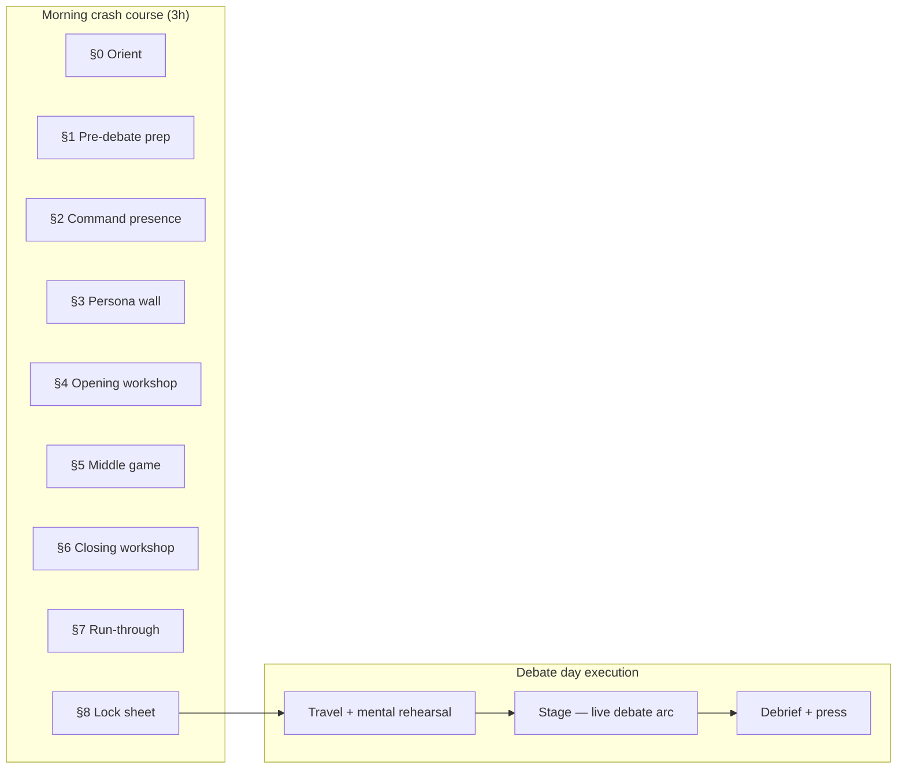

# Kelly debate prep — Day 8 crash course build plan

**Doc ID:** KELLY-DP-D8-CRASH  
**Lane:** `RedDirt/` only  
**Status:** **Audible** — candidate behind on Days 1–7; Day 8 reframed as **3-hour standalone morning course** before debate execution  
**Created:** 2026-06-23  
**Calendar:** Thursday · **2026-06-26** · APA Annual Press Convention · Eureka Springs  
**Goal:** One linear, section-by-section course that **compacts the whole week** into **180 minutes** — structured like a **real debate**, audience shifted from **clerk forum** to **Arkansas people**, with **opening/closing construction + delivery** and **Command Mode** baked into every section.

---

## Executive summary — why this audible

| Reality | Response |
|---------|----------|
| Kelly did not run the full 7-day pathway faithfully | Do **not** assign catch-up homework tonight — **one morning, one path** |
| First forum was **ACCA / clerk-room** framing | This debate is **APA statewide broadcast** — voters, press, validators in living rooms |
| Days 1–7 exist as deep drill-down | Day 8 **imports** them — no new research, no admin detours on the Kelly path |
| Debate is **same calendar day** | **AM:** 3-hour crash course · **PM:** travel → stage → debrief (existing Command Mode execution) |

**Kelly success test (Day 8 AM):** She completes all **9 sections** in order (or **minimum path** §8 in 90 min), delivers **one timed opening (90s)** and **one timed closing (60s)** aloud, runs **one abbreviated debate run-through**, and leaves with a **one-page lock sheet** — green lines only, no new stats.

---

## Audience shift — clerks → Arkansas people

### What changed since the forum

| ACCA clerk forum (Days 1–4 spine) | APA debate (Day 8 frame) |
|-----------------------------------|---------------------------|
| Peer-to-peer with election professionals | **Explain** clerk reality to voters who never run a polling site |
| “Implementation burden,” mandates, funding | **Why that burden matters to your ballot** |
| Carol W. / Linda S. as primary “picture in the room” | **Marcia T., Robert K., Diane P., Rev. James H.** in living rooms — Carol/Linda still watching, grading tone |
| Technical correctness wins | **Calm competence + one quotable line** wins the broadcast |

### Frame copy (product constant — `DAY8_ARKANSAS_PEOPLE_FRAME`)

> The clerk forum was your job interview with the people who run elections. **Today’s debate is your job interview with Arkansas.** Same facts — different translation. Clerks belong **inside** your answers; voters and press belong **in front of** your eyes when you speak.

Carry forward `DAY5_APA_STATEWIDE_BROADCAST_FRAME` and `DAY6_APA_SIM_FRAME` — Day 8 does not replace them; it **re-centers the persona wall** for the statewide audience.

---

## Persona cast — who Kelly pictures in each section

Use existing voter-audience models (`kelly-voter-audience-models.json`). **Do not invent new personas** — assign **section anchors** so every practice line has a face.

| Persona | Segment | Day 8 role | Speak-to note |
|---------|---------|------------|---------------|
| **Marcia T.** | Lane 2 recovery Democrat | **Default “living room” viewer** | Suburban LR — competence, not slogans; opening beat 2 lands here |
| **Robert K.** | Moderate Republican open door | **NWA / business persuasion** | Steady administrator; not asking him to leave his party |
| **Diane P.** | Direct democracy defender | **Ozarks / petition culture** | Carroll corridor; transparent rules; Hammer petition friction **without motive smear** |
| **Rev. James H.** | Faith & community anchor | **Access & dignity** | Voter suppression dressed as reform — partner, don’t preach |
| **Bill J.** | Election skeptic | **Process transparency** | Show audits and observers — no dunks, no “stolen election” |
| **Carol W.** | Election professional | **Validator in the back row** | Still grading — peer respect when you mention clerks |
| **Frank D.** | Ozarks retiree | **Eureka geography** | Tourism county civics — calm, local, not performative |

**Section 3 product requirement:** `ElectionPlanDay8PersonaWallPanel` — six chips, one “primary speak-to” selector Kelly toggles before each rep. Default: **Marcia T.**

**Norris / primary crossover (brief only — no unsourced claims):** Where location briefs already show Norris strength + Direct Democracy / transparency alignment, Section 5 SOS prompts include **one optional hook** per persona: “picture the voter who agreed with Norris on access but distrusts Capitol mandates.” Pull numbers from **existing** county cards only — never invent turnout stats in Day 8 copy.

---

## Week compaction map — what each day feeds Day 8

| Day | Theme | Day 8 section(s) | Import — do not re-teach |
|-----|-------|------------------|---------------------------|
| **1** | Command foundation | §2 Command presence · §4 opening beat 1 | Breath protocol, author vs administrator, 90s opening draft |
| **2** | Read the table | §5 trap responses | Hammer tells (authorship, ranking, mandate), Pakko pivot, trap lanes 1–2 |
| **3** | Superiority map | §4 opening beats 2–3 · §5 SOS | Qualification stack (3 pillars), claims-green superiority lines |
| **4** | Forum intelligence | §5 moderator Q&A | Forum notecard, predicted lines, green capitalize triggers |
| **5** | Anticipate & capitalize | §5 when-X-say-Y · §7 run-through | 8 timed pairs, trap lanes 3–6, APA broadcast tone |
| **6** | Full simulation | §7 run-through · §6 closing beat 2 | Sim debrief top-3 fixes, dress-rehearsal segment order |
| **7** | Refine & steal show | §1 lock sheet · §4/§6 bookends | Opening/closing polish, quotable lock-in, claims final cut |

**Hard rule:** Day 8 **surface loader** (`load-day8-crash-course-surface.ts`) merges the above — Kelly never navigates back to seven day landings during the 3-hour block.

---

## Debate anatomy — structural model for the course

Day 8 sections mirror **stage time order**, not study-day order. This is the spine Kelly memorizes:

### Live debate arc (stage — what §7 rehearses)

| Stage segment | ~time | Kelly job | Week source |
|---------------|-------|-----------|-------------|
| **Backstage / mic check** | pre-show | Three safe lines only; breath once | §1 ritual |
| **Walk-on & first impression** | 0:00 | Feet planted; scan room; **picture Marcia T.** | §2 Command Mode |
| **Opening statement** | 90s | Administrator → qualification → Arkansas promise | §4 |
| **Listen — opponents speak** | variable | Eyes on speaker; no reactive face; notes forbidden | §2 scan drill |
| **Rebuttal / exchange windows** | variable | When-X-say-Y — **no new stats** | §5 pairs |
| **Moderator questions** | fast | SOS bank — 90s cap; clerk detail **translated** for voters | §5 SOS |
| **Trap / pile-on** | stress | Bridge to clerks → rise to statewide tone | Day 5 pile-on |
| **Closing statement** | 60s | Peak-end — clerk invoke + one quotable | §6 |
| **Leave the stage** | post | Same calm as walk-on; staff handles press | §8 debrief preview |

---

## 3-hour section-by-section curriculum (180 minutes)

**Design principles**

- **One scroll, one pathway** — nine sections, numbered, no optional admin links on minimum path  
- **Speak-aloud every section** — no passive reading > 5 minutes  
- **Timer visible** on opening, closing, and SOS reps  
- **Claims gate on every section** — green lines only; Day 7 claims final cut is the ceiling  

### §0 · Start here — today’s job (10 min)

| Beat | Activity | Outcome |
|------|----------|---------|
| 0.1 | Read **audible card**: “You’re behind. This course is the whole week.” | Emotional safety — adult learning |
| 0.2 | Read `DAY8_ARKANSAS_PEOPLE_FRAME` | Audience shift internalized |
| 0.3 | Preview **9 sections** + PM debate timeline | No surprises |
| 0.4 | Choose **minimum (90 min)** or **full (180 min)** path toggle | Manages fatigue |

**Success check:** Kelly can name **three things** she will **not** do today (new research, new stats, opponent motive attacks).

---

### §1 · Pre-debate prep — what happens before the mic (15 min)

*Replaces “morning ritual” fluff with structural checklist.*

| Beat | min | Activity | Source |
|------|-----|----------|--------|
| 1.1 | 5 | **Lock sheet preview** — staff-approved lines only | Day 7 claims final + quotable lock |
| 1.2 | 5 | **Implementation intentions** — three if-X-then-Y cards (breath, pile-on, bad question) | Day 8 psych principle |
| 1.3 | 5 | **Physical readiness** — hydrate, voice, no new content ingestion | `b8-morning` |

**Kelly lines to memorize (not write):**

1. If Hammer says “I wrote the law” → administrator pivot (Day 1).  
2. If pile-on → clerk bridge, rise to tone (Day 5).  
3. If moderator rushes → “The clerks deserve a complete answer” + 90s cap.

---

### §2 · Command presence — body before words (20 min)

*Day 1 compressed — no philosophy lecture.*

| Beat | min | Activity | Source |
|------|-----|----------|--------|
| 2.1 | 8 | **4-4-6 breath × 3** + mic pause drill | Day 1 `b1-posture` |
| 2.2 | 7 | **Scan protocol** — moderator · opponents · camera · **one persona chip** | Day 2 coaching geometry |
| 2.3 | 5 | **Listen face** — staff reads Hammer bait; Kelly still body | Command Mode |

**Success check:** Two breath cycles without notes; scan names **four points** in room order.

---

### §3 · Persona wall — who is listening (15 min)

| Beat | min | Activity | Source |
|------|-----|----------|--------|
| 3.1 | 8 | **Persona wall UI** — read six cards; pick **primary speak-to** | voter-audience models |
| 3.2 | 7 | **Translation drill** — one clerk sentence → one voter sentence (×3) | ACCA → APA shift |

**Example translation (template only):**

- Clerk room: “Unfunded mandates land on Friday rule drops.”  
- Arkansas people: “When Little Rock passes a rule without paying for it, **your county clerk** eats the cost — and **your ballot** waits.”

**Success check:** Kelly completes **three translations** aloud; primary persona set for the day.

---

### §4 · Opening statement — construct & deliver (30 min)

*First integrated **construction** module — not just polish.*

#### Construction template (90 seconds · three beats)

| Beat | sec | Construct | Deliver |
|------|-----|-----------|---------|
| **A** | 0–30 | **Administrator frame** — SOS as operations; no opponent names | Day 1 `rehearse-opening-90s` |
| **B** | 30–60 | **Qualification proof** — three pillars in **one breath each** | Day 3 qualification stack |
| **C** | 60–90 | **Arkansas promise** — clerks + voters; picture **primary persona** | Day 4 forum tone + Day 5 APA frame |

#### Workshop flow

| Beat | min | Activity |
|------|-----|----------|
| 4.1 | 8 | Read construction template + **claims gate** |
| 4.2 | 7 | **Build on paper** — three beats only; staff verifies green |
| 4.3 | 10 | **Deliver rep 1** — timer 90s; log weak beat |
| 4.4 | 5 | **Deliver rep 2** — fix one beat only |

**Do-not list:** New stats · opponent names in opening · clerk jargon without translation.

**Success check:** One opening **≤90s** that passes claims gate; Kelly names which persona beat C targets.

---

### §5 · Middle game — listen, traps, moderator Q&A (45 min)

*The debate “middle” — where unprepared candidates lose.*

| Block | min | Activity | Week import |
|-------|-----|----------|-------------|
| 5.1 Listen | 8 | Opponents speak — Kelly **silent scan**; staff logs one tell each | Day 2 tells |
| 5.2 Traps | 15 | **Four when-X-say-Y reps** (lanes 1–2 + two from Day 5 sheet) | Days 2 + 5 |
| 5.3 SOS | 15 | **Three moderator questions** · 90s each · **voter translation** in last 20s | Day 4 SOS bank |
| 5.4 Pile-on | 7 | One cold pile-on pivot | Day 5 `ex5-pileon` |

**SOS question themes (map to personas — use existing bank IDs, do not invent questions):**

| Theme | Persona hook | Kelly lane |
|-------|--------------|------------|
| Election integrity definition | Bill J. — process | Clerk-centered concrete |
| Direct democracy / petitions | Diane P. | Transparent rules; fair admin |
| Funding / mandates | Carol W. + Marcia T. | Implementation dollars |
| Business services / UCC | Robert K. | Administrator competence |
| Access / faith communities | Rev. James H. | Registration partners, not pandering |

**Success check:** Four trap pairs **under 60s**; three SOS answers **under 90s** with voter translation.

---

### §6 · Closing statement — construct & deliver (25 min)

*Peak-end rule — papers remember the last calm minute.*

#### Construction template (60 seconds · three beats)

| Beat | sec | Construct | Source |
|------|-----|-----------|--------|
| **1** | 0–20 | **Clerk invoke** — who runs elections | Day 7 `d7-close` |
| **2** | 20–40 | **One fix from sim** — single sentence | Day 6 debrief import |
| **3** | 40–60 | **Quotable close** — one breath pause before last word | Day 7 quotable lock |

#### Workshop flow

| Beat | min | Activity |
|------|-----|----------|
| 6.1 | 7 | Read closing template + peak-end frame |
| 6.2 | 8 | Import **one** debrief fix into beat 2 (no rewrite) |
| 6.3 | 10 | **Two timed reps** — 60s hard stop |

**Success check:** Closing ends on **clerk invoke**, not agree-only; quotable line staff-cleared.

---

### §7 · Abbreviated debate run-through (22 min)

*Day 6 sim **compressed** — speak-aloud only, no video.*

| Segment | min | Label |
|---------|-----|-------|
| 7.1 | 2 | Walk-on + breath |
| 7.2 | 2 | Opening 90s |
| 7.3 | 4 | Staff: Hammer authorship bait → Kelly trap |
| 7.4 | 4 | Staff: Pakko libertarian line → Kelly pivot |
| 7.5 | 6 | Moderator: **two** SOS questions timed |
| 7.6 | 2 | Pile-on cold |
| 7.7 | 2 | Closing 60s |

**UI:** `ElectionPlanDay8CrashRunPanel` — segment timer + persona banner + “translate for Arkansas” nudge on SOS segments.

**Success check:** Full arc complete without stopping for research; **one** fix logged for post-debate debrief.

---

### §8 · Lock sheet & handoff to debate day (8 min)

| Beat | min | Activity |
|------|-----|----------|
| 8.1 | 3 | Export **lock sheet** — opening beats, 4 trap pairs, 3 SOS, closing, quotable |
| 8.2 | 3 | Read **PM protocol** — travel rehearsal, backstage once, debrief strip |
| 8.3 | 2 | Evening success check aloud |

**PM blocks (unchanged from intensive calendar — execution only):**

| Block | min | Activity |
|-------|-----|----------|
| `b8-travel` | 60 | Silent opening run-through in car |
| `b8-stage` | 120 | Live debate — Command Mode active |
| `b8-debrief` | 45 | Capture what worked; APA LTE within 48h |

---

## Minimum path (90 minutes) — if she fades

| Order | Section | min |
|-------|---------|-----|
| 1 | §0 Orient | 5 |
| 2 | §2 Command presence | 15 |
| 3 | §3 Persona wall (3 personas only) | 10 |
| 4 | §4 Opening — one rep only | 20 |
| 5 | §5 Traps ×2 + SOS ×2 | 25 |
| 6 | §6 Closing — one rep | 10 |
| 7 | §8 Lock sheet | 5 |

Roll §7 full run-through to **car rehearsal** (`b8-travel`).

---

## Five-pass engineering build (election-plan portal)

Work **one pass at a time** — same bar as Days 1–7.

### Pass 1 — Pathway spine & registry

**Theme:** `DAY8_ID` exists; nine sections navigable.

| Artifact | Notes |
|----------|-------|
| `day8-learning-pathway.ts` | 9 steps mirroring §0–§8 |
| `debatePrepDay8Registry.ts` | Section IDs, minutes, week-import tags |
| `debate-prep-day8-release.ts` | `pass1` |
| Extend `debatePrepDayDrillDown.ts` | `DAY8_ID = "day-8-command-mode-debate"` |
| `test-debate-prep-day8-pathway.ts` | 9 steps · 180 min total |

**Exit:** Static params + day landing renders.

---

### Pass 2 — Section study guides & crash surface loader

**Theme:** Phased study for each section; week content merged.

| Artifact | Notes |
|----------|-------|
| `debatePrepDay8BlockStudy.ts` | 9 section studies (rename “blocks” → “sections” in UI) |
| `debate-prep-day8-crash-copy.ts` | Frames, templates, claims gates |
| `load-day8-crash-course-surface.ts` | Pull Day 1–7 artifacts by import map above |
| `debate-prep-day8-run-segments.ts` | §7 segment shape (reuse Day 6 types) |

**Exit:** Every section has ≥2 phases + claimsGate; loader returns opening/closing/trap/SOS bundles.

---

### Pass 3 — Linear pathway UI — “course mode”

**Theme:** Single-scroll **course** feel — not seven-day hub chaos.

| Artifact | Notes |
|----------|-------|
| `ElectionPlanDay8CrashCoursePanel.tsx` | Section list + progress + minimum/full toggle |
| `ElectionPlanDay8ContinueButton.tsx` | Section-to-section |
| `ElectionPlanDay8PathwayProgressBar.tsx` | 9 segments |
| Wire day landing + subnav **Day 8** tab | |
| `isKellyDay8CrashCoursePath()` | Hides non-essential drill-down on day landing |

**Exit:** Kelly can complete §0→§8 without leaving pathway.

---

### Pass 4 — Interactive panels

**Theme:** Construction + run-through UI.

| Panel | Section |
|-------|---------|
| `ElectionPlanDay8PersonaWallPanel.tsx` | §3 |
| `ElectionPlanDay8OpeningWorkshopPanel.tsx` | §4 — beats A/B/C + timer |
| `ElectionPlanDay8MiddleGamePanel.tsx` | §5 — trap + SOS tabs |
| `ElectionPlanDay8ClosingWorkshopPanel.tsx` | §6 |
| `ElectionPlanDay8CrashRunPanel.tsx` | §7 |
| `ElectionPlanDay8LockSheetPanel.tsx` | §8 — printable/export local |
| `ElectionPlanDay8Panels.tsx` | Server embed router |

Wire into section routes (reuse block phase routes with `s8-*` IDs).

**Exit:** Opening/closing workshops timer-tested; lock sheet exports.

---

### Pass 5 — Hub, parity, v1.0.0

**Theme:** Production sign-off.

| Task | Detail |
|------|--------|
| Hub | `debatePrepHubPrimaryDayId("2026-06-26")` → `DAY8_ID`; tonight focus promotes crash course AM |
| Release | `day-8-crash-course-v1.0.0` |
| System v8 | Bump patch tag |
| Parity | Extend `test-debate-prep-day-parity.ts` — Day 8 section count, persona panel, 180 min |
| Intensive calendar | Update `debateWeekIntensive2026.ts` — `hoursTarget: 3`, blocks align §0–§8 AM + PM execution |

**Exit:** Hub + parity + Netlify green.

---

## Claims & content gates (non-negotiable)

- **No new stats** on Day 8 — Day 7 claims final cut is the ceiling  
- **No opponent motive attacks** — job-fit contrast only  
- **Forum quotes** — same green status as Day 4 notecard  
- **Norris / primary numbers** — county cards only; no invented crossover claims  
- **Personas** — fictional planning profiles; not voter-file PII  

---

## Pass log

| Pass | Date | Commit | Notes |
|------|------|--------|-------|
| Plan | 2026-06-23 | — | Audible documented; awaiting Pass 1 build |
| 1 | 2026-06-23 | — | Pathway spine + 9 sections |
| 2 | 2026-06-23 | — | Three SOS domains, crash surface loader, full block study |
| 2 | | | |
| 3 | | | |
| 4 | | | |
| 5 | | | |

---

## Related docs

- [`KELLY_DEBATE_PREP_DAY_6_FIVE_PASS_PLAN.md`](./KELLY_DEBATE_PREP_DAY_6_FIVE_PASS_PLAN.md) — sim segment shape, bookends UI precedent  
- [`KELLY_DEBATE_PREP_DAY_7_FIVE_PASS_PLAN.md`](./KELLY_DEBATE_PREP_DAY_7_FIVE_PASS_PLAN.md) — polish + lock sheet (if present)  
- `src/lib/intelligence/v4/debateWeekIntensive2026.ts` — calendar Day 8 blocks  
- `data/campaign-brain/kelly-voter-audience-models.json` — persona source  
- `src/lib/election-plan/debate-prep-day5-anticipate-copy.ts` — APA statewide frame
