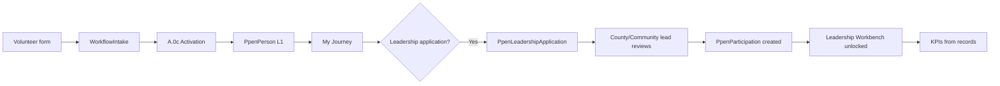

# Leadership Workbench Architecture

> **Status:** Planning inventory only — **do not implement** until Sherwood + Jacksonville pilot smoke passes and PPEN A.0b + A.0c ship together.  
> **Registry:** `data/campaign-brain/leadership-workbench-registry.source.json`  
> **Lane:** RedDirt / election-plan / PPEN doctrine only

---

## Why this layer exists

Community Workbench v1–v4 gave us **places** (city, county, coalition, CCH, SMOS) and **slots** (leadership rows, events, field log). What we do not yet have is a **job-specific command surface** for each person after they are placed in a role.

Onboarding without execution leaves leaders asking: *What do I do Monday? Who are my people? What proves I'm winning? What's overdue?*

**Leadership Workbenches** are the bridge:

```text
Website volunteer form → Activation (A.0c) → Person + Participation (A.0b) → Leadership placement → Leadership Workbench
```

Each workbench answers six questions on every login:

```text
Who owns this?
What are they supposed to do?
Who are their people?
What numbers prove progress?
What is overdue?
What needs escalation?
```

---

## Not one generic dashboard

**Wrong:** One "Leader Dashboard" with cards that mix county, city, event, and coalition KPIs.

**Right:** Ten workbench **types**, each with the same shell but **role-specific** duties, KPIs, people lists, and connected surfaces.

| # | Workbench type | Primary user |
|---|----------------|--------------|
| 1 | County Leadership | County chair / county captain |
| 2 | Volunteer Leadership | Volunteer lead / captain |
| 3 | Community Leadership | City/community lead |
| 4 | Event Leadership | Event chair / committee |
| 5 | Voter Engagement | Help 10 / registration / vote-plan team |
| 6 | Network Growth / My Five | Every participant + lead rollups |
| 7 | Coalition Leadership | Coalition / cultural outreach leads |
| 8 | Communications Leadership | CCH / Substack / social coordination |
| 9 | Media Creator | Writers, photographers, editors |
| 10 | Training / Onboarding | Onboarding managers |

Full KPI and role detail: **registry JSON** (`workbenchTypes[]`).

---

## Shared shell (every leadership workbench)

Every type uses the same navigation skeleton so operators learn once:

```text
Overview
Role Description
Current Leader
Deputy / Backup
Responsibilities
KPI Dashboard
Task Board
People List
Calendar
Training
Documents
Notes
Reports
Escalations
```

**Principle 1 (data integrity):** KPI Dashboard shows **record counts only**. Planning targets (hosts, VIP tables, chapter vote targets) stay in separate panels — never mixed into live KPI bars.

---

## PPEN alignment

Leadership Workbenches sit on the **Participant Layer** (OS Layer 1):

| PPEN object | Leadership Workbench use |
|-----------|-------------------------|
| **Person** | Current Leader, People List, activation |
| **Participation** | Role placement per county / community / coalition / event / comms |
| **Relationship** | My Five, Help 10, local relationships |
| **Impact** | Because-of-you rollups on reports |

**Access levels L1–L6** gate which workbench types a user sees:

| Level | Typical leadership surfaces |
|-------|----------------------------|
| L1 Participant | My Journey, own My Five / Help 10 |
| L2 Leader | Community, Event, Volunteer, Coalition, Creator workbenches |
| L3 County | County Leadership Workbench |
| L4 Regional | Multi-county rollups |
| L5 State | CCH hub, SMOS hub, statewide programs |
| L6 Executive | War room, escalations, cross-workbench reports |

**Hard gate:** No PPEN Prisma models until pilot smoke green (`COMMUNITY_WORKBENCH_PPEN_ROADMAP.md`).

---

## What exists today (RedDirt lane)

### Partially live

| Surface | What works | What's missing |
|---------|------------|----------------|
| **Community Workbench** | 8 leadership roles, events, field log, relationships, record counts | Dedicated Leadership nav; My Five / Help 10 sections; PPEN people |
| **County Workbench v4** | Leadership mapping, OPEN slots, pipeline framework | PPEN counts (hard-zero); 3 strike roles not in UI |
| **Event ops panel** | `leadName`, assignments, run of show, AAR | Not branded "Event Leadership Workbench"; G&G not seeded as DB event |
| **Coalition / SMOS / CCH** | 12 + 27 + 7 workbench shells, framework slots | Creator/comms KPI records; leadership placement |
| **Field log** | `ElectionPlanFieldEntry` rollups | Not merged into Person layer |
| **Voter contact** | Quitman capture path live | Not linked to Participation |

### Interim JSON (until PPEN)

- `data/campaign-brain/county-strike-teams.json` — 9 roles × 75 counties  
- `CommunityWorkbenchLeadership` — name strings per workbench  
- Planning JSON (`win-sherwood-operation.json`, numeric targets) — **must not** feed live KPI dashboards

### Known integrity violation to fix in B.2

War room still surfaces Sherwood volunteer count from **planning JSON**, not field records. Event Leadership workbench + data-integrity pass must remove this.

---

## Workbench type summaries

### 1. County Leadership Workbench

**Who:** County chair, county captain, strike team leads.  
**Route:** `/election-plan/counties/{countySlug}` (v4 ops panel → future dedicated `#leadership-workbench`).

**Owns:** County leadership slots, county goals (planning), child community workbenches, county calendar, volunteer pipeline, relationships, intel.

**KPIs (record-backed when live):**

- Leadership roles filled → `CommunityWorkbenchLeadership` + strike team `assigned`  
- Active volunteers → field entry + PPEN Person  
- Events scheduled → `CommunityWorkbenchEvent`  
- My Five / Help 10 → PPEN Relationship (post A.0b)  
- County contact universe → `ElectionPlanVoterContact` + Person  
- Overdue follow-ups → relationships + voter contact status  

**Strike roles today:** 6 in v4 UI + 3 missing (postcard, phone, canvass, candidate liaison in JSON only).

---

### 2. Volunteer Leadership Workbench

**Who:** Volunteer Lead, Volunteer Captain, shift captains.  
**Owns:** Onboarding, active list, shifts, training, retention, assignments.

**KPIs:** new signups, activated accounts, trained volunteers, assigned, hours, inactive needing follow-up.

**Connected:** Community `volunteer_lead` slot, county pipeline, event assignments, training workbench.

---

### 3. Community Leadership Workbench

**Who:** Community Lead and the 8 `COMMUNITY_LEADERSHIP_ROLES` (`constants.ts`).  
**Route:** `/election-plan/workbenches/{slug}` — **this is the current Community Workbench**, to be extended with Leadership shell sections.

**Owns:** City plan, local events/leaders/relationships, community goals (Quitman #41 bonus KPIs isolated).

**KPIs:** leadership filled, events completed, relationships, local volunteers (field log), My Five / Help 10 rollups.

---

### 4. Event Leadership Workbench

**Who:** Event chair, committee, assignment owners — **not** city community leads.

**Critical doctrine fix — Sherwood:**

```text
Sherwood Community Workbench
├── Community Leadership (8 roles)     ← city/org leadership ONLY
└── Events
    └── Grassroots & Guitar Strings    ← Event Chair, committee, hosts HERE
```

- **Grassroots & Guitar Strings** leadership lives on **`CommunityWorkbenchEvent`**, not `community_lead`.  
- Co-chairs (John Duke, Jay Powell) and ops lead (Steve Grappe) are **event metadata** in `win-sherwood-operation.json` until seeded as event participation records.  
- **Event hosts ≠ house-party hosts** — house parties roll up via field entry category `house_party`.

**KPIs:** event status, roles filled, expected/actual attendance, volunteers assigned, post-event follow-ups.

**Route target:** `/election-plan/workbenches/{slug}/events/{eventId}` (extends existing Event Ops panel).

---

### 5. Voter Engagement Workbench

**Who:** Help 10 team, registration verification, polling support, vote-plan coaches.

**Owns:** Help 10 Participate records (distinct from My Five), registration verification, polling info, vote plans, nonpartisan election info.

**KPIs:** submitted, contacted, registration verified, polling info sent, vote plans completed, unresolved cases.

**Doctrine:** "Help 10 People **Participate**" — not "Register 10 Voters."

---

### 6. Network Growth / My Five Workbench

**Who:** Every participant (My Journey home) + leads viewing rollups.

**Owns:** 5/5 relationship completion, direct/gen-2/gen-3 recruits, network impact.

**Not an org-chart slot:** Power of 5 multiplication is **doctrine + journey track**, not a `COMMUNITY_LEADERSHIP_ROLES` key.

---

### 7. Coalition Leadership Workbench

**Who:** Coalition leads per culturally specific workbench.

**Priority coalitions (registry):** African American, Hispanic, Muslim (incl. women's pathway), Youth, Veterans, Labor, Educators, Disability, Faith, Small Business.

**Instance source:** `coalition-workbenches.registry.source.json` — 12 workbenches already in `CommunityWorkbench` with `kind: coalition`.

**KPIs:** pathway slots filled, trusted messengers, coalition events, orgs mapped, volunteer conversions.

---

### 8. Communications Leadership Workbench

**Who:** Comms Lead, Editor, Publisher, Kelly (approver).

**Owns:** Kelly source posts → Substack canonical → platform adaptations (SMOS) → publish.

**Instance source:** 7 CCH workbenches (`campaign-communications-workbenches.registry.source.json`).

**KPIs:** drafted, approved, published, replies needing response, platform adaptations, creator tasks.

**Min access:** L5 state (Kelly + comms team).

---

### 9. Media Creator Workbench

**Who:** Writers, photographers, videographers, editors, graphic designers.

**Owns:** Uploads, story intake, assignments, drafts, approvals.

**Instance source:** SMOS registry — Content Studio, Media Library, Story Corps, platform workbenches.

**KPIs:** assets uploaded, drafts, stories collected, approved, published.

---

### 10. Training / Onboarding Workbench

**Who:** Onboarding managers, training leads, L2 reviewers.

**Owns:** Activation pipeline (`ppen-participant-framework.source.json` → `intakeActivationPipeline`), L1 grants, L2 onboarding, certifications.

**KPIs:** signups, activations, onboarding completed, L2 candidates, trainings overdue.

**Front door:** Website volunteer form → WorkflowIntake → A.0c → Person → My Journey.

---

## Role inventory (cross-cutting)

### Community roles (8)

`community_lead`, `deputy_lead`, `volunteer_lead`, `events_lead`, `faith_lead`, `business_lead`, `youth_lead`, `data_lead`

### County strike roles (9)

`countyCaptain`, `volunteerCaptain`, `faithCaptain`, `postcardCaptain`, `phoneBankCaptain`, `canvassCaptain`, `eventsCaptain`, `mediaCaptain`, `candidateLiaison`

### Event assignment roles (7)

Registration table, AV team, Greeters, Media, Security, Food, Cleanup

### Participation contexts (PPEN)

`county`, `community`, `coalition`, `event_committee`, `comms`, `program`

---

## Record backing matrix

| KPI family | Record source (target) | Live today? |
|------------|------------------------|-------------|
| Leadership filled | `CommunityWorkbenchLeadership`, strike JSON, `PpenParticipation` | Partial |
| Volunteers active | `ElectionPlanFieldEntry`, `PpenPerson` | Partial |
| Events | `CommunityWorkbenchEvent` | Yes |
| My Five / Help 10 | `PpenRelationship` | No — show 0 / hidden until A.0b |
| Contacts | `ElectionPlanVoterContact`, `PpenPerson` | Partial (Quitman) |
| Comms / media pipeline | `CchContentRecord`, `SmosContentRecord` (planned) | No |
| Training | `PpenTrainingCompletion` (planned) | No |

**Rule:** If `liveToday: false` in registry, UI shows **0 with drill-down disabled** or **"Awaiting PPEN"** — never fake numbers.

---

## Build order (do not skip)

```text
A.0   Pilot smoke — Sherwood + Jacksonville (#pilot-smoke)
A.0b  Person + Participation + L1–L6 access
A.0c  Volunteer intake → activation → My Journey
B.1   County + Community Leadership Workbench shells (extend existing)
B.2   Volunteer, Event, Coalition, Training (+ seed G&G as Sherwood event)
B.3   Voter Engagement + My Five rollups
B.4   Communications + Media Creator leadership views
```

---

## Assignment flow (target state)



**Interim:** `CommunityWorkbenchLeadership.personName` and strike JSON remain editable until Participation sync replaces duplicate strings.

---

## Connected surfaces map

```text
War Room (executive view — rollups only, drill to workbenches)
├── County Leadership → /election-plan/counties/{slug}
├── Community Leadership → /election-plan/workbenches/{city}
├── Coalition → /election-plan/workbenches?kind=coalition
├── CCH → /election-plan/workbenches?kind=communications
├── SMOS → /election-plan/workbenches?kind=media
└── My Journey (participant home — post A.0c)

County v4 ──feeds──► County Leadership Workbench
Community Workbench ──feeds──► Community + Event Leadership
Quitman capture ──feeds──► Voter Engagement + Community people list
```

---

## Hard rules (non-negotiable)

1. **No fake counts** — zeros until records exist.  
2. **No placeholders presented as live** — framework slots show OPEN, not "3 volunteers."  
3. **Event leaders ≠ city leaders** — enforce on Sherwood G&G immediately in B.2.  
4. **Event hosts ≠ house-party hosts** — separate field categories and UI copy.  
5. **Active volunteers from participant records** — not `win-sherwood-operation.json`.  
6. **Every KPI drills to records** — click count → filtered people/event/task list.  
7. **Power of 5 Lead is not a role key** — use My Five journey + field category `leader` if needed.

---

## Next pass for Burt (when build starts)

1. Read registry JSON — confirm role keys match your org chart conversations.  
2. Run pilot smoke — document blockers in defect log.  
3. Implement A.0b + A.0c together — Person before Leadership Workbench KPIs.  
4. Extend `CommunityWorkbenchShell` nav with shared Leadership sections (don't fork 10 UIs).  
5. Seed **Grassroots & Guitar Strings** as `CommunityWorkbenchEvent` on Sherwood workbench.  
6. Remove war-room Sherwood volunteer count from planning JSON.  
7. Wire `leadership-workbench-registry.source.json` loader (mirror coalition registry pattern).

---

## Related docs

- `docs/ELECTION_PLAN_OPERATING_SYSTEM_DOCTRINE.md`  
- `docs/ELECTION_PLAN_DATA_INTEGRITY_DOCTRINE.md`  
- `docs/PPEN_A0B_PARTICIPANT_IDENTITY_LAYER.md`  
- `docs/PPEN_A0C_VOLUNTEER_INTAKE_ACTIVATION.md`  
- `docs/COMMUNITY_WORKBENCH_PPEN_ROADMAP.md`  
- `docs/COALITION_COMMAND_WORKBENCH_MIGRATION.md`  
- `docs/COUNTY_WORKBENCH_V4_DOCTRINE.md`  
- `docs/COMMUNITY_WORKBENCH_V1_3_PILOT.md`
