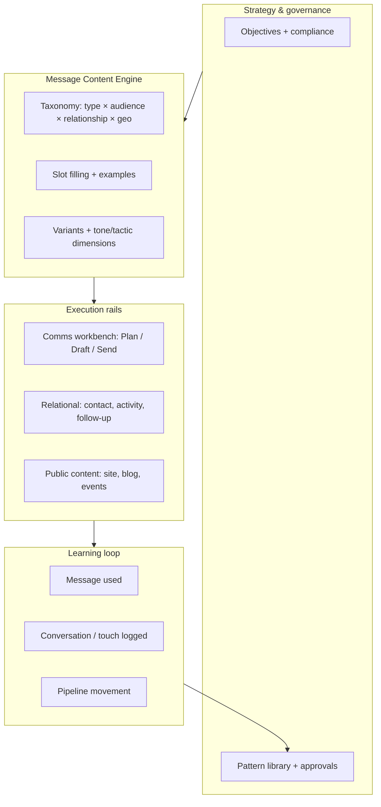

# Message Content Engine — system plan (RedDirt)

**Lane:** `H:\SOSWebsite\RedDirt` only.  
**Status:** **Architecture + product vocabulary** — planning document; **no feature implementation** required from this file alone.  
**Date:** 2026-04-27.  
**Cross-ref:** [`POWER_OF_5_RELATIONAL_ORGANIZING_SYSTEM_PLAN.md`](./POWER_OF_5_RELATIONAL_ORGANIZING_SYSTEM_PLAN.md) · [`MESSAGE_SYSTEM_LANGUAGE_AUDIT_REPORT.md`](./MESSAGE_SYSTEM_LANGUAGE_AUDIT_REPORT.md) · [`communications-unification-foundation.md`](./communications-unification-foundation.md) · [`message-workbench-analysis.md`](./message-workbench-analysis.md) · [`audits/DASHBOARD_HIERARCHY_COMPLETION_AUDIT.md`](./audits/DASHBOARD_HIERARCHY_COMPLETION_AUDIT.md)

---

## 1. System vision

The **Message Content Engine (MCE)** is the campaign’s **structured layer for what we say** in relational and public-facing organizing: **reusable, governable message patterns** that connect **human intent** (strategy, narrative, compliance) to **channel outputs** (talking points, scripts, SMS/email drafts, in-person openers) **without** exposing voter microtargeting or surveillance vocabulary to volunteers or the public.

**North star:**

| Pillar | Meaning |
|--------|---------|
| **One intent, many surfaces** | A single *message unit* (or *plan-linked bundle*) can spawn channel-specific copy while preserving objective, audience posture, and geography context — aligned with COMMS-UNIFY-1 (`CommunicationPlan` → `CommunicationDraft` / variants). |
| **Relational-first** | Default use case is **trusted conversation**: the engine suggests *how to open, bridge, listen, and follow up* — not bulk persuasion spam. |
| **Honest segmentation** | Audience and relationship types describe **posture and context**, not hidden scores shown to field users. |
| **Geography as story, not dossier** | State → precinct inform *local examples and invites*, not public voter-file browsing. |
| **Feedback closes the loop** | Using a message, logging a conversation, and recording outcomes feeds **pipeline health** and **content quality** — aggregate and permissioned. |

**What MCE is not:** a public “AI” product, a voter search tool, or a replacement for counsel-approved legal/finance copy. **Public vocabulary** follows [`MESSAGE_SYSTEM_LANGUAGE_AUDIT_REPORT.md`](./MESSAGE_SYSTEM_LANGUAGE_AUDIT_REPORT.md) (e.g. **message support**, **conversation tools**, **organizing insights**).

---

## 2. Public vocabulary

**Visitor- and volunteer-facing terms (preferred):**

| Use | Avoid in public UI |
|-----|---------------------|
| Message support / conversation tools | “AI,” vendor names, “automated intelligence” |
| Organizing insights / field intelligence | Microtargeting, propensity, “persuasion score” |
| Talking points / openers / follow-up prompts | Internal segment codes, raw list names |
| Local story / bridge / listening prompt | Surveillance or shaming framing |
| Semantic index (where technical) | Exposing env vars or model names in errors |

**Staff/admin:** may use operational labels (plan, draft, segment, objective) inside **`/admin`**; glossary should map **Plan** vs **Campaign** vs **Thread** per [`communications-unification-foundation.md`](./communications-unification-foundation.md).

**Stable product nouns for MCE:**

- **Message pattern** — A typed template (e.g. conversation starter, bridge statement) with slots for geography and relationship.
- **Playbook snippet** — Short, approved block intended for copy/paste or training.
- **Channel package** — The set of drafts under one plan (email, SMS, talking points, phone script, etc.).
- **Outcome tag** — Post-use label (e.g. follow-up needed) for learning loops — **not** a public grade on a person.

---

## 3. Internal architecture

**Conceptual layers:**



**Repo alignment (today — convergence, not big-bang schema):**

| Concern | Home / pattern |
|--------|----------------|
| **Intent container** | `CommunicationPlan` + `CommunicationObjective` — strongest “one effort” object ([`message-workbench-analysis.md`](./message-workbench-analysis.md)). |
| **Channel bodies** | `CommunicationDraft` (`CommsWorkbenchChannel`: talking points, phone script, SMS, email, internal notice, …). |
| **Forks** | `CommunicationVariant` (audience/copy/channel overrides; opaque segment labels in schema). |
| **Execution** | `CommunicationSend` + recipients / events; parallel Tier-2 campaign models — **link by convention** (e.g. `metadataJson` keys) per COMMS-UNIFY-1. |
| **Relational touches** | `RelationalContact`, `OrganizingActivity`-style logs (conceptual in P5 plan; implementation evolves with P5 packets). |
| **Volunteer asks** | `VolunteerAsk` + types — natural consumer for **volunteer ask** and **event invite** patterns. |
| **Public narrative** | Editorial content, blog, county/regional OIS copy — **read-only** consumption of approved snippets where appropriate. |

**MCE-specific logic (future modules — illustrative):**

- `src/lib/message-content-engine/` — taxonomy enums, validators, “pattern + slot” resolution, **no** raw PII in public helpers.
- `src/components/message-content-engine/` — UI for picking patterns, previewing packages, **staff** variant review.
- Optional: metadata conventions on `CommunicationPlan.metadataJson` for `messagePatternIds[]`, `primaryGeography`, `audiencePosture`.

---

## 4. Relationship to Power of 5

Power of 5 defines the **human graph and geography spine** (Individual → Power Team → … → State) and **pipelines** (signup, invite, conversation, follow-up, GOTV, …). MCE **feeds** those pipelines with **language**:

| P5 concept | MCE role |
|------------|----------|
| **My Five / invites** | Conversation starters, bridge statements, listening prompts tuned by **relationship type**. |
| **Conversation log** | Links to **message pattern used** (optional field) for coaching and analytics. |
| **Follow-up queue** | Follow-up and objection-response patterns; leader dashboards surface **next best phrase**, not dossiers. |
| **Missions** | Weekly missions can attach **playbook snippet sets** by region/county. |
| **GOTV** | GOTV asks as governed templates; geography slots pre-filled from assignment, not from public voter lists. |
| **Privacy tiers** | MCE outputs respect P5 privacy tiers (public aggregate vs member vs leader vs organizer). |

**Rule:** MCE **never** becomes the system of record for relationships; P5/relational models own people and activity. MCE owns **reusable content + governance**.

---

## 5. Relationship to county / region / state dashboards

Dashboards ([`audits/DASHBOARD_HIERARCHY_COMPLETION_AUDIT.md`](./audits/DASHBOARD_HIERARCHY_COMPLETION_AUDIT.md)) provide **context and next actions**. MCE connects as follows:

| Surface | MCE connection |
|---------|----------------|
| **State `/organizing-intelligence`** | Statewide narrative + “what to say” links to approved plans/snippets; optional “this week’s message theme” from ops. |
| **Region** | Region-specific **local stories**, peer county bridges, event invites; aligns with `RegionDashboardView` coaching blocks. |
| **County / OIS county placeholder** | County-named examples in patterns; links to public county command where relevant — **no** voter roll in copy generators on public pages. |
| **Personal `/dashboard`** | Pattern picker + “copy for my next conversation” — placeholder until auth; **no** live targeting. |
| **Leader `/dashboard/leader`** | Team coaching packages, follow-up scripts, objection responses — consent-scoped roster only (future). |
| **Admin `/admin/organizing-intelligence`** | Operator hub: which patterns are active, which plans feed which geographies, QA queue. |

**Impact line:** Dashboard “what to do next” should **optionally** resolve to **one recommended pattern id** + link into workbench or volunteer UI — aggregate metrics only on usage counts, not on individual persuasion scores.

---

## 6. Relationship to voter / contact profiles

**Principles:**

- **Relational contacts** (`RelationalContact`, REL-2) are **human-entered** with optional **staff-reviewed** voter match — MCE may suggest **generic** patterns from relationship + geography + audience type; it does **not** read raw `VoterRecord` on public routes.
- **Voter reference** (P5 §5) is **reference layer**: match confidence and reasons stay **behind** organizer/admin gates; MCE must not leak match reasons into volunteer-facing copy.
- **`User` / `VolunteerProfile`** — appropriate home for **consent** and **preferences**; message packages should respect `ContactPreference` and suppression.

**Allowed:**

- “Precinct captain” sees **aggregate** gap narrative + **approved** GOTV scripts.
- Organizer tools attach **optional** `messagePatternId` to an activity log.

**Not allowed (public / volunteer UI):**

- Display of propensity, vote history, or model scores.
- Language like “target weak Ds in precinct X” on public or volunteer surfaces.

---

## 7. Message types

Canonical **message pattern types** (extensible enum in future `types.ts`):

| Type | Purpose | Typical channel |
|------|---------|-----------------|
| **Conversation starter** | Open a relational touch warmly and clearly. | In-person, SMS short, talking points |
| **Bridge statement** | Connect shared values to civic action or candidate mission. | Talking points, phone script |
| **Local story** | Ground the ask in place (county/city/precinct context). | Email, blog pull-quote, talking points |
| **Follow-up** | Continue after an inconclusive or positive touch. | SMS, email, script |
| **Event invite** | Invite to a specific time/place with RSVP path. | SMS, email, social |
| **Volunteer ask** | Invite deeper participation (shift, role). | All channels |
| **Donor ask** | Fundraising — **finance/compliance reviewed**. | Email, DM script |
| **Petition ask** | Signature / public comment with clear mechanics. | SMS, email |
| **Candidate recruitment ask** | Invite to run / file / join pipeline (often staff-forwarded). | Talking points, phone |
| **GOTV ask** | Vote plan, hours, ID rules — **election law accurate**. | SMS, phone, door |
| **Objection response** | Short, respectful replies to predictable concerns. | Card/grid in volunteer app |
| **Listening prompt** | Questions that prioritize two-way trust before persuasion. | In-person, phone |

**Mapping note:** `CommunicationObjective` on plans overlaps **partially** (e.g. event promotion, donor engagement); MCE **message type** is finer-grained. Store both: **objective** (plan) + **`messagePatternType`** (pattern metadata).

---

## 8. Audience types

**Audience posture** (for copy tone and example selection — **not** public scores):

| Audience | Description | Copy posture |
|----------|-------------|--------------|
| **Supporter** | Already aligned; reinforce and invite action. | Celebratory, clear CTA |
| **Persuadable** | Open but unconvinced; needs bridge + local proof. | Curious, non-condescending |
| **Skeptical** | Distrustful of politics or messengers; listening-first. | Humble, specific, no jargon |
| **Disengaged** | Low information or burnout; tiny asks. | Light touch, optional opt-in |
| **Civic leader** | Trusted local voice; peer-to-peer elevation. | Respectful of their table |
| **Volunteer prospect** | May say yes to a shift or team. | Role clarity, time-bound |
| **Donor prospect** | May fund; compliance-sensitive. | Transparent use of funds |
| **Candidate prospect** | May run; often private or small-circle. | Confidential-adjacent tone |

**Internal only:** model-based segments may exist in **admin** list tools — they must **map** to these postures for MCE selection, not expose raw model labels to volunteers.

---

## 9. Relationship types

Tune **openers, humor boundaries, and ask intensity**:

| Relationship | Guidance |
|--------------|----------|
| **Family** | Direct, durable trust; shorter preamble |
| **Friend** | Reciprocal; space for disagreement |
| **Neighbor** | Place-based courtesy; avoid over-familiarity |
| **Coworker** | Professional boundaries; workplace-appropriate |
| **Church / community** | Shared values; respect institutional norms |
| **Local leader** | Deferential; offer support not extraction |

Optional future: **“met online”** / **acquaintance** — same slot machinery.

---

## 10. Geography

Geography **scopes examples and compliance** (which early vote sites, which county party, which regional event):

| Level | MCE use |
|-------|---------|
| **State** | Arkansas-wide framing; SoS-relevant facts |
| **Region** | Campaign region slug (CANON-REGION-1) — peer narratives |
| **County** | County slug, local institutions, fairs |
| **City** | Municipal hooks; smaller events |
| **Precinct** | **Aggregate** turf identity only on volunteer surfaces; no public voter maps |

**Data rule:** Slot fill pulls from **approved content** and **public** datasets — not from ad-hoc voter file queries in the pattern engine.

---

## 11. Feedback loop

Closed loop for **quality and pipeline truth**:

| Stage | Meaning | Storage / rail |
|-------|---------|----------------|
| **Message used** | Volunteer or staff selected / sent a pattern or package. | Event on send recipient, or `OrganizingActivity` metadata; aggregate counts |
| **Conversation logged** | Touch happened; optional outcome. | Relational activity log; respect encryption/redaction policy |
| **Response sentiment** | Coarse bucket (positive / mixed / negative / unknown) — **self-reported** or staff-coded, not “AI sentiment” on public copy |
| **Follow-up needed** | Creates task in leader queue | `FollowUpTask` (P5 concept) |
| **Pipeline movement** | Stage change (e.g. volunteer prospect → signed up). | Pipeline model; link **attribution** loosely to message id where ethical |

**Ethics:** No gamification that punishes individuals for “negative” responses; use **coaching**, not shame.

---

## 12. Privacy model

| Rule | Implementation expectation |
|------|----------------------------|
| **No public voter-file exposure** | MCE APIs for public/volunteer tiers do not accept `VoterRecord` ids; geography is slugs + approved copy. |
| **No sensitive targeting language** | Ban patterns that name microsegments (“unlikely voters in X”) on volunteer-visible outputs; staff-only plans may use operational labels **inside admin** with RBAC. |
| **No private persuasion scores visible to public** | Scores never appear on `/organizing-intelligence`, `/dashboard`, or county public pages. |
| **Consent & suppression** | Respect `ContactPreference`, opt-out, and REL-2 consent scopes before suggesting follow-ups. |
| **Audit** | Staff actions on linking content to lists are logged per existing admin patterns. |

---

## 13. Implementation roadmap

Safe, **sequential** packets (adjust names in PRs):

| Packet | Deliverable |
|--------|-------------|
| **MCE-1** | This plan + shared glossary in admin docs (optional). |
| **MCE-2** | `docs/audits/MESSAGE_CONTENT_ENGINE_INVENTORY.md` — map message types to `CommunicationPlan` / `CommunicationDraft` / `VolunteerAsk` / relational models; **read-only**. |
| **MCE-3** | **Types-only** `src/lib/message-content-engine/types.ts` — enums for message type, audience, relationship, geo scope; Zod or const objects; **no** Prisma migration. |
| **MCE-4** | Metadata convention doc + **one** pilot plan in seed or fixture (no PII) showing pattern ids on `metadataJson`. |
| **MCE-5** | Admin UI: “pattern” column or filter on comms drafts (read-mostly). |
| **MCE-6** | Volunteer UI slice: show **one** approved starter + bridge for Pope/demo county only. |
| **MCE-7** | Wire **feedback** fields on conversation log (optional pattern id + sentiment bucket). |
| **MCE-8** | Privacy + counsel review of public examples; regression grep for targeting language. |

Dependencies: **P5** packets for dashboard auth and relational depth; **COMMS** for execution truth.

---

## 14. Next Cursor script — **Script 3** (MCE-3: types-only packet)

Paste into Cursor:

```text
ACTIVE PROJECT:
Kelly Grappe for Arkansas Secretary of State — RedDirt repo (H:\SOSWebsite\RedDirt).

ACTIVE SLICE:
Message Content Engine — MCE-3 (types-only). No Prisma migrations, no new public routes, no voter PII, no voter-file queries.

HARD RULES:
- Lane RedDirt only; no cross-lane imports.
- No secrets in chat, commits, or logs.
- Types + barrel export only; optional unit tests for enum exhaustiveness.
- Public copy must remain aligned with docs/MESSAGE_SYSTEM_LANGUAGE_AUDIT_REPORT.md (no new “AI” marketing strings).

READ FIRST:
- docs/MESSAGE_CONTENT_ENGINE_SYSTEM_PLAN.md (this system plan)
- docs/POWER_OF_5_RELATIONAL_ORGANIZING_SYSTEM_PLAN.md (§5 voter reference, §7 pipelines)
- docs/message-workbench-analysis.md
- docs/communications-unification-foundation.md

OBJECTIVE:
1. Add src/lib/message-content-engine/types.ts defining canonical unions/enums for:
   - Message pattern type (conversation starter, bridge statement, local story, follow-up, event invite, volunteer ask, donor ask, petition ask, candidate recruitment ask, GOTV ask, objection response, listening prompt)
   - Audience posture (supporter, persuadable, skeptical, disengaged, civic leader, volunteer prospect, donor prospect, candidate prospect)
   - Relationship context (family, friend, neighbor, coworker, church/community, local leader)
   - Geography scope (state, region, county, city, precinct)
   - Feedback loop labels (message used, conversation logged, response sentiment buckets, follow-up needed, pipeline movement) as needed for future logs
2. Add src/lib/message-content-engine/index.ts re-export.
3. Add short file-level doc comments: privacy rules (no voter id on public-facing helpers).
4. Run npm run check from RedDirt.

OUTPUT:
- List files changed; confirm no runtime behavior change outside new module.
- If MCE-2 audit doc does not exist yet, note it as follow-up (do not scope-creep into writing the full audit in this packet unless trivial).
```

---

**End of plan.**
