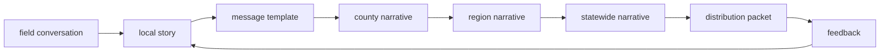

# Narrative Distribution Engine — system plan (RedDirt)

**Lane:** `H:\SOSWebsite\RedDirt` only.  
**Status:** **Architecture + product vocabulary** — planning document; **no feature implementation** required from this file alone.  
**Date:** 2026-04-27.  
**Cross-ref:** [`MESSAGE_CONTENT_ENGINE_SYSTEM_PLAN.md`](./MESSAGE_CONTENT_ENGINE_SYSTEM_PLAN.md) · [`POWER_OF_5_RELATIONAL_ORGANIZING_SYSTEM_PLAN.md`](./POWER_OF_5_RELATIONAL_ORGANIZING_SYSTEM_PLAN.md) · [`communications-unification-foundation.md`](./communications-unification-foundation.md) · [`message-workbench-analysis.md`](./message-workbench-analysis.md) · [`audits/DASHBOARD_HIERARCHY_COMPLETION_AUDIT.md`](./audits/DASHBOARD_HIERARCHY_COMPLETION_AUDIT.md) · [`MESSAGE_ENGINE_DASHBOARD_INTEGRATION_REPORT.md`](./MESSAGE_ENGINE_DASHBOARD_INTEGRATION_REPORT.md)

---

## 1. System vision

The **Narrative Distribution Engine (NDE)** is the campaign’s **orchestration layer for how approved stories move**: from **field-sourced truth** and **local color** through **governed message assets**, into **geographic narrative scopes** (county → region → state), and out to **every channel** that should carry the same intent **without** breaking compliance, consent, or privacy.

**North star:**

| Pillar | Meaning |
|--------|---------|
| **One narrative spine, many surfaces** | A coherent storyline (why this week matters, what changed locally, what we ask) is **versioned and traceable**; channel outputs are **derivatives**, not competing truths. |
| **Field-up, not top-down only** | The best lines often start in conversation; NDE **captures** and **elevates** local stories into templates **with review** — aligned with relational-first organizing. |
| **Distribution is a first-class workflow** | “Approved” is not enough: NDE tracks **assign** (who owns localization), **distribute** (which rails fired), and **measure** (aggregate performance, gaps, feedback). |
| **Honest geography** | County and region narratives **ground** the message; they **never** justify microtargeting language on public or volunteer surfaces. |
| **MCE executes language; NDE executes reach** | The **Message Content Engine** defines *what we say* (patterns, slots, packages). NDE defines *who must hear it next*, *where it publishes*, and *how we know it landed* — using existing comms, CMS, and social rails. |

**What NDE is not:** a replacement for counsel/finance review, a voter file browser, a public “AI” product, or a single new monolithic table. It is a **named system** for **linking** plans, assets, places, channels, and feedback — converging on **`CommunicationPlan`** and related models per COMMS-UNIFY-1.

**Public vocabulary** follows [`MESSAGE_SYSTEM_LANGUAGE_AUDIT_REPORT.md`](./MESSAGE_SYSTEM_LANGUAGE_AUDIT_REPORT.md): prefer **story**, **message support**, **organizing insights**, **distribution packet** — not “AI-generated campaign” or vendor hype.

---

## 2. Relationship to Power of 5

Power of 5 is the **human graph and pipeline spine** (Individual → Power Team → … → State). NDE **does not** own roster or relationship truth; it **feeds** and **reflects** organizing motion:

| P5 concept | NDE role |
|------------|----------|
| **My Five / invites** | Distribution packets include **peer-appropriate** invite and follow-up assets; leaders get **amplification queue** items tied to the same narrative ID. |
| **Conversation & follow-up pipelines** | Field feedback (aggregate) signals **which narrative beats** need clearer scripts or local proof — closes loop with MCE pattern updates. |
| **Weekly missions** | Missions **attach** a **statewide or regional narrative version** + optional county “localize this line” tasks. |
| **Geography scoreboards** | Region/county dashboards show **narrative gaps** (what story is missing for this turf) and **what shipped** this week — aggregates only on public routes. |
| **Privacy tiers** | Distribution targets respect P5/staff boundaries: **public** packets never imply voter-level selection; **leader** views see team-scoped assignments, not dossiers. |

**Rule:** NDE **never** exposes voter-level targeting reasons to volunteers; P5’s **reference layer** for voter match stays behind organizer gates (see P5 plan § voter reference).

---

## 3. Relationship to Message Content Engine

| Layer | Owner | Question answered |
|-------|--------|-------------------|
| **MCE** | Patterns, types, tone, slots, channel **packages** | *How should this conversation or post sound?* |
| **NDE** | Narrative **versions**, **scope** (field → state), **channel routing**, **calendar**, **assignment** | *Which story wave is live, for which places, on which rails, under what approval?* |

**Data handshake (conceptual):**

- MCE **`messagePatternType`**, **`MessageTemplate`**, and **playbook snippets** are **ingredients**.
- NDE **distribution packets** reference **approved ingredient IDs** + **geographic scope** + **channel checklist** + **owner roles**.
- **`CommunicationPlan`** remains the strongest **intent container** ([`message-workbench-analysis.md`](./message-workbench-analysis.md)): NDE treats a plan as a **narrative wave** when `objective` + sources + drafts align; **`metadataJson`** can hold `narrativeWaveId`, `primaryGeography`, `assetBundleRef` in future packets.

**Dashboard integration:** [`MESSAGE_ENGINE_DASHBOARD_INTEGRATION_REPORT.md`](./MESSAGE_ENGINE_DASHBOARD_INTEGRATION_REPORT.md) already surfaces **message intelligence** on state/region/county views — NDE extends that story with **pipeline** and **distribution status** (what is scheduled vs shipped), still **demo/seed** until telemetry lands.

---

## 4. Distribution channels

Each row is a **surface** NDE must map to **without** pretending a single unified send row exists today (per COMMS-UNIFY-1).

| Channel | Role in NDE | Primary repo alignment (examples) |
|---------|-------------|-----------------------------------|
| **Power of 5 network** | Peer-to-peer propagation: packets delivered as **missions**, **leader queues**, and **volunteer scripts** — attribution at **aggregate** usage. | Volunteer asks, relational activities (future wire-up); `/dashboard`, `/dashboard/leader` when auth ships. |
| **Blog** | Long-form **statewide or regional** narrative; durable URL for press and organizers. | Editorial/blog sync, `ContentDecision`, public site routes. |
| **Email** | **Broadcast** and **plan-driven** sends; counsel-sensitive asks as **flagged** assets. | `CommunicationPlan` → drafts → `CommunicationSend`; Tier-2 `CommunicationCampaign` (parallel rail — link by metadata). |
| **SMS** | **Applicable where consent, compliance, and vendor rails exist** — short copy variants, GOTV and event paths. | `CommunicationThread` / `CommunicationMessage`, workbench SMS drafts; **`ContactPreference`** / suppression mandatory. |
| **Social** | Outbound **scheduled posts** + variant per platform; inbound **opportunities** feeding the next wave. | `SocialContentItem`, `SocialPlatformVariant`; listen path `ConversationOpportunity`. |
| **Local events** | Narrative **anchors in place**; event scripts and RSVP CTAs as packet attachments. | `CampaignEvent`, plan `sourceEvent`, community suggestions admin. |
| **Influencers / community leaders** | **Peer elevation** track: talking points + **press-style** briefs; assignment to **civic leader** audience posture (MCE §8). | `MediaOutreachItem`, relational **local leader** lists (staff); no impersonation (§9). |
| **Earned media** | Pitches, **press notes**, rapid response tied to same narrative ID as digital. | `MediaOutreachItem`, email workflow items, plan linkage. |
| **County pages** | **County narrative** slice + CTAs; links to command hub and briefings when published. | `/counties/*`, county briefings, future `/organizing-intelligence/counties/[slug]`. |
| **Region dashboards** | **Region narrative** + “what to say this week” + gap cards. | `RegionDashboardView`, OIS region routes. |

**Implementation truth:** NDE **orchestrates metadata and UI** first; **execution** stays on existing send/post models.

---

## 5. Content lifecycle

Stages are **conceptual**; in the DB they may span `WorkflowIntake`, `CommunicationPlan` status, CMS workflow, and relational logs.

| Stage | Meaning | Typical handoff |
|-------|---------|-----------------|
| **Field conversation** | Relational touch generates **signal** (theme, quote-level note, objection trend) — **aggregate** capture, no public transcripts by default. | Intake, REL-2 logs, social listen clusters. |
| **Local story** | Editor/staff elevates signal into a **place-based** draft with sourcing discipline. | Workflow queue, plan `summary`, blog draft. |
| **Message template** | MCE **pattern** or **playbook snippet** approved for reuse (slots for geo/relationship). | Template registry, `CommunicationDraft` (talking points / SMS / email). |
| **County narrative** | “Why this matters in {County}” — **one** coherent short narrative + optional stats from **public** or **approved** sources only. | County page block, county packet. |
| **Region narrative** | Peer counties, regional events, shared risks/opportunities. | Region dashboard narrative panel, regional plan variants. |
| **Statewide narrative** | Campaign-wide line of the week / phase story. | `/organizing-intelligence`, blog hero, email masthead. |
| **Distribution packet** | **Frozen bundle**: asset IDs, channel checklist, owners, rollout window, compliance flags. | Plan metadata + linked drafts/sends + optional PDF/export for field. |
| **Feedback** | Opens, clicks, replies (where available), **field outcome tags**, **gap reports**. | Recipient events, MCE feedback loop, dashboard panels. |



---

## 6. Narrative assets

Assets are **typed content objects** NDE tracks and versions; several map cleanly to **`CommsWorkbenchChannel`** and MCE **message types**.

| Asset | Description | Typical channel output |
|-------|-------------|------------------------|
| **Talking points** | Bulleted, staff/volunteer safe; may include **listening** prompts. | `TALKING_POINTS` draft, print packet. |
| **Short posts** | Social-length; platform variants. | `SocialContentItem`, SMS body (short). |
| **Long-form posts** | Blog / site article body. | Editorial CMS, `InboundContentItem` decisions. |
| **Email copy** | Subject, preview, body, CTA; may include **segment** variants (opaque labels in admin). | `EMAIL` draft, campaign templates. |
| **Event script** | Run-of-show, stump, **RSVP** ask. | Event attachment, `PHONE_SCRIPT` / talking points. |
| **Volunteer script** | Relational opener + bridge + follow-up (MCE patterns). | P5 missions, `/dashboard` picker (future). |
| **Press note** | Short factual pitch or **rapid response** — often counsel-sensitive. | `PRESS_OUTREACH` / `MediaOutreachItem`. |
| **Story card** | One-card summary: headline, local hook, CTA, **compliance tag**. | Dashboard “message of the week,” leader clipboard. |
| **County message packet** | **County narrative** + talking points + optional event/email/social stubs. | Download or admin “publish set” for organizers. |

---

## 7. Editorial workflow

Aligns with workbench **plan** lifecycle where possible ([`message-workbench-analysis.md`](./message-workbench-analysis.md)); NDE adds **assignment** and **measure** explicitly.

| Stage | Actor | Outcome |
|-------|-------|---------|
| **Draft** | Writer / field liaison | Story exists in intake or plan `DRAFT` / `PLANNING`. |
| **Review** | Comms + compliance (as needed) | `READY_FOR_REVIEW`; finance/legal flags on donor/GOTV content. |
| **Approve** | Authorized approver | `APPROVED`; narrative version **immutable** for that wave (edits → new version). |
| **Assign** | Ops / regional / county lead | Owners and **localizers** named; tasks in workbench or task system. |
| **Distribute** | Channel owners | Sends queued, posts scheduled, packets released to P5 leaders. |
| **Measure** | Analytics + field reporting | Aggregate performance, conversation outcomes, gap detection. |
| **Revise** | Closes loop | New draft or **variant**; MCE pattern updates for recurring objections. |

---

## 8. Dashboards

| Dashboard | Audience | Purpose |
|-----------|----------|---------|
| **Narrative calendar** | Staff, regional leads | What narrative **waves** land when; dependencies (events, law deadlines, media). |
| **Message performance** | Staff | Opens/clicks/replies where wired; **category** mix vs goals; tie to `CommunicationRecipientEvent` / social stats. |
| **Region gaps** | Regional + state | Which regions lack **local proof**, **language**, or **distribution** for the active wave. |
| **Story pipeline** | Comms | Intake → draft → approve → packet; **WIP** limits; bottleneck alerts. |
| **Amplification queue** | Leaders | Ordered **asks** for P5: who should forward what, with **scripts** and **deadlines** — consent-scoped roster only. |

**Public surfaces:** State/region/county OIS views remain **aggregate**; attributable queues stay in **`/admin`** or gated leader UI.

---

## 9. Safety

| Risk | Control |
|------|---------|
| **Misinformation** | **Source discipline** for stats and dates; election-law and finance review paths for GOTV/donor content; rapid-response **single owner**. |
| **Impersonation** | No **fake** local voices; **community leader** track uses **clear attribution** and **opt-in**; social and email sender identities **verified** per platform rules. |
| **Private voter data exposure** | No voter ids, scores, or household maps in packets or public dashboards; geography is **slug + public context** only on volunteer/public tiers. |
| **“AI” public branding** | No visitor-facing claims that narratives are “AI-generated”; internal tools avoid model names in errors (MCE §2). |

Regression habit: periodic grep and QA on **targeting language** (see MCE §13 **MCE-8**).

---

## 10. Implementation roadmap

Safe, **sequential** packets (rename in PRs as needed):

| Packet | Deliverable |
|--------|-------------|
| **NDE-1** | This plan + glossary alignment in admin docs (optional). |
| **NDE-2** | **`docs/audits/NARRATIVE_DISTRIBUTION_ENGINE_INVENTORY.md`** — map lifecycle stages and asset types to `CommunicationPlan`, drafts, sends, social items, blog/CMS, events, `MediaOutreachItem`; **read-only**. |
| **NDE-3** | **Metadata convention** doc: suggested `metadataJson` keys on plans (`narrativeWaveId`, `assetBundleRef`, `geographyScope`, `distributionChecklist`). |
| **NDE-4** | Admin UI stub: **narrative calendar** read-only (pull from plans + events) — no new schema if avoidable. |
| **NDE-5** | Wire **story pipeline** columns on existing comms plan list (status + owner + due). |
| **NDE-6** | **County message packet** export (staff-only): assemble approved drafts into one printable/HTML bundle — **no PII**. |
| **NDE-7** | Leader **amplification queue** (gated): tasks linked to plan + MCE template ids. |
| **NDE-8** | Telemetry: replace demo narrative metrics with **aggregate** queries; keep public routes non-attributable. |

Dependencies: **MCE** packets for pattern IDs; **COMMS** for send truth; **P5** for roster-scoped leader UI.

---

## 11. Next Cursor script — **Script 10** (NDE-2: narrative distribution inventory)

Paste into Cursor:

```text
ACTIVE PROJECT:
Kelly Grappe for Arkansas Secretary of State — RedDirt repo (H:\SOSWebsite\RedDirt).

ACTIVE SLICE:
Narrative Distribution Engine — NDE-2 (read-only inventory). No Prisma migrations, no new public routes, no voter PII, no voter-file queries, no unsourced factual claims in examples.

HARD RULES:
- Lane RedDirt only; no cross-lane imports.
- No secrets in chat, commits, or logs.
- Output is documentation only unless Steve expands scope: one audit markdown file plus optional internal cross-links.
- Public vocabulary: follow docs/MESSAGE_SYSTEM_LANGUAGE_AUDIT_REPORT.md (no new “AI” marketing strings).

READ FIRST:
- docs/NARRATIVE_DISTRIBUTION_ENGINE_SYSTEM_PLAN.md (this system plan)
- docs/MESSAGE_CONTENT_ENGINE_SYSTEM_PLAN.md
- docs/communications-unification-foundation.md
- docs/message-workbench-analysis.md
- prisma/schema.prisma (CommunicationPlan, CommunicationDraft, CommunicationSend, SocialContentItem, MediaOutreachItem, CampaignEvent, ContentDecision — relevant sections only)

OBJECTIVE:
1. Add docs/audits/NARRATIVE_DISTRIBUTION_ENGINE_INVENTORY.md that:
   - Maps each content lifecycle stage (field conversation → … → feedback) to existing models and/or admin routes (“today” vs “gap”).
   - Maps each narrative asset type (talking points through county message packet) to the closest existing artifact (CommsWorkbenchChannel, SocialContentItem, blog/CMS, etc.).
   - Maps each distribution channel (Power of 5 network through region dashboards) to execution rails and key files under src/lib/* and src/app/admin/*.
   - Calls out SMS applicability: consent, ContactPreference, and when SMS drafts are in scope vs out of scope.
   - Includes a short “NDE metadata convention (proposed)” subsection referencing NDE-3 — do not implement JSON yet unless trivial.
2. Add a bullet to docs/README.md under the appropriate section linking the new audit (if docs/README.md already indexes similar audits).
3. Run npm run check from RedDirt if any code was touched; if doc-only, state doc-only verification.

OUTPUT:
- List files changed.
- Explicit table: “artifact → primary Prisma model(s) → primary UI route(s)”.
- Note top 5 implementation gaps for NDE-4+ packets.
```

---

**End of plan.**
