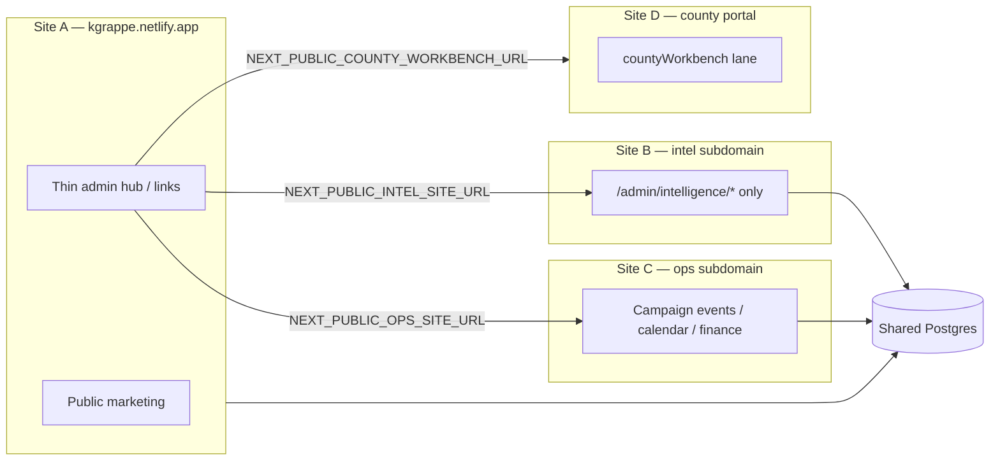

# Netlify multi-site chunking (RedDirt)

## Problem

One RedDirt Next.js app on Netlify packages **public site + full `/admin` OS** into a single `___netlify-server-handler`. Netlify’s **250 MB unzipped** function cap is the hard limit—not “branch count.”

Merging more modules into `main` without shrinking traced routes makes deploys flaky even when the Git tree is clean.

## What already works (do not reinvent)

| Mechanism | Purpose |
|-----------|---------|
| `NEXT_PUBLIC_INTELLIGENCE_LAUNCH_MODE=opposition_debate` | Shrinks build trace + `included_files` exclusions + skips heavy SSG (see `next.config.ts`, `netlify.toml`) |
| `netlify/plugins/prune-server-handler` | Post-build strip of `.git`, static blobs, duplicate engines |
| `NEXT_PUBLIC_COUNTY_WORKBENCH_URL` | **Separate Netlify site** for county portal; main admin links out (`getCountyWorkbenchPortalUrl`) |
| `outputFileTracingIncludes` | Per-route globs so only needed `data/**` ships with that route |

**Branch-per-module for production does not reduce bundle size.** Netlify production deploys one built artifact per site. Feature branches are for **review and deploy previews**, not for splitting the handler.

## Recommended architecture: hub + satellite sites

Same repo (`Grappe501/reddirt`), **multiple Netlify sites**, different **build env** (not different codebases unless you later extract).

### Site roles

| Netlify site | Production branch | Base dir | Build profile |
|--------------|-------------------|----------|---------------|
| **Kelly public hub** | `main` (slim profile) | `RedDirt` | No full campaign-events data trace; admin = link hub only |
| **Kelly intelligence** | `main` or `deploy/intelligence` | `RedDirt` | `NEXT_PUBLIC_INTELLIGENCE_LAUNCH_MODE=opposition_debate` **always on** |
| **Kelly campaign ops** | `main` or `deploy/campaign-ops` | `RedDirt` | Full events/calendar trace; intelligence launch mode **off** |
| **County workbench** | own repo/site | `countyWorkbench` | Already separate lane |

All sites can share **`DATABASE_URL`**, **`DIRECT_URL`**, **`ADMIN_SECRET`** (same operator login cookie only works on **one hostname** unless you add shared auth—see below).

### Cross-site communication (minimal contract)

1. **URLs (public env)**  
   - `NEXT_PUBLIC_SITE_URL` — canonical public hub  
   - `NEXT_PUBLIC_INTEL_SITE_URL` — intelligence satellite origin  
   - `NEXT_PUBLIC_OPS_SITE_URL` — campaign OS satellite origin  
   - `NEXT_PUBLIC_COUNTY_WORKBENCH_URL` — existing county portal  

2. **Hub admin shell**  
   Sidebar “Intelligence”, “Campaign events”, “Counties” become **links** (new tab) when satellite URL is set; hide in-app routes that would bloat the hub build.

3. **Data**  
   One Postgres (Prisma) is fine. Satellites are UI/deploy slices, not separate databases.

4. **Auth caveat**  
   `ADMIN_SECRET` cookie is **per-origin**. Operators sign in on each hostname once, or hub redirects to satellite login with shared secret. Do not assume single sign-on across `*.netlify.app` sites without explicit work.

## Git hygiene (before more modules)

1. **`main`** = last known **green Netlify** deploy (currently includes debate-week nav + prune fixes).  
2. **Delete or archive** stale remote branches after merge (`build/*`, old `feature/*`) via GitHub UI or `git push origin --delete <branch>`.  
3. **Naming for deploy profiles** (optional, same repo):  
   - `deploy/intelligence` — only env/docs changes for intel site  
   - `deploy/campaign-ops` — ops site profile  
   - `deploy/hub` — slim public hub  
   These branches are **config markers**, not long-lived feature dumps. Merge to `main` when stable.

4. **Do not** point two Netlify production sites at different branches that diverge for weeks—env profiles should differ, not drifted application code.

## Phased rollout (debate week first)

### Phase 0 — Now (single site, launch mode)

- Keep **one** Netlify site on `main`.  
- `NEXT_PUBLIC_INTELLIGENCE_LAUNCH_MODE=opposition_debate` in `netlify.toml` (already set).  
- Verify deploy &lt; 250 MB after prune.  
- Use **Deploy Previews** on PRs for module work.

### Phase 1 — Intelligence satellite (highest ROI)

1. Duplicate Netlify site → e.g. `kgrappe-intel.netlify.app`.  
2. Same repo, base `RedDirt`, branch `main`.  
3. Env: `NEXT_PUBLIC_INTELLIGENCE_LAUNCH_MODE=opposition_debate`, same DB + `ADMIN_SECRET`.  
4. Hub site: set `NEXT_PUBLIC_INTEL_SITE_URL=https://kgrappe-intel.netlify.app`.  
5. Code follow-up: hub Intelligence nav → external link when env set (mirror county workbench).

### Phase 2 — Campaign ops satellite

1. Second satellite with launch mode **unset**.  
2. Restrict middleware/build to `/admin/campaign-*`, `/admin/campaign-events/*`, etc. (future: `NEXT_PUBLIC_DEPLOY_PROFILE=campaign_ops`).  
3. Hub links via `NEXT_PUBLIC_OPS_SITE_URL`.

### Phase 3 — Slim hub

1. Hub build excludes heavy `data/campaign-events/**` traces.  
2. Public routes + content CMS + link-out admin only.

## What not to do

- **Do not** create a new branch per module and call that “deploy”—merge to `main` or use deploy previews.  
- **Do not** duplicate the full app on 4 sites with identical env (4× migrations, 4× cap risk, cookie chaos).  
- **Do not** split lanes (`countyWorkbench`, `sos-public`) into the RedDirt handler—keep separate repos/sites per coordination rules.

## Implementation checklist (engineering)

- [ ] Confirm Netlify **base directory** = `RedDirt` (monorepo root on GitHub).  
- [ ] Document three site URLs in Netlify env (hub / intel / ops).  
- [ ] Add `getIntelSiteUrl()` / `getOpsSiteUrl()` next to `getCountyWorkbenchPortalUrl()`.  
- [ ] Hub `AdminBoardShell`: external link when satellite URL present.  
- [ ] Optional: `NEXT_PUBLIC_DEPLOY_PROFILE=hub|intelligence|campaign_ops` to replace boolean launch mode over time.  
- [ ] Prune audit script: log handler unzip size after each profile.  
- [ ] Archive stale Git branches after Phase 1 green.

## Related files

- `netlify.toml` — handler exclusions, launch mode  
- `next.config.ts` — `outputFileTracingIncludes`, opposition trace excludes  
- `src/lib/intelligence/intelligenceLaunchMode.ts` — launch routes + nav  
- `src/lib/county/county-workbench-portal-url.ts` — prior art for cross-site link  
- `docs/deployment.md` — env and monorepo base directory  
