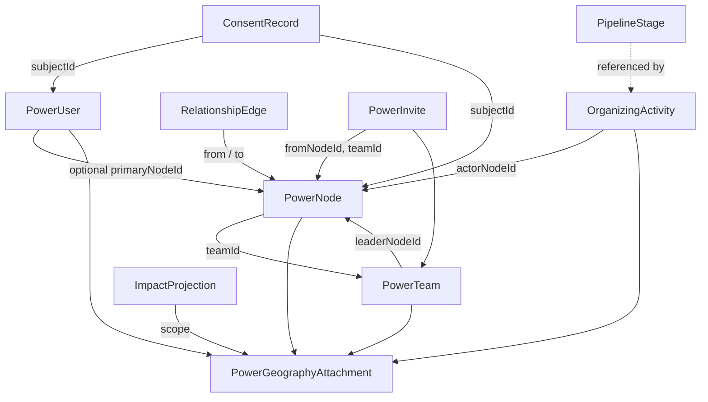

# Power of 5 — data model (TypeScript schema)

**Lane:** `RedDirt/` only.  
**Status:** **Schema definition** — types live in `src/lib/power-of-5/types.ts`. **No database** or Prisma mapping in this packet.  
**Date:** 2026-04-27.

**Related:** `docs/POWER_OF_5_RELATIONAL_ORGANIZING_SYSTEM_PLAN.md` (product + principles), `docs/audits/DASHBOARD_HIERARCHY_COMPLETION_AUDIT.md` (route IA).

---

## 1. Purpose

This document describes the **canonical domain objects** for the Power of 5 relational organizing spine: people, teams, relationship edges, invites, activities, pipeline stages, consent, and impact projections — each optionally **anchored to geography** (state through precinct).

**Constraints:**

- **No voter PII** in types intended for public or volunteer APIs; geography uses codes, slugs, and aggregate-safe labels.
- **Consent and visibility** are first-class; edges and rosters respect `RelationshipVisibility` and `ConsentRecord` at implementation time.
- **Persistence is future work** — names and shapes here are stable contracts for app code and later Prisma models.

---

## 2. Geography ladder

Geography is modeled as composable pieces plus a single rollup struct:

| Type | Role |
|------|------|
| `PowerGeographyState` | State anchor (`stateCode`, optional `stateFips`). |
| `PowerGeographyRegion` | Campaign / field region (`regionKey`, optional display name). |
| `PowerGeographyCounty` | County (`countySlug`, optional FIPS / display name). |
| `PowerGeographyCity` | Place (`citySlug`, optional ZIP for coarse use). |
| `PowerGeographyPrecinct` | Voting precinct / district id + label. |
| `PowerGeographyAttachment` | **Combined** stack: `state` required; `region`, `county`, `city`, `precinct` nullable until known. |

**Rollup story (bottom → up):** node / team activity attaches to `PowerGeographyAttachment`; aggregates compute at precinct → city → county → region → state without exposing household maps on public surfaces.

`PowerGeographyAttachmentFieldReady` is a **narrow** type (state + region + county required) for builders that assume field-ready turf.

---

## 3. Core entities

### 3.1 `PowerUser`

Authenticated product user: `displayName`, `role` (`PowerRole`), optional `primaryNodeId`, timestamps, optional `geography`.

Links **0..1** `PowerNode` until onboarding completes; staff roles may have nodes only for testing.

### 3.2 `PowerNode`

Graph vertex for a person in the network: `userId` nullable for invite / pre-account, `teamId`, `status` (`PowerNodeStatus`), optional `rosterLabel` and `geography`.

### 3.3 `PowerTeam`

Small organizing unit: `leaderNodeId`, `targetSize` (often 5), `status`, **required** `geography` (`PowerGeographyAttachment`), optional `cohortKey`.

### 3.4 `RelationshipEdge`

Directed or logical tie between nodes: `fromNodeId`, `toNodeId`, `kind` (`RelationshipEdgeKind`), `visibility`, optional `revokedAt` and typed `metadata` bag.

### 3.5 `PowerInvite`

Invitation artifact: `fromNodeId`, `teamId`, `toContactToken` (**hashed / tokenized — never raw email or phone in logs**), `channel`, `status`, optional acceptance fields.

### 3.6 `OrganizingActivity`

Logged work: `actorNodeId`, `type` (`OrganizingActivityType`), `pipelineId`, optional `pipelineStageId`, timestamps, optional `noteEncryptedRef`, optional `geography`.

---

## 4. Pipeline and stages

### 4.1 `PowerPipelineId`

Enumerates program funnels: signup, invite, activation, volunteer, event, conversation, followup, candidate, donor, petition, gotv.

### 4.2 `PipelineStage`

Stage within a pipeline: `id`, `pipelineId`, `order`, `label`, `kpiKey`, optional `description`, optional `isTerminal`.

Stages may be **config-driven** later; this type is the per-stage record shape.

---

## 5. Consent

### `ConsentRecord`

Records a grant or denial: `subjectId`, `subjectKind` (`power_user` | `power_node` | `contact`), `purpose` (`ConsentPurpose`), `granted`, `recordedAt`, `evidenceRef`, optional `expiresAt`, optional `recordedByActorId`.

Purposes include relational contact, voter match, SMS, email, analytics, and portrait/media — extend only with policy review.

---

## 6. Impact

### `ImpactProjection`

Aggregate-safe planning object: `scope` (`PowerGeographyAttachment`), `label`, optional `headlineMetric`, `modelVersion`, `confidence`, `computedAt`, optional `attributedTo`.

Used for “if we add N teams, modeled coverage moves X” copy — **not** individual voter outcomes.

---

## 7. Relationship diagram (logical)

---

## 8. File location

| Artifact | Path |
|----------|------|
| TypeScript schema | `src/lib/power-of-5/types.ts` |
| Onboarding demo (unchanged) | `src/lib/power-of-5/onboarding-demo.ts` |

---

## 9. Next packets (out of scope here)

- Prisma models + migrations mirroring these types.
- Field-level encryption for `noteEncryptedRef` and invite tokens.
- Voter reference layer (separate types) gated behind organizer roles.
- Validation library (zod / valibot) co-generated from this schema if desired.
