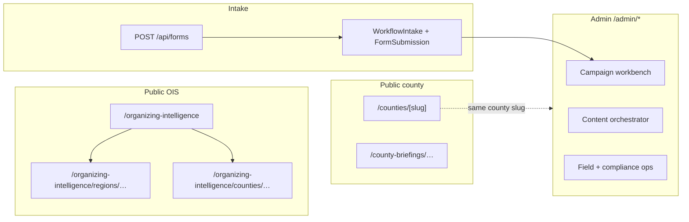

# Dashboard hierarchy — completion audit (OIS)

**Lane:** `RedDirt/` only.  
**Status:** Inventory + URL patterns; **placeholder routes** for OIS county + personal/leader + admin OIS hub (see §4, §9–§11, §17).  
**Date:** 2026-04-27 (routes updated same day).  
**Related:** `docs/RED_DIRT_ORGANIZING_INTELLIGENCE_SYSTEM_PLAN.md` (OIS-1), `docs/COUNTY_INTELLIGENCE_SYSTEM_PLAN.md`, `src/lib/campaign-engine/regions/arkansas-campaign-regions.ts` (CANON-REGION-1), `src/lib/county/arkansas-county-registry.ts` (command `regionId`).

---

## 1. Executive summary

| Layer | Primary route(s) in repo | Verdict |
|-------|--------------------------|---------|
| **State** | `/organizing-intelligence` | **Exists** (state OI + builder) |
| **Region (8 campaign regions)** | `/organizing-intelligence/regions/{slug}` | **Exists** (fixed per-slug pages + `regions/[slug]` placeholder) |
| **County (OIS v2 sample)** | `/county-briefings/pope/v2` | **Exists** (Pope v2, shared `CountyDashboard` shell) |
| **County (public command hub)** | `/counties/[slug]` | **Exists** (separate from OIS tree) |
| **City** | (see patterns below) | **Not implemented** under `organizing-intelligence` |
| **Community** | (see patterns below) | **Not implemented** |
| **Precinct** | (see patterns below) | **Not implemented** (DATA-1: no precinct geometry in product) |
| **Block / census** | (see patterns below) | **Future** |
| **Personal** | `/dashboard` | **Placeholder** — `src/app/(site)/dashboard/page.tsx` (public shell; no auth or live tiles) |
| **Leader** | `/dashboard/leader` | **Placeholder** — `src/app/(site)/dashboard/leader/page.tsx` |
| **Admin / command** | `/admin/organizing-intelligence` | **Placeholder** — `src/app/admin/(board)/organizing-intelligence/page.tsx` (`requireAdminPage`); sidebar: AdminBoardShell **Organizing intelligence (OIS)** |

**Rollup direction (design law):** organizing models **up** (Individual → … → State); UIs **drill down** (State → … → Individual). This audit maps **URL coverage** to that ladder.

### 1a. Whole-system map (layers)

RedDirt “dashboards” fall into **four** buckets: **public organizing intelligence (OIS)**, **public county command**, **admin command center** (`/admin/*`, cookie auth), and **volunteer/leader** routes (`/dashboard*`, **placeholder pages** in repo; real gates and data TBD).

**See also:** **Section 18** (full `/admin` route atlas), **Section 19** (`WorkflowIntake` intake path).

---

## 2. State dashboard

| Route | File | Status |
|-------|------|--------|
| `/organizing-intelligence` | `src/app/organizing-intelligence/page.tsx` | **Live** — `StateOrganizingIntelligenceView` + `buildStateOrganizingIntelligenceDashboard()` |
| `layout` | `src/app/organizing-intelligence/layout.tsx` | **Live** |

**Reusable pieces:** `src/lib/campaign-engine/state-organizing-intelligence/`, `src/components/organizing-intelligence/StateOrganizingIntelligenceView.tsx`.

---

## 3. Region dashboards (8 stakeholder regions)

**Canonical slugs** (`ArkansasCampaignRegionSlug` in `arkansas-campaign-regions.ts`):

| Stakeholder URL segment | `page.tsx` path | `RegionDashboardView`? |
|-------------------------|-----------------|------------------------|
| `northwest-arkansas` | `organizing-intelligence/regions/northwest-arkansas/page.tsx` | **Yes** (NWA builder) |
| `central-arkansas` | `…/central-arkansas/page.tsx` | **Yes** |
| `river-valley` | `…/river-valley/page.tsx` | **Yes** |
| `north-central-ozarks` | `…/north-central-ozarks/page.tsx` | **Yes** |
| `northeast-arkansas` | `…/northeast-arkansas/page.tsx` | **Yes** |
| `delta-eastern-arkansas` | `…/delta-eastern-arkansas/page.tsx` | **Yes** |
| `southeast-arkansas` | `…/southeast-arkansas/page.tsx` | **Yes** |
| `southwest-arkansas` | `…/southwest-arkansas/page.tsx` | **Yes** |

**Also:** `src/app/organizing-intelligence/regions/[slug]/page.tsx` — **placeholder** for any `ArkansasCampaignRegionSlug` not shadowed by a static segment (prevents 404s; some regions may be primarily reached via static routes in practice).

**Reusable pieces:** `src/components/regions/dashboard/*`, `src/lib/campaign-engine/regions/build-region-dashboard.ts`, `src/lib/campaign-engine/regions/types.ts`.

**Note:** User-facing name “Northwest Arkansas (NWA)” is **not** the URL slug; slug remains `northwest-arkansas` (kebab).

---

## 4. County dashboards

| Route | Role |
|-------|------|
| `/county-briefings/pope/v2` | **OIS gold-sample** — `PopeCountyDashboardV2View` + `buildPopeCountyDashboardV2()`. Reusable: `src/components/county/dashboard/*`, `county-dashboards/types.ts`. |
| `/counties` | **Public county index** — roster linking into each `CountyCommandExperience`. |
| `/counties/[slug]` | **Public county command** (Kelly SOS county hub) — `CountyCommandExperience`; **not** the same as OIS v2 data shell. |
| `/county-briefings/pope` | Original briefing (narrower) |
| `/county-briefings` | Briefings hub (if present) |
| `/organizing-intelligence/counties/[countySlug]` | **Placeholder** — `src/app/organizing-intelligence/counties/[countySlug]/page.tsx`; static copy + links only (slug validation); no OIS v2 hydration yet |

**Canonical OIS county URL (implemented as stub):**

- `GET /organizing-intelligence/counties/[countySlug]` (kebab slug; 404 if pattern invalid)

Optional later mirror: `/organizing-intelligence/arkansas/counties/[countySlug]` — **not** in repo.

Rationale: keeps **OIS** drill path under one tree; `county-briefings` remains briefings; `/counties` remains public command. **Do not** remove Pope v2; when ready, add a second entry point or 302 only after product decision.

---

## 5. City — defined pattern (planned)

**Recommended path:**

` /organizing-intelligence/counties/[countySlug]/cities/[citySlug] `

- `countySlug`: e.g. `pope-county` (align with `County.slug` / registry).
- `citySlug`: kebab, e.g. `russellville` (no table in v1; config-driven list until `City` model exists).

**Status:** **No** `cities` segment under `src/app/organizing-intelligence/` at audit time. Pope v2 uses **in-page** city cards + future HREF **strings** only.

---

## 6. Community / neighborhood — defined pattern (planned)

` /organizing-intelligence/counties/[countySlug]/cities/[citySlug]/communities/[communitySlug] `

**Status:** **Not implemented.** Requires stable `communitySlug` and consent/visibility model (OIS-1).

---

## 7. Precinct — defined pattern (planned)

**Option A (county-pivot, list-first, matches DATA-1 “no map” phase):**  
` /organizing-intelligence/counties/[countySlug]/precincts/[precinctId] `

**Option B (city-nested, when city routes exist):**  
` /organizing-intelligence/counties/[countySlug]/cities/[citySlug]/precincts/[precinctId] `

`precinctId` should be a **string key** from ingest (not assumed unique statewide unless namespaced: e.g. `05115-XX`).

**Status:** **Not implemented.** Voter/result rows may have `VoterRecord.precinct` string; no public precinct product route.

---

## 8. Block / census unit — future pattern

` /organizing-intelligence/counties/[countySlug]/census/[geoId] `

**Status:** **Future** — ethics + Census blend + no public household maps in v1 (OIS-1, privacy model).

---

## 9. Personal dashboard

**Recommended path:** ` /dashboard `

**Status:** **Placeholder** — `src/app/(site)/dashboard/page.tsx` (URLs `/dashboard`; uses public `(site)` layout).

**Blockers before real:** auth session, `User` / volunteer context, data minimization, “My Five” product model (see P5 plan).

---

## 10. Leader dashboard

**Recommended path:** ` /dashboard/leader `

**Status:** **Placeholder** — `src/app/(site)/dashboard/leader/page.tsx`.

**Blockers:** role flags, roster visibility, consent, separate from public OIS pages.

---

## 11. Admin / command (organizing intelligence)

**Recommended path:** ` /admin/organizing-intelligence `

**Status:** **Placeholder** — `src/app/admin/(board)/organizing-intelligence/page.tsx` (static copy + deep links; no Prisma / voter / live P5). Nav: **Organizing intelligence (OIS)** in `AdminBoardShell` campaign operations list.

**Stand-ins today (OIS-adjacent ops in admin):**

| Route | Role |
|-------|------|
| `/admin/organizing-intelligence` | Operator hub stub (links public OIS + volunteer placeholders) |
| `/admin/county-intelligence` | County intel board (operator-facing; not the public OIS tree) |
| `/admin/county-profiles` | Political / profile editing |
| `/admin/counties`, `/admin/counties/[slug]` | **County command master workbench** (separate layout from `(board)`; links public `/counties/*`) |
| `/admin/workbench` | **Primary operator queue**: open work, threads, comms hooks, links to tasks and calendar |

Public OIS pages remain **unauthenticated** under `/organizing-intelligence/*`. The admin route above is a **landing stub** until a gated mirror or editor pack ships.

**Safe interim:** deep-link from workbench or style hub to public OIS when needed; extend `/admin/organizing-intelligence` in **future** route packs (P5-15 / integration) if product wants queues or exports here.

---

## 12. Reusable components (inventory)

| Area | Key paths |
|------|-----------|
| **County v2 shell** | `src/components/county/dashboard/*` |
| **Region shell** | `src/components/regions/dashboard/*` |
| **State OI** | `StateOrganizingIntelligenceView` |
| **Campaign region taxonomy** | `arkansas-campaign-regions.ts` |
| **County registry / map** | `arkansas-county-registry.ts` |
| **OI builders** | `state-organizing-intelligence/build-state-oi-dashboard.ts`, `regions/build-region-dashboard.ts` |
| **Pope v2 data** | `county-dashboards/pope-county-dashboard.ts` |

**Cross-cutting:** `CountyKpiCard`, `CountyActionPanel` (incl. `nextStep` when present), `CountySectionHeader` (if used in polishes), `RegionDashboardShell`, Power-of-5 **panels** (demo) at state/region.

---

## 13. Unsafe gaps (must document before “real” city/precinct)

1. **No first-class `City` / `Precinct` models** in OIS app routes — only strings and political profile engine lists.  
2. **DATA-1 / identity docs:** voter file is aggregate-friendly; public pages must not become microtargeting.  
3. **Auth** not in scope of OIS public routes — personal/leader require gates.  
4. **FIPS + slug** reconciliation: `pope` vs `pope-county` already needs care in links.  
5. **Duplicate route strategies:** static `regions/{name}` + `[slug]` — team must not add a **third** conflicting pattern for regions.  
6. **River Valley vs `central` registry** — FIPS override (Pope) documented in CANON-REGION-1; drill labels must not confuse users.  

---

## 14. What must be done before city/precinct routes become “real”

1. **Packet 1–style** route/data audit: inventory Prisma fields for precinct, city, events (read-only).  
2. **Canonical keys:** `countySlug`, `citySlug` enum or table, `precinctId` format from file.  
3. **Auth + RLS** (or app-layer) for anything past aggregate public.  
4. **Geo:** placeholder list/chips until GeoJSON; no surprise map deps.  
5. **Product:** one OIS path chosen (`organizing-intelligence/...` vs `county-briefings/...`) for county v2 “canonical” link.  
6. **QA:** `npm run check`, no PII in seeds.

---

## 15. Recommended next packets (hierarchy + P5)

| Packet | Content |
|--------|---------|
| **H1** | Add **spec-only** `docs/ROUTING_ORGANIZING_INTELLIGENCE.md` (optional) or extend OIS-1 with exact URL table — *no code*. |
| **H2** | `organizing-intelligence/counties/[countySlug]/page.tsx` **stub** — **done** (placeholder copy + slug validation; no county rollup UI yet). |
| **P5-1** | Read-only `POWER_OF_5_EXISTING_CODE_AUDIT.md` (see Power of 5 system plan). |

**Do not** add city/precinct **dynamic** routes until H1 + data keys are agreed.

---

## 16. Placeholder docs (this file)

- **This audit** satisfies “placeholder docs for missing levels” as **URL + architecture documentation**.  
- **Public placeholder** `page.tsx` files now exist for `/dashboard`, `/dashboard/leader`, `/organizing-intelligence/counties/[countySlug]`, and **admin placeholder** for `/admin/organizing-intelligence` — all **static** (no auth product, no voter file, no live P5 on those pages).

---

## 17. Verification checklist (quick)

- [x] State route exists.  
- [x] All eight `ArkansasCampaignRegionSlug` values have a defined campaign region.  
- [x] Each slug has a **static** `page.tsx` under `organizing-intelligence/regions/…` (verified by glob).  
- [x] Pope v2 at `/county-briefings/pope/v2`.  
- [x] Whole-system map + admin atlas documented in **§1a**, **§18**, **§19** (this file).  
- [x] OIS-nested county route — **placeholder** at `/organizing-intelligence/counties/[countySlug]`.  
- [x] `/dashboard` / `/dashboard/leader` — **placeholders** under `(site)`.  
- [x] `/admin/organizing-intelligence` — **placeholder** under `(board)`.  

**Sign-off note:** hierarchy is **design-complete** in docs and **route-partial** in code: state + regions + Pope sample + county **command** hub + **stub** county OIS + **stub** volunteer/admin OIS URLs; **downstream** (city/precinct + *real* personal/leader/admin OIS product) remain **defined but unbuilt** where gated by data and auth.

---

## 18. Admin route atlas (complete inventory)

**Auth:** `ADMIN_SECRET` cookie session; `(board)` routes use `AdminBoardShell` (three nav groups: **Campaign operations**, **Site content**, **Orchestrator**). **`/admin/login`** is ungated. **`/admin/counties` and `/admin/counties/[slug]`** live outside `(board)` (no sidebar shell; still admin-gated).

### 18.1 Campaign operations (primary nav + nested)

| Route | Notes |
|-------|--------|
| `/admin/workbench` | Campaign manager dashboard, open work, county/thread query params |
| `/admin/workbench/social` | Social workbench; `WorkflowIntake` mentions in copy |
| `/admin/workbench/seats` | Seat / position roster |
| `/admin/workbench/positions` | Position list |
| `/admin/workbench/positions/[positionId]` | Position detail |
| `/admin/workbench/festivals` | Community events feed |
| `/admin/workbench/email-queue` | Email queue list |
| `/admin/workbench/email-queue/[id]` | Email queue item |
| `/admin/workbench/calendar` | Calendar HQ |
| `/admin/workbench/comms` | Comms hub entry |
| `/admin/workbench/comms/plans` | Communication plans |
| `/admin/workbench/comms/plans/new` | New plan (optional `sourceWorkflowIntakeId`) |
| `/admin/workbench/comms/plans/[id]` | Plan detail |
| `/admin/workbench/comms/plans/[id]/segments/[segmentId]` | Segment editor |
| `/admin/workbench/comms/media` | Comms media list |
| `/admin/workbench/comms/media/[id]` | Comms media detail |
| `/admin/workbench/comms/broadcasts` | Broadcasts |
| `/admin/workbench/comms/broadcasts/new` | New broadcast |
| `/admin/workbench/comms/broadcasts/[id]` | Broadcast detail |
| `/admin/candidate-briefs` | Brief index |
| `/admin/candidate-briefs/nwa-benton-washington` | Example scoped brief |
| `/admin/style-guide` | Style & content hub |
| `/admin/campaign-ops/community-equity` | Community equity outreach plan UI |
| `/admin/organizing-intelligence` | Organizing intelligence operator hub (**placeholder**; links public OIS) |
| `/admin/intelligence` | Opposition intelligence (INTEL-3) |
| `/admin/media-monitor` | Press / conversation monitoring |
| `/admin/events/community-suggestions` | Public event suggestions |
| `/admin/events` | Events list |
| `/admin/events/[id]` | Event detail (+ tasks) |
| `/admin/tasks` | Internal tasks (includes workflow-generated) |
| `/admin/asks` | Volunteer asks |
| `/admin/volunteers/intake` | Volunteer sheet intake |
| `/admin/volunteers/intake/[documentId]` | Intake document |
| `/admin/relational-contacts` | Relational contacts (REL-2) |
| `/admin/relational-contacts/[id]` | Contact detail |
| `/admin/gotv` | GOTV |
| `/admin/compliance-documents` | Compliance documents |
| `/admin/financial-transactions` | Financial ledger |
| `/admin/budgets` | Budget plans (BUDGET-2) |
| `/admin/budgets/[id]` | Budget detail |
| `/admin/voter-import` | Voter file import |
| `/admin/voters/[id]/model` | Voter model (stewarded reference UI) |

### 18.2 Site content (CMS-style board)

| Route | Notes |
|-------|--------|
| `/admin`, `/admin/content` | Website content orientation / overview |
| `/admin/homepage` | Homepage composition |
| `/admin/pages`, `/admin/pages/[pageKey]` | Page copy |
| `/admin/stories` | Stories admin |
| `/admin/editorial` | Editorial admin |
| `/admin/explainers` | Explainers admin |
| `/admin/media` | Media library metadata |
| `/admin/owned-media` | Owned media |
| `/admin/owned-media/grid` | Grid view |
| `/admin/owned-media/batches`, `/admin/owned-media/batches/[batchId]` | Ingest batches |
| `/admin/owned-media/[id]` | Owned media asset |
| `/admin/counties` | County command roster (master workbench; **not** `(board)` layout) |
| `/admin/counties/[slug]` | Per-county admin editor |
| `/admin/county-profiles` | County profiles |
| `/admin/county-intelligence` | County intel |
| `/admin/blog` | Blog / Substack sync |
| `/admin/settings` | Site settings |

### 18.3 Orchestrator (inbound public content pipeline)

Documented in `docs/admin-orchestrator.md`. Nav entries:

| Route | Role |
|-------|------|
| `/admin/orchestrator` | Command center |
| `/admin/inbox`, `/admin/inbox/[id]` | Inbound inbox + item |
| `/admin/review-queue` | Pending review |
| `/admin/feed` | Sync timeline |
| `/admin/content-graph` | Aggregate graph |
| `/admin/distribution` | Distribution / routing |
| `/admin/platforms` | Per-platform status |
| `/admin/settings/platforms` | Platform env reference (no secrets in UI) |
| `/admin/media-library` | Alias entry (orchestrator nav) |
| `/admin/insights` | Insights placeholder |

**Related read:** `docs/admin-content-board.md` (content board vs movement ops).

---

## 19. Public form → operator path (`WorkflowIntake`)

| Step | Location |
|------|-----------|
| **Submit** | Public site forms POST JSON to **`/api/forms`** (`src/app/api/forms/route.ts`). |
| **Persist** | `persistFormSubmission` in `src/lib/forms/handlers.ts` writes **`FormSubmission`** and creates **`WorkflowIntake`** (returns `workflowIntakeId` in JSON when DB path succeeds). |
| **Classify** | Optional OpenAI classification when configured (same handler). |
| **Operate** | Operators use **`/admin/workbench`** (unified open work), **`/admin/tasks`**, comms/social/monitor flows that create or link **`WorkflowIntake`** (e.g. `workbench-social-actions`, `conversation-monitoring-actions`, comms plan `sourceWorkflowIntakeId`). |

This closes the loop: **public intake → Kelly DB → workbench / tasks / comms**. A dedicated **`/admin/organizing-intelligence`** route now exists as a **non-functional landing stub** for future OIS operator tooling; primary operations remain **workbench / tasks / comms** until that pack ships.
