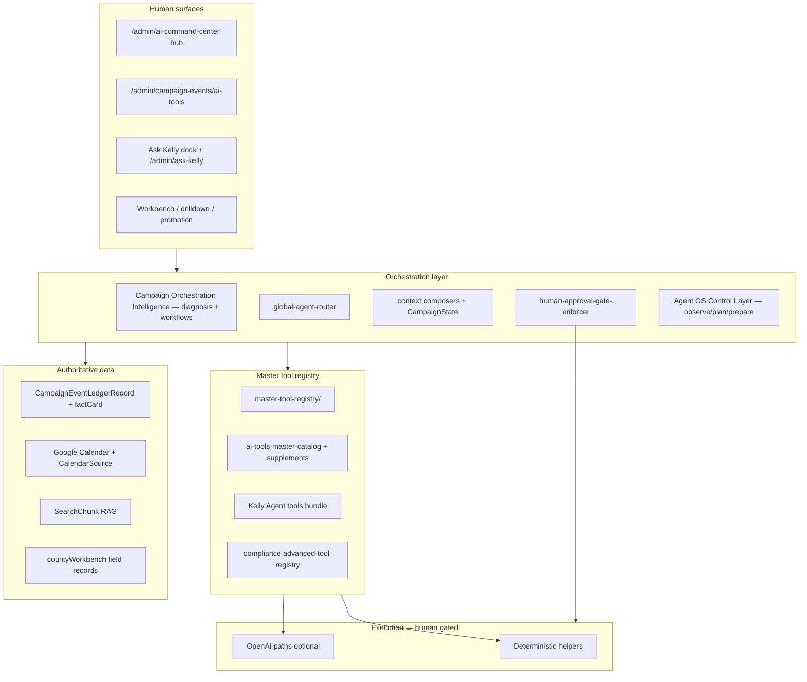
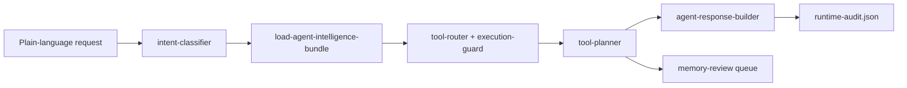

# All-Knowing Campaign Agent — architecture

**Status:** Design + inventory pass (May 2026). **No** autonomous writes, sends, or compliance certifications.

**May 2026 update:** **Campaign Orchestration Intelligence Layer** is the next evolution of this architecture — cross-domain reasoning above the tool registry. **Phase 3A** adds the campaign knowledge graph + lessons engine (`src/lib/agents/orchestration/knowledge/`). **Phase 3B** adds the human feedback + lesson approval loop (`src/lib/agents/orchestration/feedback/`). **Phase 4A** adds the AI Agent Tooling Brain (`src/lib/agents/orchestration/tooling/`). **Phase 4B** adds the Cross-Domain Agent Tool Orchestrator (`src/lib/agents/orchestration/cross-domain/`). **Phase 4D** adds the Role Copilot Orchestration Network (`src/lib/agents/orchestration/role-copilots/`). See [`ORCHESTRATION_PHASE_4D_ROLE_COPILOT_NETWORK_HANDOFF.md`](./ORCHESTRATION_PHASE_4D_ROLE_COPILOT_NETWORK_HANDOFF.md).

---

## 1. North star

One **operator-facing intelligence layer** that:

- Knows **what tools exist** across SOSWebsite (events, travel, calendar, approval, county, compliance, comms, public Ask Kelly).
- **Composes context** from authoritative data sources (ledger, factCard, sync truth, reimbursement status).
- **Recommends** next human actions with provenance.
- **Never** executes gated actions without explicit click (email send, GCal write, filing, voter export).

Public **Ask Kelly** remains the voter/education surface; the All-Knowing Agent is the **campaign operations brain** behind admin UIs.

---

## 2. Layer model

---

## 3. Domain map (unified)

| Domain | Source of truth | Primary tools today | Target registry domain |
|--------|-----------------|---------------------|------------------------|
| Campaign events | Event OS ledger | Sprint 1–5 catalogs | `campaign_events` |
| Approval / email | factCard + SendGrid gate | Sprint 4 | `approval_email` |
| Google calendar | promotion + sync | Sprint 5 + legacy push | `google_calendar` |
| Travel / reimbursement | travel-report + month status | Sprint 1 + kelly-travel pkg | `travel_reimbursement` |
| Ask Kelly public | RAG + assistant tools | `/api/assistant` | `ask_kelly` |
| Kelly Agent ops | context pack + tool bundle | `kelly-agent/*` | `kelly_agent` |
| Calendar command | normalized JSON + HQ | calendar-command-center | `calendar` |
| Hot wash / media | media-storage | hot_wash lifecycle | `hot_wash` |
| Compliance / FIN | compliance agents + FIN read-only | `compliance/ai/*` | `compliance` |
| Email command center | ai-brain-registry | ECC AI modules | `email_command_center` |
| County intelligence | countyWorkbench manifests | docs + JSON store | `county_workbench` |
| Public scheduling | intake bridge + scheduling agent | website form | `public_scheduling` |
| Municipal (AJAX) | isolated | ajax personas | `ajax_municipal` (excluded default) |

---

## 4. Context composers (V1)

Implemented as **contracts** in `sprint-global-agent-tools.ts`; helpers wire incrementally:

| Composer | Bundles |
|----------|---------|
| `campaign-context-loader` | Dashboard snapshot, sprint status |
| `event-context-composer` | Row + factCard + sync + promotion |
| `travel-context-composer` | Travel lines + gaps |
| `reimbursement-context-composer` | Month status + print readiness |
| `approval-context-composer` | Package + email log + tokens |
| `calendar-truth-context-composer` | Sync + lane health + promotion |
| `county-context-composer` | County profile slice (RedDirt); V2 countyWorkbench adapter |

**Router** (`global-agent-router`) chooses composer chain from intent + pathname.

---

## 5. Observation bus (shared)

Single append-only pattern:

- Event OS: `factCard._aiObservations`
- Promotion: promotion audit + observation recorder
- Approval email: approval observation hooks
- Future: central `AgentObservationStore` (Prisma or JSON) — **not in this pass**

All composers and tools **emit** observation events; learning roadmap defines aggregation.

---

## 6. Consolidation phases

| Phase | Work | Risk |
|-------|------|------|
| **0 (done)** | Global inventory + hub route + registry scaffold + 20 global tool contracts | Low |
| **1** | Import Kelly Agent tool IDs into registry; deprecate duplicate calendar reports | Medium |
| **2** | Single GCal write path for ledger (disable lifecycle auto-push for ledger-sourced events) | High — needs Steve |
| **3** | Ask Kelly admin mode reads Event OS context composers (read-only) | Medium |
| **4** | countyWorkbench adapter (read field records by county slug) | Low with packet |
| **5** | Compliance + ECC tools in registry; shared human gate | Medium |
| **6** | Learning miner + accepted/rejected suggestion store | Medium |

---

## 7. Hard boundaries (never automate)

From `CAMPAIGN_AI_HUMAN_CONTROL_RULES` + `ai-agent-brain-map.md`:

- Outbound email/SMS/SendGrid
- Google Calendar write (except explicit Promote click + env)
- Compliance certify / file / reconcile lock
- Voter file export / PII bulk
- Role/seat promotion
- Autonomous approval decisions

---

## 8. Routes (current + planned)

| Route | Role |
|-------|------|
| `/admin/ai-command-center` | **Hub** — links, registry counts, doc index |
| `/admin/campaign-events/ai-tools` | **Operational** catalog + sprint pipelines |
| `/admin/ask-kelly` | Candidate onboarding |
| `/api/assistant` | Public Ask Kelly |
| `/api/admin/kelly-agent/recommend` | Ops recommendations |

**Future:** merge hub + operational into one command center UI with domain tabs.

**Sprint 3 (May 2026):** `campaign-agent-runtime.ts` unifies intent → context bundle → safe tool router → operator response. `AgentCommandPalette` is the primary human entry point; `ask-kelly-adapter` and `kelly-agent-adapter` expose legacy surfaces as registry-aware read bridges without autonomous execution.

---

## 9. Unified runtime (Sprint 3)

| Output | Purpose |
|--------|---------|
| `interpretedIntent` | domain, task, risk, route hint |
| `selectedTools` / `blockedActions` | registry-safe recommendations |
| `nextLinks` | operator navigation |
| `memoryCandidates` | human review before durable memory |

**Not in Sprint 3:** LLM tool loop, vector memory write, autonomous sends/writes.

---

## 10. Related docs

- [`GLOBAL_AI_AGENT_TOOL_INVENTORY.md`](./GLOBAL_AI_AGENT_TOOL_INVENTORY.md)
- [`AI_AGENT_OBSERVATION_AND_LEARNING_ROADMAP.md`](./AI_AGENT_OBSERVATION_AND_LEARNING_ROADMAP.md)
- [`docs/ai-agent-brain-map.md`](../ai-agent-brain-map.md)
- [`AI_AGENT_TOOL_BUILD_MAP.md`](./AI_AGENT_TOOL_BUILD_MAP.md)
