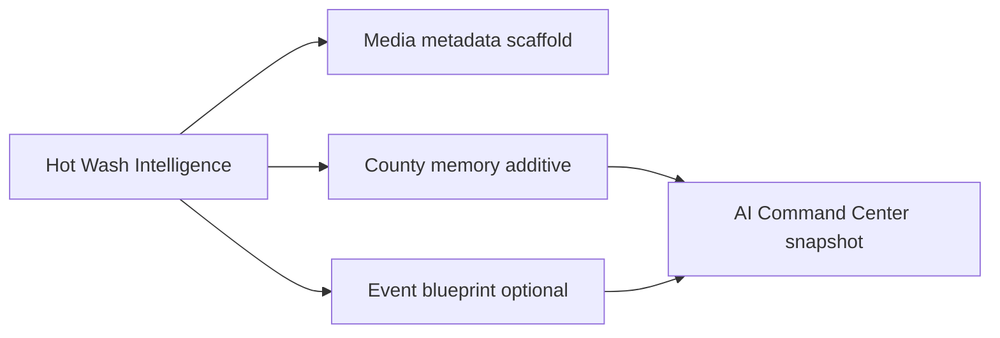

# Campaign Learning Loop (Sprint 7)

**Principle:** CAPTURE → CHUNK → LEARN → RECOMMEND (V1: deterministic capture + learn; recommend via command center + hot wash UI).

## Pipeline

## Orchestrator

`src/lib/campaign-events/hot-wash-intelligence/campaign-learning-loop.ts`

## Observations (append-only)

On complete review: `hotwash_completed`, `county_memory_updated`, `county_signal_detected`, `messaging_signal_detected`, `strategic_signal_detected`, `followup_task_generated`, `relationship_opportunity_detected`, and when applicable `successful_event_logged`, `event_blueprint_created`, `event_pattern_detected`.

## Boundaries (V1)

- No auto email, CRM, or GCal writes
- No real transcription, OCR, or face detection
- Human completes review before memory/blueprint writes

## Test

`npm run campaign-events:test-hot-wash-intelligence`
