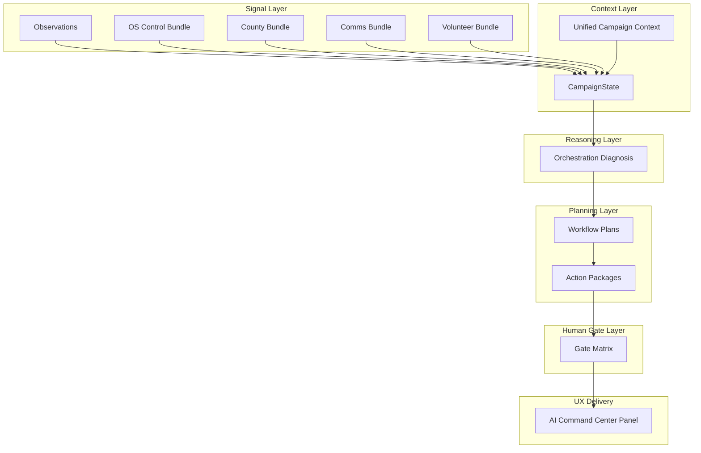

# Campaign Orchestration Intelligence — architecture

**Status:** Master plan approved for implementation (Phase 1 complete)  
**North star:** One coordinated campaign brain — not isolated tools.

---

## Core question

Every future tool must answer:

> **How does this improve the AI's understanding of the entire campaign?**

---

## Eight layers

### 1. Signal layer

**Inputs:** observations, dashboard snapshots, domain bundles, calendar sync, queues.

| Source | Module | Signal type |
|--------|--------|-------------|
| OS control | `load-os-control-bundle.ts` | Health score, blockers, top moves |
| Observations | `user-observations.ts` | Friction, workflow events |
| County | `county-intelligence-engine.ts` | Weak counties, Power of 5 |
| Communications | `communications-intelligence-engine.ts` | Fatigue, follow-up gaps |
| Volunteer | volunteer engines | Underused segments |
| Finance | finance V2 + reimbursement ops | Packet readiness |
| Training | training-progress-store | Module gaps |
| Tool builder | tool-builder-queue | Open tickets |

**Loader:** `load-campaign-orchestration-signals.ts` — graceful degradation; failed domain → blocker row, not throw.

**Progress:** `[████████░░] 85%` Phase 3A knowledge graph live

**Phase 3A module:** `src/lib/agents/orchestration/knowledge/`  
**API:** `GET /api/agents/campaign-knowledge-state`  
**Test:** `npm run agents:test-campaign-knowledge`

---

### 7. Learning layer (Phase 3A)

| Component | Module |
|-----------|--------|
| Knowledge graph builder | `knowledge/campaign-knowledge-graph.ts` |
| Observation intake | `knowledge/campaign-observation-intake.ts` |
| Lessons engine | `knowledge/campaign-lessons-engine.ts` |
| Recommendation feedback | `knowledge/campaign-recommendation-feedback.ts` |
| CampaignState merge | `knowledge/campaign-knowledge-state.ts` |

**CampaignState field:** `knowledge` — graphHealth, strongestLessons, knowledgeGaps, recurringBlockers, recommendationFeedbackSummary

**Progress:** `[████████░░] 85%` functional V1

---

### 8. Agent tooling brain (Phase 4A)

| Component | Module |
|-----------|--------|
| Unified registry | `tooling/agent-tool-registry.ts` |
| Tool selector | `tooling/agent-tool-selector.ts` |
| Tool sequencer | `tooling/agent-tool-sequencer.ts` |
| Action prep | `tooling/agent-action-prep.ts` |
| Safety engine | `tooling/agent-tool-safety.ts` |
| Coverage analysis | `tooling/agent-tool-coverage.ts` |
| State builder | `tooling/agent-tooling-state.ts` |

**CampaignState field:** `agentTooling` — topRecommendedTools, sequences, preparedActions, coverageByDomain, safetySummary

**API:** `GET /api/agents/orchestration-tooling-state`  
**Test:** `npm run agents:test-agent-tooling-brain`

**Progress:** `[████████░░] 85%` functional V1

---

### 9. Feedback + lesson approval loop (Phase 3B)

| Component | Module |
|-----------|--------|
| Recommendation outcomes | `feedback/recommendation-feedback-service.ts` |
| Lesson approvals | `feedback/lesson-approval-service.ts` |
| Learning engine | `feedback/feedback-learning-engine.ts` |
| Safety validation | `feedback/feedback-safety.ts` |
| Dashboard controls | `OrchestrationFeedbackLoopPanel.tsx` |

**CampaignState field:** `feedbackLoop` — recentOutcomes, pendingLessonApprovals, approvedLessons, ignoredRecommendations, failedPatterns, feedbackHealth

**APIs:** `GET/POST /api/agents/orchestration-feedback`, `GET/POST /api/agents/lesson-approvals`  
**Test:** `npm run agents:test-orchestration-feedback-loop`

**Progress:** `[████████░░] 85%` functional V1

---

### 2. Context layer

| Composer | Output |
|----------|--------|
| Unified campaign context | Strategic + operator narrative |
| Cross-domain context | Path-active domain + next actions |
| Role context | Copilot brief slices |
| County context | `composeCountyDashboardContext` |
| Communications context | `composeCommunicationsIntelligenceContext` |

**Merged into:** `CampaignState` (`campaign-state-types.ts`).

**Progress:** `[██████░░░░] 55%` types + skeleton builder

---

### 3. Reasoning layer

**Engine:** `orchestration-reasoning-engine.ts` (deterministic V1).

| Analyzer | Output |
|----------|--------|
| Campaign state analyzer | `overallHealth`, domain bands |
| Blocker detector | `activeBlockers` (from OS + signals) |
| Opportunity detector | `activeOpportunities` |
| Priority ranker | `urgentActions` |
| Risk detector | `topRisks` (send, finance, compliance) |
| Momentum interpreter | Strategic line (Phase 2+) |
| Workload balancer | Volunteer/field plans |

Optional LLM narration **later** — never replaces gates.

**Progress:** `[███████░░░] 70%` V1 diagnosis

---

### 4. Planning layer

**Engine:** `orchestration-workflow-planner.ts`

| Planner | Templates |
|---------|-----------|
| Cross-domain workflow | 6 built-in chains (reimbursement, county visit, weak county, house party, volunteer push, CM daily) |
| Action package builder | Extends county-action-package + OS prepared actions |
| Role assignment | `ownerRole` per step |
| Communication sequence | Links to comms sequence builder (draft) |
| Dashboard adaptation | Simplification when `dashboardHealth` weak |

**Progress:** `[███████░░░] 75%` templates + plan builder

---

### 5. Human gate layer

| Component | Role |
|-----------|------|
| `human-approval-gate-matrix.ts` | safe / gated / forbidden |
| `orchestration-human-gate-enforcer` | Tool contract |
| `orchestration-autonomy-boundary-checker` | Blocks mass send, GCal, finance post |
| `CAMPAIGN_AI_HUMAN_CONTROL_RULES` | Global rules |

**Forbidden auto actions:** `ORCHESTRATION_FORBIDDEN_AUTO_ACTIONS` in tool contracts.

**Progress:** `[████████░░] 85%` rules exist; orchestration enforcers partial

---

### 6. Execution prep layer

| Output | Description |
|--------|-------------|
| Prepared actions | From OS preparer + workflow packages |
| Drafts | ECC / Message Studio — no send button on Campaign OS studio |
| Packets | Reimbursement, treasurer, county action |
| Route links | Every step has `route` |
| Tool chains | Catalog tool IDs per workflow step |
| Checklists | Human execution lists |

**Progress:** `[██████░░░░] 65%` OS preparer functional; orchestration packages Phase 3

---

### 7. Learning layer

| Mechanism | Store |
|-----------|-------|
| Observations | `data/.../user-observations.json` |
| Memory candidates | memory review store |
| Hot wash | hot-wash-intelligence |
| Relationship memory | communications/memory |
| Tool-builder queue | `ai-tool-builder-queue.json` |
| Training gaps | training-progress |

**Tools:** memory candidate builder, observation miner, sprint recommender.

**Progress:** `[██████░░░░] 60%`

---

### 8. UX delivery layer

| Surface | Phase |
|---------|-------|
| AI command center | Phase 4 orchestration panel |
| Dashboards | Phase 7 adaptation |
| Copilots | Phase 5 role tabs fed by orchestration |
| Command palette | Existing — add orchestration intents |
| Training center | Phase 6 gap-driven modules |
| Communications studio | Draft-only; ECC for send |

**Progress:** `[████░░░░░░] 45%` plan only

---

## Data flow



---

## Command center plan (Phase 4)

**Route:** `/admin/ai-command-center` — new **Orchestration** section (do not overload hub).

| Block | Content | Collapsible |
|-------|---------|-------------|
| Executive summary | Headline + health band + period | No |
| Top 3 moves | From diagnosis + OS topMoves | No |
| Cross-domain blockers | P0/P1 list with routes | Yes |
| Opportunities | Momentum / growth | Yes |
| Recommended workflows | Template cards + readiness % | Yes |
| Prepared packages | OS + orchestration execution packages | Yes |
| Role assignments | Tab per role: CM, candidate, field, comms, treasurer | Yes |
| Training gaps | Module IDs + links | Yes |
| Tool build recs | Queue tickets | Yes |
| Human-gated queue | Forbidden + review actions | Yes |
| Memory candidates | Pending review count | Yes |

**UX rules:** “Why this matters” one line per card; every action has route link; no send buttons in orchestration panel.

**Progress:** `[███░░░░░░░] 35%` design complete

---

## Relationship to Agent OS Control

| OS Control | Orchestration |
|------------|---------------|
| Campaign-wide health snapshot | **Feeds** CampaignState |
| Top 3 moves (single loop) | **Merges** with cross-domain workflows |
| Prepared actions | **Execution prep** input |
| Tool readiness | **Tool gap** orchestrator input |

Orchestration **extends** OS control; does not replace it.

---

## Relationship to All-Knowing Agent

`ALL_KNOWING_CAMPAIGN_AGENT_ARCHITECTURE.md` describes registry + runtime. Orchestration is the **reasoning and planning brain** above registry lookup:

- Registry answers: *what tools exist?*
- Orchestration answers: *what should happen across the campaign now?*

---

## File map (implementation)

| Artifact | Path |
|----------|------|
| State types | `src/lib/agents/orchestration/campaign-state-types.ts` |
| Signal loader | `load-campaign-orchestration-signals.ts` |
| Reasoning | `orchestration-reasoning-engine.ts` |
| Workflows | `orchestration-workflow-planner.ts` |
| Domains | `orchestration-domains.ts` |
| Tool contracts | `orchestration-tool-contracts.ts` |
| Sprint catalog | `ai-tools/sprint-orchestration-intelligence-tools.ts` |

---

## Layer readiness dashboard

```
Signal layer           [██████░░░░] 60%
Context layer          [██████░░░░] 55%
Reasoning layer        [███████░░░] 70%
Planning layer         [███████░░░] 75%
Human gate layer       [████████░░] 85%
Execution prep         [██████░░░░] 65%
Learning layer         [██████░░░░] 60%
UX delivery            [████░░░░░░] 45%
Overall architecture   [███████░░░] 72%
```

---

*Next: `ORCHESTRATION_BUILD_ROADMAP.md` for phased delivery.*
