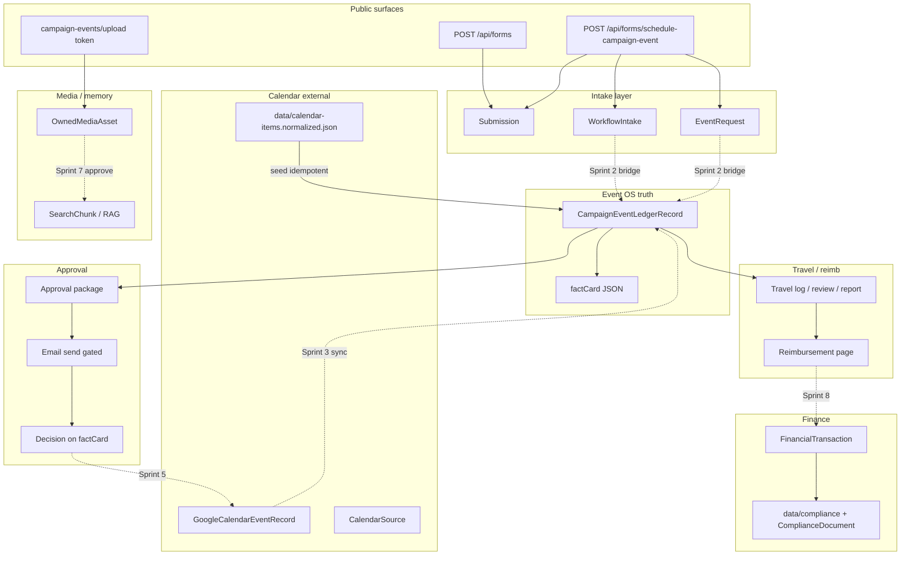
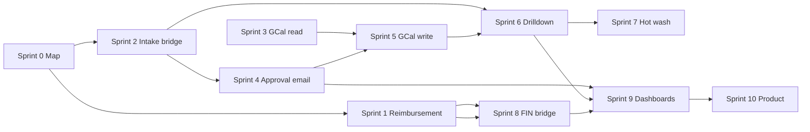
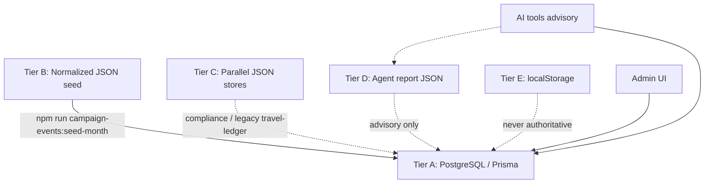
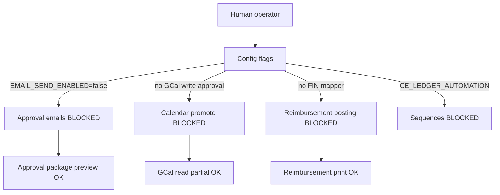
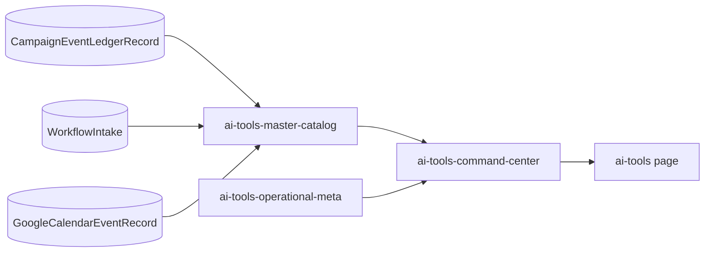

# System Dependency Graph

**Lane:** `RedDirt/`  
**Purpose:** Show what depends on what for the Campaign OS master build.  
**Companion:** [`MASTER_CAMPAIGN_OS_ROADMAP.md`](./MASTER_CAMPAIGN_OS_ROADMAP.md), [`BUILD_SPRINT_STATUS.md`](./BUILD_SPRINT_STATUS.md)

---

## 1. Master data flow (target state)



**Solid arrows:** implemented today. **Dotted:** planned sprint deliverables.

---

## 2. Sprint dependency chain



| Sprint | Hard depends on | Soft depends on |
|--------|-----------------|-----------------|
| 1 | 0 | Ledger seeded months |
| 2 | 0 | `WEBSITE_ENTRY` enum |
| 3 | 0, 2 (ledger rows exist) | GCal OAuth env |
| 4 | 2, 3 (stable ledger + package) | SendGrid / comms hub |
| 5 | 3, 4 | Human promote UX |
| 6 | 2 | — |
| 7 | 6 | Owned media ingest |
| 8 | 1 | FIN-1 models |
| 9 | 1, 4, 6 | — |
| 10 | 9 | Auth/tenant design |

---

## 3. Source-of-truth tiers



| Tier | Examples | Rule |
|------|----------|------|
| A | `CampaignEventLedgerRecord`, `WorkflowIntake`, `FinancialTransaction` | Wins on conflict |
| B | `calendar-items.normalized.json` | Bootstrap only; idempotent seed |
| C | `data/travel-ledger/`, `data/compliance/*` | Domain-specific; migrate to A when bridged |
| D | `data/agent/*-latest.json` | Operator hints only |
| E | Franklin planner, month review toggles | Per-browser UX |

---

## 4. Integration boundaries (do not cross without packet)

| From | To | Status | Sprint |
|------|-----|--------|--------|
| `WorkflowIntake` | `CampaignEventLedgerRecord` | **Gap** | 2 |
| Ledger approved travel | `FinancialTransaction` | **Gap** | 8 |
| Ledger | Google Calendar write | **Blocked** | 5 |
| `Submission` (generic forms) | Ledger | Partial / manual | 2+ policy |
| `CampaignEvent` (HQ) | Ledger | Parallel systems | Document only |
| RedDirt | `sos-public/` | **Forbidden** | — |
| RedDirt | `countyWorkbench/` | Link-out only (`NEXT_PUBLIC_COUNTY_WORKBENCH_URL`) | — |

---

## 5. Blocked automations graph



| Automation | Config / doc gate |
|------------|-------------------|
| Approval email | `approval-recipients.ts` → `EMAIL_SEND_ENABLED` |
| GCal write | Product + Sprint 5 human confirm |
| Auto email sequences | `CE_LEDGER_AUTOMATION_NEEDS.md` |
| Inbound reply parser | Not built |
| SendGrid bulk from event OS | Comms hub governance separate |

---

## 6. AI tools dependency on data



**Rule:** Tools **read** Tier A first; **write** only through existing persistence helpers (`persistence/review-persistence.ts`, `records.ts`, etc.).

---

## 7. Route clusters (dependency for nav polish — Sprint 9)

| Cluster | Routes | Merge target |
|---------|--------|--------------|
| Calendar views | `/admin/campaign-calendar/*` | Campaign OS hub |
| Event ops | `/admin/campaign-events/*` | Same hub |
| Legacy calendar | `/admin/calendar-command-center/*` | Deprecate gradually after Sprint 2–3 |
| Legacy travel | `/admin/travel-ledger/*` | Banner → campaign-events travel |
| Command | `/admin/workbench`, candidate/CM dashboards | Single command center (Sprint 9) |

---

## 8. External services

| Service | Used for | Sprint |
|---------|----------|--------|
| PostgreSQL (Docker / Supabase) | All Tier A | 0+ |
| Google Calendar API | Read/sync/promote | 3, 5 |
| OpenAI | Intake classify, search, optional drafts | Optional all sprints |
| SendGrid | Comms + future approval email | 4 |
| Netlify | Deploy | 10 |
| countyWorkbench | County dashboards (sister lane) | Link only |

---

## 9. Prisma model neighborhood (ledger-centric)

```text
Submission ──► WorkflowIntake ──► EventRequest
                      │
                      ╳ (Sprint 2 bridge)
                      ▼
         CampaignEventLedgerRecord ◄── seed ── calendar-items.normalized.json
                      │
          ┌───────────┼───────────┐
          ▼           ▼           ▼
    factCard._review  travel fields  googleSyncStatus
          │                       │
          ▼                       ▼
   EventApproval*          FinancialTransaction (Sprint 8)
   GoogleCalendarEventRecord (Sprint 3–5)
   OwnedMediaAsset (Sprint 7)

* EventApproval model exists for HQ events; ledger uses factCard._review primarily today.
```

---

## 10. Verification queries (operator / dev)

After bridge or sync work, verify in order:

1. Public schedule → `WorkflowIntake` row exists (`source` / metadata).
2. Sprint 2+ → matching `CampaignEventLedgerRecord` with `entrySource = WEBSITE_ENTRY`.
3. Workbench filter shows tentative lane.
4. Month review wizard includes row.
5. Approval package preview renders.
6. Travel/reimbursement paths unchanged for seeded months.

---

## Related generated graphs (self-build lane)

Separate from Campaign OS but same repo:

- `docs/REDDIRT_SELFBUILD_DEPENDENCY_GRAPH.md`
- `data/selfbuild/reddirt_selfbuild_dependency_graph.json`

Do not confuse **nightly self-build** graphs with this **Campaign OS** graph.

---

## Maintenance

Regenerate this doc when:

- A dotted edge in §1 becomes solid (sprint complete).
- A new blocker flag is introduced.
- A legacy route is retired (update §7).
