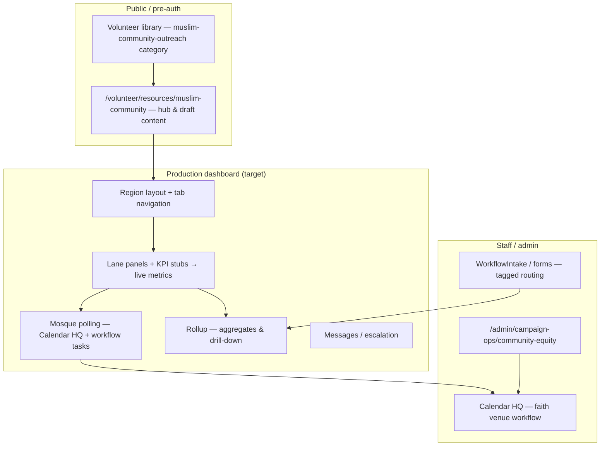

# Muslim Community Dashboard — architecture & launch path

**Purpose:** Meeting-ready summary of how the **Muslim Community Region** dashboard is structured in-product, what exists today, and how we reach **production quality** as the first community-native organizing system.  
**Audience:** Muslim community leadership, Field Director, campaign ops, engineering.  
**Language posture:** Respectful, **community-native** civic framing — partner-led, non-extractive; legal/comms/counsel on any public election messaging.  
**Last updated:** 2026-05-11

**Related docs**

- Plan (lanes, KPIs, resources): [`MUSLIM_COMMUNITY_CIVIC_ORGANIZING_DASHBOARD_PLAN.md`](./MUSLIM_COMMUNITY_CIVIC_ORGANIZING_DASHBOARD_PLAN.md)  
- Product priorities: [`COMMUNITY_REGIONS_PRODUCT_PRIORITIES.md`](./COMMUNITY_REGIONS_PRODUCT_PRIORITIES.md)  
- Community equity master plan: [`COMMUNITY_EQUITY_OUTREACH_MASTER_PLAN.md`](./COMMUNITY_EQUITY_OUTREACH_MASTER_PLAN.md)  
- **Code (single source for tab labels & lane copy):** `src/lib/campaign-ops/muslim-community-dashboard-plan.ts`

---

## 1. Architecture (high level)

### 1.1 Community Region concept

A **Community Region** is a scoped organizing unit with:

- Its own **leadership tree** (community leads + campaign column alignment).
- **Lane dashboards** (P5/VR, Events, Social, Youth, Women’s, mosque readiness, etc.).
- **Shared services**: events + registration workflows, resources, messaging library, rollup, staff escalation.
- **Governance**: draft / community-review labeling until trusted leaders sign off on copy.

The Muslim Community Region is the **first** implementation; Spanish and Marshallese regions will **reuse the same route + component patterns** with different content packs and (later) data.

### 1.2 Logical layers



### 1.3 Authentication & authorization (production target)

- **Community leads** access the region dashboard via **authenticated session** (campaign account or magic-link scope TBD with security).
- **RBAC**: roles mapped to leadership seats (Overall Lead, lane leads); optional read-only for trusted deputies.
- **PII**: voter-level data stays in governed admin paths; region dashboard emphasizes **counts, tasks, and community-approved messaging** — not raw voter file on public surfaces.

### 1.4 Data (phased)

| Phase | What |
|-------|------|
| **Now** | Static plan + hub page + library entries; draft labels. |
| **Next** | `CommunityRegion` / membership model (or reuse `VolunteerOpsTeam`-style pattern with `regionKey: "muslim_community"`). |
| **Then** | Lane KPIs from relational + event + intake aggregates; rollup materialized or queried. |

Exact Prisma shapes are a **build decision** — the **UI contract** is the tab list and lane panels in `muslim-community-dashboard-plan.ts`.

---

## 2. Routes & component structure

### 2.1 Current (shipped for review)

| Route | Role |
|-------|------|
| `/volunteer/resources/muslim-community` | Single-page **draft hub**: sticky section nav (tab-like), leadership model, all lanes, cross-lane panel, resource stubs, rollup/messages placeholders. |
| `/volunteer/resources` | Lists **Muslim Community outreach (draft)** category. |
| `/admin/campaign-ops/community-equity` | Staff hub; links to public hub; goals + mosque polling pointers. |

**Components**

- Page: `src/app/(site)/volunteer/resources/muslim-community/page.tsx`  
- Content constants: `src/lib/campaign-ops/muslim-community-dashboard-plan.ts`  
- Library: `src/lib/volunteer-resources.ts` (`muslim-community-outreach`)

### 2.2 Target production route tree (recommended)

Keep the **public hub** for orientation; add an **authenticated** shell:

| Route | Purpose |
|-------|---------|
| `/volunteer/resources/muslim-community` | **Public** explainer + resources + draft labeling (remains, or redirects “overview” only). |
| `/dashboard/community/muslim` *(or `/organizing/muslim-community`)* | **Authenticated** region home (Overview). |
| `/dashboard/community/muslim/[section]` | Deep links per tab OR client tab state with shareable URLs. |

**Suggested filesystem**

```text
src/app/(authed)/dashboard/community/muslim/
  layout.tsx              # Region chrome + tab nav + draft banner
  page.tsx                # Overview + leadership + cross-lane summary
  p5-vr/page.tsx
  events/page.tsx
  social/page.tsx
  youth-outreach/page.tsx
  womens-outreach/page.tsx
  cross-lane/page.tsx     # optional if not folded into overview
  mosque-polling/page.tsx # embeds workflow status / links to admin calendar
  resources/page.tsx      # links + same anchors as public hub
  messages/page.tsx
  rollup/page.tsx
```

**Shared UI** (extract as you implement):

- `src/components/community-regions/MuslimCommunityDashboardChrome.tsx` — tabs, title, review banner.  
- `src/components/community-regions/lanes/*.tsx` — one component file per lane (props: KPIs, tasks, links).  
- `src/components/community-regions/MosquePollingReadinessPanel.tsx` — surfaces workflow key + task checklist link.

Reuse patterns from `src/components/dashboard/vos/*` (team dashboard) where sensible; **do not** couple Muslim region to geographic triad slugs unless product requires it.

---

## 3. Leadership model

Single tree under **Muslim Community Overall Lead**:

- P5 / Voter Registration Lead  
- Events Lead  
- Social / Communications Lead  
- **Youth Outreach Lead** (first-class)  
- **Women’s Outreach Lead** (first-class)  

**Reporting lines**

- P5/VR → Campaign P5/VR lead  
- Events → Campaign Events lead  
- Social → Campaign Social Media lead  
- Youth + Women’s → **Overall Lead** + Field Director support  
- Overall Lead → **Field Director / campaign team lead structure**

Authoritative strings: `MUSLIM_REGION_LEADERSHIP_MODEL` in `muslim-community-dashboard-plan.ts`.

---

## 4. Youth & Women’s Outreach lanes

Both lanes are **peers** of P5/VR, Events, and Social — not supplementary notes.

- **Youth Outreach:** networks, family/elders coordination, students/young professionals, registration education, volunteer recruitment, event participation, escalation, support for social/events/P5 helpers.  
- **Women’s Outreach:** women’s networks, women-led registration and conversations, family-friendly outreach, listening sessions, volunteer routing, modesty/norms respect, scheduling for women and families.

**KPIs** for each lane are enumerated in the same TS module (`MUSLIM_YOUTH_OUTREACH_LANE`, `MUSLIM_WOMENS_OUTREACH_LANE`) and on the public hub for tonight’s discussion.

**Cross-lane coordination** (`MUSLIM_CROSS_LANE_COORDINATION`): Youth ↔ P5/VR; Women’s ↔ Events; Social ↔ messaging support; Events ↔ shared calendar; P5/VR ↔ registration goals.

---

## 5. Mosque Polling Location Readiness module

**Intent:** One place in the region dashboard that answers: *Where are we in making a mosque (or faith-anchored) site election-ready, with neutral public language and stakeholder alignment?*

**Existing engine (campaign manager)**

- Workflow template key: **`s4_event_faith_venue_polling_v1`** (`FAITH_VENUE_POLLING_WORKFLOW_KEY` in `src/lib/campaign-ops/community-equity-plan.ts`).  
- Applied in **Calendar HQ** to a **MEETING**-type campaign event (planning milestone).  
- Spawns tasks (MOU, county clerk, access/ADA, comms, counsel, etc.) — see `COMMUNITY_EQUITY_OUTREACH_MASTER_PLAN.md`.

**Region dashboard module (target)**

- **Read-only or deep-link** into admin task list for authorized users.  
- **Lane page** `mosque-polling`: status chips, next deadline, link to Calendar event, link to community-equity doc.  
- **No** substitution for counsel or election-official process — UI is **coordination**, not legal advice.

---

## 6. Resource & messaging structure

### 6.1 Resources

- **Volunteer library category:** `muslim-community-outreach` in `volunteer-resources.ts`.  
- **Hub:** `/volunteer/resources/muslim-community` lists Youth + Women’s stub resources (anchors `#resource-…`).  
- **Production:** expand stubs into PDFs or MD articles after **community review**; keep **Draft — pending Muslim community review** visible until sign-off.

### 6.2 Messaging / talking points

- **Campaign-approved** general messaging remains in `/volunteer/resources/messaging` and field playbook.  
- **Region-specific** copy should live in a **reviewed pack** (future: `muslim-community` section or filtered resource tags).  
- **Rule:** No finalize for community-facing claims until **trusted women leaders, youth leaders, family leaders, and mosque/community leadership** review (as stated on hub + plan).

---

## 7. Estimated path to production launch

Rough sequencing for **one** engineer plus field/CM bandwidth (calendar weeks, not guarantees):

| Step | Scope | ETA (indicative) |
|------|--------|-------------------|
| A | Lock IA + copy review with leaders; freeze tab names | Immediate (parallel to tonight) |
| B | Auth shell + `layout` + tab routes; migrate content from single page into lane components | 1–2 weeks |
| C | Wire mosque polling module to calendar/workflow (read model or iframe-style deep links) | 1 week |
| D | KPI + rollup: minimum viable counts from existing events/intake/relational where available | 2–3 weeks |
| E | Community events + registration workflows: reuse public events + `/volunteer` + intake tags | 1–2 weeks (overlap with D) |
| F | Hardening: accessibility, mobile, audit logging, counsel pass on public strings | 1 week |

**Launch-ready bar (Muslim region):** authenticated dashboard with all **tabs live** (even if some KPIs are manual entry first), mosque workflow **visible**, rollup **honest**, resources **review-labeled**, and **no** final copy without community sign-off.

After that: **statewide VOS** at full pace, then **Spanish** and **Marshallese** regions by **cloning shell + swapping `regionKey` + content packs**.

---

*MUSLIM-DASH-ARCH-1*
