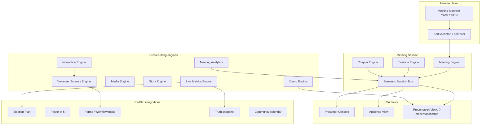

# CPOS Master Build Bible

**Doc ID:** CPOS-000  
**Lane:** `H:\SOSWebsite\RedDirt`  
**Phase:** 1 — Foundation (constitution)  
**Status:** Draft for Steve + Ernie review  
**Companion:** [`CPOS_DESIGN_PASS_01_ERNIE_CONVERSATION.md`](./CPOS_DESIGN_PASS_01_ERNIE_CONVERSATION.md)

---

## 1. Name and scope

**Campaign Presentation OS (CPOS)** is a reusable subsystem of the Kelly Grappe Campaign OS (RedDirt). It runs **live, synchronized presentations** for any campaign meeting type:

- Team kickoff (v1 ship)
- Volunteer onboarding, weekly statewide, county team, candidate training, field training
- Power of 5 workshops, house parties, donor briefings, press briefings
- Candidate school, debate prep, Arkansas Civic University modules
- Future campaigns (manifest fork, not rewrite)

**CPOS is not:** a Zoom replacement, a slide deck exporter, or a generic webinar SaaS. It is **campaign-native**: demos open **real Campaign OS surfaces**, interactions **wire volunteer journeys**, metrics pull **live campaign truth** where honest.

---

## 2. Presentation philosophy

### 2.1 Platform first, meeting second

Every meeting is a **manifest instance** on one engine. Kickoff is `kickoff-2026`, not a bespoke route.

### 2.2 Story over slides

Chapters carry **narrative intent** (why → trust → infrastructure → immersion → action). Visuals support memory, not bullet lists.

### 2.3 Guided, not locked

Audience may explore embedded demos. CPOS shows **“Now viewing: County Playbook”** with a gentle **return to meeting** — never browser imprisonment.

### 2.4 Presenter sovereignty

Presenter Console is a **separate cognitive surface**: clock, cues, notes, demo triggers, timing — invisible to audience.

### 2.5 One session, many surfaces

Audience View, Presenter Console, and embedded Presentation Views share one **Meeting Session** state via a semantic bus (chapter, segment, active demo, interaction phase) — not screen mirroring.

### 2.6 Honest live data

Live metrics display **aggregates and campaign truth** with provenance. No fabricated opponent claims; no voter microtargeting on audience UI.

### 2.7 Interaction → journey

Polls and role picks are **pipeline events**: profile hints, county leader signals, future meeting personalization — governed, not silent auto-writes.

### 2.8 Institutional memory

Every meeting is stored: manifest version, analytics, optional replay artifact — clone for next cycle.

### 2.9 Accessibility and hybrid reality

County meetings have bad Wi‑Fi and mixed devices. Offline-tolerant audience shell and reduced-motion paths are **v1 requirements**, not Phase 4 polish.

### 2.10 Build slices, not big bang

Phase 4 ships thin vertical slices on green `npm run check` per packet — aligned with RedDirt progressive build protocol.

---

## 3. Presentation architecture



**Layer rules:**

| Layer | Owns | Does not own |
|-------|------|----------------|
| Manifest | Structure, timing targets, asset refs, integration keys | Runtime session state |
| Session bus | Authoritative live state, fan-out to clients | Business persistence (delegates) |
| Surfaces | Render + local UX | Cross-client truth (reads bus) |
| Engines | Domain behavior per manifest type | Duplicate session state |
| RedDirt rails | Source data + governed writes | Presentation layout |

---

## 4. The eighteen engines

Ernie’s engine list, with CPOS constitution definitions:

| # | Engine | Responsibility |
|---|--------|----------------|
| 1 | **Meeting Engine** | Lifecycle: lobby → live → paused → ended; binds manifest to session |
| 2 | **Timeline Engine** | Schedules segments within chapters; drift warnings to presenter |
| 3 | **Chapter Engine** | Netflix-style chapters; enter, exit, skip, late-join catch-up |
| 4 | **Cue Engine** | Private timed prompts to presenter only |
| 5 | **Presenter Console** | Presenter-only app surface (may be route `/meeting/[id]/present`) |
| 6 | **Audience View** | Public volunteer-focused UI (`/meeting/[id]`) |
| 7 | **Demo Engine** | Launch embedded Campaign OS demos; track opens; auto-return |
| 8 | **Presentation Views** | `?presentation=true` (or `?cpos=1`) strips chrome on EP + admin surfaces |
| 9 | **Interaction Engine** | Polls, questions, buttons, interest forms in session |
| 10 | **Volunteer Journey Engine** | Maps interactions → profile, training, county notify |
| 11 | **Media Engine** | Video, photo, map, chart sync to chapter timeline |
| 12 | **Story Engine** | Narrative metadata: arc, emotion beat, memory hook per chapter |
| 13 | **Live Metrics Engine** | Inject live aggregates (counties, stops, conversations, …) |
| 14 | **Campaign OS Launcher** | Presenter trigger → audience receives “Open” for same demo |
| 15 | **Navigation Lock (soft)** | “Now viewing” + return timer — guidance only |
| 16 | **Meeting Analytics** | Dwell, drops, demo opens, role selections, exports |
| 17 | **Meeting Builder** | Future drag-drop manifest authoring (admin) |
| 18 | **Presentation Library** | Versioned manifest store; clone, replay, fork |

**v1 engine depth (kickoff):** Meeting, Timeline, Chapter, Cue (minimal), Presenter Console, Audience View, Demo (one path), Presentation Views (one surface), Interaction (one poll + interest capture), Volunteer Journey (hint path), Media (video + static), Story (metadata only), Live Metrics (static + one live hook), Launcher (one demo), Soft nav, Analytics (event log), Library (read manifests). **Defer v1:** full Meeting Builder UI, ACU modules, replay video, multi-demo orchestration.

---

## 5. Meeting manifest (constitutional object)

Every presentation is a **Meeting Manifest**. Example shape (normative spec in doc 021):

```yaml
id: kickoff-2026
version: 1
title: Kelly SOS Team Kickoff
meetingType: team_kickoff
estimatedDurationMinutes: 75

story:
  arc: [why, trust, infrastructure, immersion, dashboard, action, close]
  emotionalBeat: hope_to_commitment

media:
  introVideo: /media/cpos/kickoff/intro.mp4

chapters:
  - id: why
    title: Why We Run
    targetMinutes: 5
    segments: [video, narrative, metric_strip]
    cues: [cue_winthrop_rockefeller]
  - id: trust
    title: Trust the Team
    targetMinutes: 7
  - id: infrastructure
    title: The Infrastructure
    targetMinutes: 8
  - id: immersion
    title: Road Trip Immersion
    targetMinutes: 10
  - id: dashboard_demo
    title: County Playbooks
    targetMinutes: 6
    demo: county_playbook
  - id: volunteer_roles
    title: Find Your Lane
    targetMinutes: 8
    interactions: [poll_lanes, interest_form]
  - id: closing
    title: Call to Action
    targetMinutes: 5

demos:
  county_playbook:
    surface: election_plan
    path: /election-plan/counties
    presentationQuery: { presentation: true, cpos: 1 }

interactions:
  poll_lanes:
    type: poll
    options: [field, youth, comms, data, county_leader]
  interest_form:
    type: form
    formKey: volunteer_interest_kickoff

timing:
  chapterWarnings: true
  globalHardStopMinutes: 90

completion:
  followupEmailTemplate: kickoff_followup
  workflowIntakeType: volunteer_kickoff

integrations:
  electionPlan: true
  powerOf5: false
  workflowIntake: true
```

**Rules:**

- Manifests are **validated at compile time** (Zod); invalid manifests never run.
- Manifests reference **integration keys**, not raw Prisma.
- Assets use **lane-relative paths** or CDN URLs — no secrets in manifest.

---

## 6. Hierarchy (information spine)

```
Presentation (library entry)
  └── Meeting (live session instance)
        └── Chapter
              └── Segment (atomic beat: video, narrative, metric, demo slot)
                    └── Cue (presenter-only, optional)
                    └── Interaction (audience, optional)
                    └── Demo (embedded surface, optional)
                    └── Resource (link, download, optional)
        └── Presenter Notes (per chapter, markdown)
        └── Timing (targets + actuals)
        └── Completion (forms, email, intake)
```

---

## 7. Demo system

**Problem:** Presenters open tabs; audience loses thread.

**CPOS pattern:**

1. Presenter taps **Launch County Playbooks** in console.
2. Session bus sets `activeDemo: county_playbook`.
3. Audience sees primary chapter UI **or** optional split with “Open Playbook” CTA.
4. Demo opens **Presentation View** — `/election-plan/counties?presentation=true&cpos=1&meetingSession=...`
5. Soft nav shows **Now viewing: County Playbooks** + **Return to meeting** (also auto-return on chapter advance).

**Presentation View contract (doc 011):**

- Remove global nav, admin chrome, distracting CTAs.
- Keep geography context and one primary story per screen.
- Honor `prefers-reduced-motion`.
- Accept `meetingSession` query for return deep link.

---

## 8. Interaction engine

Interaction types (extensible enum):

| Type | Audience | Persistence |
|------|----------|-------------|
| `poll` | Tap choice | Session aggregate + optional identity link |
| `question` | Text (moderated queue) | Presenter console queue |
| `button` | Single action | Journey event |
| `lane_selection` | Role / interest | Journey + county routing |
| `interest_form` | Multi-field | `POST /api/forms` → WorkflowIntake |

**Governance:** Anonymous session allowed for kickoff; identified users merge by auth cookie / email on form submit. No silent voter-file writes.

---

## 9. Volunteer journey engine

On interaction (example: Youth lane):

1. Emit `VolunteerJourneyEvent` with manifest + chapter provenance.
2. Update or create **profile hints** (`VolunteerProfile.metadataJson.cpos` namespace).
3. Suggest training manifest IDs for future meetings.
4. Notify county leader channel (async, governed — email/workbench item, not v1 requirement for every path).
5. Log to Meeting Analytics.

Aligns with Power of 5 pipeline language: every click feeds a **next action**.

---

## 10. Live metrics engine

**Static beats:** manifest-declared numbers (220 stops, 20,000 miles) with `asOf` date in presenter notes.

**Live beats (when honest):** read models from:

- `getTruthSnapshot()` / election plan rollups
- County counts from election plan snapshot
- Optional future: live registration totals, volunteer counts

**Never:** individual voter stats on audience wall.

---

## 11. Analytics

Events (minimum schema):

- `session.start`, `session.end`
- `chapter.enter`, `chapter.exit`, `chapter.dwell`
- `demo.open`, `demo.return`
- `interaction.submit`
- `audience.join`, `audience.leave` (heartbeat)

Outputs: operator export JSON, admin summary panel (Phase 4), feeds talent/intel later.

---

## 12. Accessibility

- Captions on all packaged video; transcript link in chapter.
- Keyboard path for presenter console chapter advance.
- `prefers-reduced-motion`: cross-fade only, no parallax.
- Color contrast per RedDirt brand tokens.
- Screen reader: chapter title announced on change.

---

## 13. Offline and hybrid support

- Audience shell caches **last known chapter** + static chapter assets.
- Interactions queue locally with retry (idempotent keys).
- Presenter console shows **audience sync status** (connected count estimate).
- Degraded mode: presenter advances locally; audience catches up on reconnect via chapter id.

---

## 14. RedDirt integration map (constitutional)

| CPOS need | RedDirt home | v1 |
|-----------|--------------|-----|
| County demo | `src/app/election-plan/` | Yes |
| Calendar demo | election plan / community calendar bindings | Stretch |
| Volunteer intake | `POST /api/forms`, WorkflowIntake | Yes |
| Profile hints | `VolunteerProfile`, auth session | Yes |
| Live metrics | `truth-snapshot`, election plan loaders | Partial |
| Power of 5 | P5 dashboards, relational | Phase 4+ |
| Admin review | admin workbench queue | Yes (export) |
| ACU modules | future `acu_lane_c` pattern | Deferred |

No imports from other SOSWebsite lanes.

---

## 15. Security and auth posture (draft)

| Surface | Default kickoff policy |
|---------|------------------------|
| Audience join link | Unlisted URL + optional passcode (Steve decision) |
| Presenter console | Authenticated staff role |
| Presentation Views on public EP | Same as audience link policy |
| Admin demos in meeting | **Never** on anonymous link without explicit packet |

---

## 16. Future roadmap (post-kickoff)

1. Meeting Builder drag-drop UI.
2. Replay mode (chapter-synced recording).
3. Multi-presenter handoff.
4. ACU chapter type + RAG tutor sidebar.
5. Debate prep timed cue stacks.
6. County-local manifest variants (77 county intros).
7. Template extraction for non-Kelly campaigns (separate legal phase).

---

## 17. Phase 4 build slice order (when coding starts)

| Slice | Deliverable |
|-------|-------------|
| CPOS-1 | Manifest Zod spec + `kickoff-2026` fixture + validator CLI |
| CPOS-2 | Meeting session types + bus interface (in-memory dev) |
| CPOS-3 | Audience View shell + chapter renderer |
| CPOS-4 | Presenter Console shell + chapter advance |
| CPOS-5 | Realtime fan-out (chosen transport) |
| CPOS-6 | Presentation View on one EP route |
| CPOS-7 | Demo launcher + soft return nav |
| CPOS-8 | Poll interaction + analytics events |
| CPOS-9 | Interest form → `/api/forms` |
| CPOS-10 | Kickoff manifest content complete + smoke runbook |

Each slice: one commit, `npm run typecheck`, docs update, no cross-lane edits.

---

## 18. Sign-off checklist (Phase 1 complete)

- [ ] Steve + Ernie agree on v1 engine depth (§4 defer list).
- [ ] Auth policy for kickoff link (§15).
- [ ] Realtime transport choice (Pass 1 conversation).
- [ ] Kickoff chapter list locked to manifest ids.
- [ ] First demo surface locked (likely county playbook).
- [ ] Ten differentiators accepted (see Pass 1 doc).
- [ ] Phase 2 IA owner assigned (Burt drafts, Ernie reviews UX intent).

**When all checked → begin Phase 2 Information Architecture.**
