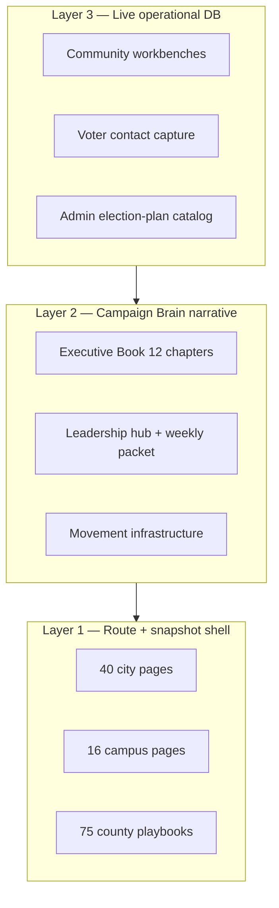

# 01 — Full system upgrade recommendation

## Goal

Bring **every Election Plan portal page** to the same standard as:

- Executive War Room hub (`/election-plan`)
- Executive Book chapters (`/election-plan/executive-book/*`)
- Faulkner county playbook (v3 intel + v4 ops reference)
- Pilot workbenches (Jacksonville, G&G event)

Without new lanes, without coalition fake metrics, without deleting existing routes.

## Diagnosis

The system has **three layers** at different maturity:



**Problem:** Layer 1 pages often show snapshot metrics only. Layer 2 is rich but uneven (some chapters have scorecards, others prose-only). Layer 3 exists only on pilot workbenches.

## Recommendation — five phases

### Phase 0 — Guardrails (this pass)

- [x] Route audit script + npm command
- [x] Rebuild election-plan + executive book + search
- [x] UI contrast fixes (warning, hero, donate gate)
- [x] Remove placeholder persona names from portal-facing copy
- [ ] Operator sign-off on [03-PAGE-TIER-MATRIX.md](./03-PAGE-TIER-MATRIX.md)

### Phase 1 — Page brief standard (all Tier B → Tier A shell)

**Every portal page gets the same chrome:**

1. Page brief strip (answers, bestFor, keyMetrics) from `page-briefs.source.json`
2. Related links row (minimum 3 outbound links)
3. “Last updated / data source” footer
4. Mobile sidebar collapse tested

**Work:** Extend page-briefs to cover all 68 route families; run `election-plan:search:build` after each batch.

**Do not:** Invent KPIs. Use “planning target” / “needs assignment” honestly.

### Phase 2 — Thick content parity

| Cluster | Upgrade action |
|---------|------------------|
| **County playbooks** | v3 intel panel on all 75 (template from Faulkner); mark “intel pending” where scrape empty |
| **Priority cities (40)** | City brief + link to workbench if exists; Mobilize enforcement callout |
| **Battlefield (9 clusters)** | Cluster week plan + county list from lanes drill-down |
| **Academy (9 roles × 3 pages)** | Uniform training checklist + how-it-helps narrative |
| **Campuses (16)** | Captain pipeline CTA → academy |
| **Movement infrastructure** | Cross-link to executive book + Po5 command center |
| **Executive book gaps** | Assign 4 operational owners; GOTV war room lead name field |

### Phase 3 — Operational wiring (DB-backed)

Align with engineering priority lock:

1. Complete Jacksonville + G&G pilot smoke in production
2. PPEN A.0b Person + Participation
3. PPEN A.0c intake → link workbench contacts to person records
4. Coalition pathway nav shell (empty sections, no enrollment until PPEN)

**Workbench template:** Export Jacksonville/G&G panel layout as the standard for new city/event workbenches.

### Phase 4 — Admin + compliance rename

- Rename `/admin/compliance/ernie` → `/admin/compliance/operator-workflow` (redirect old URL)
- Rename `build-ernie-workflow.ts` → `build-operator-workflow.ts`
- Update compliance AI artifact names (`COMPLIANCE_AI_ERNIE_TODAY.md` → operator today)
- Refresh docs that still say placeholder names in search excerpts

### Phase 5 — Continuous audit CI

Add to Netlify or pre-push:

```bash
npm run election-plan:audit:routes
npm run election-plan:community-workbench:pilot-smoke  # when DB available
```

Fail build on missing routes; warn (not fail) on pilot INCOMPLETE until launch gate.

## What NOT to build

- Coalition Command scoreboards or fake enrollment counts
- Cross-lane imports from `sos-public/`
- New product lanes (ajax, phatlip, countyWorkbench)
- Opponent claims without claim ledger citation

## Success metrics

| Metric | Target |
|--------|--------|
| Route audit | 909/909 (maintain) |
| Tier A page count | ≥ 90% of catalog hrefs |
| Pilot smoke primary gate | PASS |
| Executive book unassigned owners | 0 before Labor Day |
| Search excerpts with placeholder names | 0 |
| Contrast violations (manual QA) | 0 on hero/warning/nav |

## Resource estimate

| Phase | Operator sessions | Engineering passes |
|-------|-------------------|-------------------|
| 0 | 1 (review audit) | Done |
| 1 | 2 | 2–3 |
| 2 | 4–6 | 4–6 |
| 3 | Ongoing with pilot | PPEN A.0b + A.0c |
| 4 | 1 | 1 |
| 5 | — | 1 |

## Days 4–7 compression verdict

**Safe to compress:** Phases 1–2 (page briefs + content parity) while pilot UI work continues.

**Not safe to compress:** PPEN A.0b, pilot smoke PASS gate, or assigning real owners for GOTV/compliance workflows.
