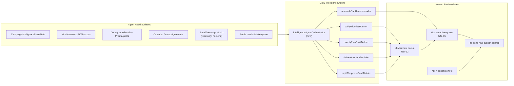

# AI Agent Intelligence System — Deployment Plan

**Version:** 1.0  
**Date:** 2026-05-31  
**Lane:** RedDirt/  
**Objective:** Define the fully functional, AI-agent-driven, deployment-ready campaign intelligence system we are building next — with human review at every publish/send/claim boundary.

---

## 1. Target state (what “done” looks like)

An operator opens **Intelligence Command Center** each morning and receives:

1. **Daily priorities** — ranked, source-grounded, INTERNAL_DRAFT — synced to Human Action Queue  
2. **Debate prep packet** — drill queue, scenario traps, opposition gaps, rapid-response drafts (all review-gated)  
3. **County field briefs** — per-county plans for priority counties using **canonical DB goals** where set, proxy labeled where not  
4. **Research gap requests** — appended to Kim Hammer retrieval tasks (human creates/approves)  
5. **Recommendation queue updates** — institutional memory + action queue, never auto-published  

The agent **reads** widely, **drafts** conservatively, **recommends** actions — it **never** publishes, sends, or makes uncited claims.

---

## 2. Architecture

---

## 3. Agent capabilities matrix

| Capability | Read | Draft | Recommend | Execute | Human gate |
|------------|------|-------|-----------|---------|------------|
| Campaign intelligence summary | ✅ today | ✅ deterministic | ✅ action queue | ❌ | Review before export |
| Opposition research | ✅ 57 JSON files | ✅ copilot tools | ✅ retrieval tasks | ❌ auto-close | Task workflow |
| County workbench (75) | ✅ adapter + registry | ⚠️ 6 full only | ⚠️ proxy goals today | ❌ mutate goals | DB goal verify |
| Calendar/events | ✅ read-only cards | 🔲 build | 🔲 build | ❌ create events | Event approval flow |
| Email/message studio | 🔲 read-safe slices | 🔲 INTERNAL_DRAFT | 🔲 | ❌ send | no-send scan |
| Daily priorities | ⚠️ partial (brain) | 🔲 build | 🔲 auto-queue | ❌ | Operator accept |
| County plans | ⚠️ overlay counties | 🔲 build | 🔲 | ❌ | County captain review |
| Debate prep | ✅ debate-prep page | ✅ workbench | ⚠️ partial | ❌ | LLM queue + export control |
| Rapid response | ✅ JSON + media intake | ✅ deterministic | ⚠️ partial | ❌ send | Comms lead review |
| Research gap requests | ✅ gaps index | ✅ suggest | ✅ queue item | ❌ auto-create | Task workflow |
| Update recommendation queue | ✅ NSI-15 sync | ✅ | ✅ syncHumanActionQueue | ❌ auto-close | Operator status |

Legend: ✅ exists · ⚠️ partial · 🔲 must build · ❌ forbidden

---

## 4. Tool inventory (existing + required)

### Existing (wire into orchestrator)

| Tool / module | Path |
|---------------|------|
| Brain coordinator | `src/lib/intelligence/intelligenceBrainCoordinator.ts` |
| Command center composer | `src/lib/intelligence/commandCenter/intelligenceCommandCenter.ts` |
| Copilot orchestrator (36 tools) | `src/lib/intelligence/aiCopilotOrchestrator.ts` |
| LLM draft gateway | `src/lib/intelligence/llmDraftGateway.ts` |
| Human action queue | `src/lib/intelligence/strategicDecisionSupport.ts` |
| Debate command state | `src/lib/opposition/debateCommandCenter.ts` |
| County intelligence engine | `src/lib/agents/county-intelligence/county-intelligence-engine.ts` |
| County agent runtime payload | `src/lib/agents/county-intelligence/countyAgentRuntimePayloadBuilder.ts` |
| Kim Hammer evidence index | `src/lib/opposition/kimHammerEvidenceIndex.ts` |

### Must build

| Component | Purpose |
|-----------|---------|
| `intelligenceAgentOrchestrator.ts` | Single entry: `runDailyIntelligenceAgentPass()` |
| `dailyPrioritiesPlanner.ts` | Merge brain + calendar + county weak list + debate traps → ranked priorities |
| `countyPlanDraftBuilder.ts` | Governed county plan INTERNAL_DRAFT using **Prisma goal read** + labeled proxies |
| `debatePrepDraftBuilder.ts` | Daily drill card + scenario crosswalk → LLM queue |
| `researchGapRecommender.ts` | Map brain signals → suggested retrieval tasks (no auto-create) |
| `agentRunAuditLog.json` | Append-only run log (or Prisma table in later phase) |
| Admin UI: `/admin/intelligence/agent-daily-run` | Operator trigger + diff view |

---

## 5. Data source rules

### County goals (critical)

1. **Read canonical:** `CountyCampaignStats.registrationGoal` via Prisma for display in county plans  
2. **Read proxy separately:** `targetDemVotesStatewide50` labeled `planningVoteTargetProxy` — never alias as registration goal  
3. **Never write** registration goals from agent passes  
4. If canonical null → plan section says `GOAL_NOT_SET — use admin county editor`  

### Opposition claims

1. Only cite claims with citation locker entries or export-ready tier  
2. Unsupported claims → `researchGapRecommender` output, not debate draft body  
3. All opposition drafts: `NON_PUBLISHABLE`, `INTERNAL_DRAFT`  

### Email / comms

1. Read metadata and INTERNAL_DRAFT templates only  
2. `email:no-send-scan` must pass before any new comms read adapter merges  
3. No invocation of `sendgrid.send`, Gmail send, or campaign event approval-email in agent path  

---

## 6. Daily agent run workflow

### Phase A — Read (deterministic, no LLM)

1. `summarizeCampaignIntelligenceState()`  
2. `composeIntelligenceCommandCenter()`  
3. `buildDebateCommandCenterState()`  
4. `composeCountyDashboardContext()` — with **fixed goal read path**  
5. Load calendar events next 7 days (campaign-events module)  
6. Load media intake pending review count  
7. Load Kim Hammer open retrieval tasks + export-ready claim count  

### Phase B — Plan (deterministic ranking)

1. Score priority candidates: media urgency, debate proximity, county weakness, open gaps, scenario HIGH risk  
2. Cap output: top 10 daily priorities, top 5 county actions, top 5 debate drills, top 3 rapid-response watches  
3. Attach `evidenceDependencies[]` and `confidenceBand` per item  

### Phase C — Draft (governed LLM optional)

1. For each priority bucket, call `generateGovernedDraft()` with template IDs from registry  
2. If `OPENAI_API_KEY` unset → deterministic synthesis (current behavior)  
3. If set → governed OpenAI call with: system prompt from template, retrieved JSON snippets only, mandatory governance header  
4. Append all drafts to `llm-draft-review-queue.json`  

### Phase D — Recommend (human queue only)

1. `syncHumanActionQueue()` with new SUGGESTION items — never AUTO_ACCEPT  
2. `syncRecommendationLedgerFromActionQueue()`  
3. Append `agentRunAuditLog` entry with run ID, inputs hash, output counts  

### Phase E — Operator review (mandatory)

Operator reviews at:
- `/admin/intelligence/llm-review-queue`  
- `/admin/intelligence/action-queue`  
- `/admin/intelligence/kim-hammer/intelligence-gaps` (for gap promotions)  

---

## 7. Debate Command Center target behavior

Daily presidential-level prep room means:

| Today | Target |
|-------|--------|
| Hardcoded readiness scores | Computed from drill completion + scenario risk + gap counts |
| Static academy track list | Module checklist with operator check-offs persisted in JSON |
| Film room placeholder | Clip index from debate archive + notes field |
| Drill list only | Timed drill session state (start/pause/complete) — human-scored |
| Separate pages | Single debate-command dashboard feeds from agent daily pass |

---

## 8. County workbench target behavior

| Today | Target |
|-------|--------|
| 3 v2 dashboards | Rollout queue: Benton, Washington next, then regional batches |
| Proxy goals in intel UI | Dual display: canonical DB + labeled proxy |
| 0 institutional memory | Capture event outcomes post-hot-wash into county memory index |
| 5 KH overlays | Expand overlays research-first (10 counties per pass) |
| Generic AI recommendations | County plan draft per priority county with validator checklist |

---

## 9. Deployment phases

### Phase 1 — Foundation (safe to deploy)

- Goal read-path fix (rename proxy, add Prisma read)  
- Agent orchestrator skeleton + audit log  
- Daily priorities deterministic pass → action queue  
- Debate scoreboard computed signals (remove hardcoded 71/74/…)  

### Phase 2 — Governed LLM

- Enable OpenAI in `llmDraftGateway` with citation-required prompts  
- Complete 16 generic copilot tool handlers  
- Agent daily run UI  

### Phase 3 — Field integration

- Calendar read adapter in agent pass  
- County memory capture from hot-wash  
- County v2 dashboard replication (Benton, Washington)  

### Phase 4 — Elite tier (post-launch)

- JSON → Postgres migration for action queue + LLM queue  
- Multi-agent coordination (phase 4R contracts → live)  
- Public narrative intelligence (phase 4P) with strict governance  

---

## 10. Success metrics

| Metric | Target |
|--------|--------|
| Daily agent run completes | < 60s deterministic; < 3min with LLM |
| % priorities with evidence dependencies | 100% |
| Auto-published drafts | **0** |
| Auto-sent emails | **0** |
| County plans using mislabeled proxy as canonical | **0** after Phase 1 |
| Operator acceptance rate tracked | Yes, via action queue disposition |
| Debate readiness score sourced from data | 100% after Phase 1 |

---

## 11. Non-negotiable governance

- No deletes of voter goals or canonical county data  
- No live sends  
- No public-facing opposition exports without KH-4 clearance  
- No LLM claim creation without citation attachment  
- No auto-promotion from review queue  
- Mark unsupported claims as research gaps  
- Every agent run logged  

---

## 12. Environment requirements

| Variable | Required for | Notes |
|----------|--------------|-------|
| `DATABASE_URL` + `DIRECT_URL` | Prisma goal read, admin | Required |
| `ADMIN_SECRET` | Admin routes | Required production |
| `OPENAI_API_KEY` | Phase 2 LLM | Optional Phase 1 |
| `NEXT_PUBLIC_COUNTY_WORKBENCH_URL` | Sister portal links | Optional |
| SendGrid/Gmail keys | **Must remain unused by agent** | no-send scan |

---

## 13. Related documents

- `INTELLIGENCE_OPPOSITION_DEBATE_FULL_PROGRESS_REPORT.md`  
- `COUNTY_WORKBENCH_75_COUNTY_READINESS_MATRIX.md`  
- `NEXT_BURT_BUILD_SCRIPT_AI_AGENT_INTELLIGENCE_SYSTEM.md`  
- `docs/county-registration-goals-verification.md` (GOALS-VERIFY-1)
