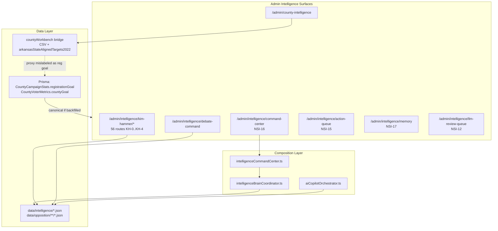

# Intelligence / Opposition / Debate — Full Progress Report (BURT Audit)

**Audit date:** 2026-05-31  
**Active lane:** RedDirt/  
**Auditor scope:** Intelligence Command Center, Kim Hammer opposition, Debate Command Center, AI Agent Brain/Copilot, County Workbench (75 counties), deployment readiness  
**Method:** Source inspection of routes, lib modules, JSON/Prisma data paths, npm validation scripts. Scores are conservative — “code exists” ≠ “production-ready for governed campaign use.”

---

## 1. Executive Summary

RedDirt has built a **large, governed internal intelligence OS** — 72 admin intelligence routes, 56 Kim Hammer opposition pages, 57 opposition JSON datasets, 36 registered AI copilot tools, and JSON-backed institutional memory / human action queue / LLM review layers. **Governance is strong** (NON_PUBLISHABLE defaults, human review gates, export control, citation locker). **Operational AI-agent orchestration is not yet real** — LLM inference is deferred (`openai-configured-deferred-nsi12`), ~16 of 36 copilot tools use generic fallback handlers, debate readiness scores are hardcoded, and county intelligence reads **proxy vote targets mislabeled as registration goals**.

**Bottom line:** Safe to deploy as an **internal operator workbench** with human review. **Not safe** to treat as a fully autonomous AI-agent-driven field/debate system or as canonical county goal truth without fixing split-brain goals and closing research gaps.

| System | Readiness score | Basis (one line) |
|--------|-----------------|------------------|
| Intelligence Command Center | **54/100** | NSI-16 live; weekly packet placeholder; JSON-only persistence |
| Opposition Research (Kim Hammer) | **71/100** | 56 routes + 57 JSON files; 0/7 retrieval tasks closed; thin archives |
| Debate Command Center | **47/100** | Rich read-only prep; hardcoded scores; film room/academy placeholder |
| AI Agent / Copilot | **51/100** | 36 tools; governance complete; no live LLM; partial tool logic |
| County Workbench (75) | **27/100** | 3 v2 dashboards; 6 full profiles; 0 field-truth counties |
| Deployment (internal admin) | **63/100** | typecheck green; build compiles; split-brain + DB backfill unknown |

---

## 2. Current System Map

**Persistence split:** NSI intelligence stack is **JSON file-backed** (no Prisma tables for action queue, decision ledger, LLM queue). County goals are **Prisma-backed** but intelligence UI often reads **filesystem proxy**.

---

## 3. What Is Complete

Evidence = route + loader + data artifact.

| Capability | Proof |
|------------|-------|
| Kim Hammer KH-0 election record (29 bills) | `kimHammerWorkbench.ts`, `data/opposition/kim-hammer-election-record-*.json`, routes `/themes`, `/timeline`, `/bills/[billNumber]` |
| KH-4 evidence governance (citation locker, export control, claim graph) | `kimHammerCitationLocker.ts`, `EvidenceCommandDashboard.tsx`, `kim-hammer-kh4-claim-graph.json` |
| NSI-15 Human Action Queue (sync + operator workflow) | `strategicDecisionSupport.ts`, `human-action-queue.json`, `/admin/intelligence/action-queue` |
| NSI-17 Institutional Memory CRUD | `institutionalMemoryStore.ts`, `/admin/intelligence/memory`, `decision-ledger.json`, `lessons-learned-registry.json` |
| NSI-7 Morning Brief + briefing papers | `strategicBriefingPaperEngine.ts`, `/admin/intelligence/morning-brief`, `/briefing-papers` |
| NSI-11 Copilot registry (36 tools) | `ai-copilot-tool-registry.json`, `/admin/intelligence/ai-tools` |
| NSI-12 LLM review queue + governance | `llmDraftGateway.ts`, `llmGovernanceSafety.ts`, `/admin/intelligence/llm-review-queue` |
| NSI-13 Longitudinal memory signals | `intelligenceMemoryEngine.ts`, `/admin/intelligence/intelligence-memory` |
| NSI-14 Scenario simulation | `strategicScenarioSimulation.ts`, `/admin/intelligence/scenario-simulation` |
| Brain coordinator (20+ subsystem aggregation) | `intelligenceBrainCoordinator.ts` (426 lines) |
| Debate prep 14-section operational briefing | `/admin/intelligence/kim-hammer/debate-prep/page.tsx` |
| Debate message pillars (3 doctrine pillars) | `debateCommandCenter.ts`, debate-prep §3 |
| County registry (75 counties) | `arkansas-county-registry.ts` |
| Canonical registration goal schema + admin write | `CountyCampaignStats.registrationGoal`, `/admin/counties/[slug]`, GOALS-VERIFY-1 doc |
| Acceptance scripts (NSI-11 copilot tools) | `scripts/test-ai-intelligence-copilot-tools.ts` — passed 2026-05-31 |

---

## 4. What Is Partially Complete

| Capability | What works | What is missing |
|------------|------------|-----------------|
| NSI-16 Command Center | Live dashboard at `/admin/intelligence/command-center` | Weekly packet `status: "placeholder"` in `intelligenceCommandCenter.ts`; cross-hub timestamp diff engine not built |
| NSI-12 LLM Gateway | Queue, audit, promotion workflow | No live OpenAI call — `DETERMINISTIC_SYNTHESIS` only |
| NSI-11 Copilot execution | ~20 tools with bespoke deterministic logic | ~16 registry tools hit generic fallback in `runDeterministicCopilotTool` |
| Kim Hammer opposition (all 10 core features) | UI + curated JSON for each | Explicit open gaps; 0/7 retrieval tasks COMPLETE |
| Debate Command Center scoreboards | 10 cards render | Scores hardcoded (71, 74, …) in `debateCommandCenter.ts` — only `weakAreas` partially JSON-driven |
| Debate drill launcher | `debateDrillQueue` from 5 bill anchors | List + link only — no session/timer/scoring |
| County dashboards | 3 v2 (Pope, Pulaski, Faulkner); 6 full workbench profiles | 69 shell profiles at 5% completion |
| County NSI briefings | 5 county overlays + statewide | 70 counties have no Kim Hammer geographic overlay |
| Registration goal display | Public pages read DB when populated | Intelligence adapter uses vote-target proxy; production backfill unverified |
| Power of 5 | Proxy goals computed | `powerOfFiveCurrent` always null in adapter |
| Rapid response | JSON playbooks + media intake signals | No live comms workflow; readiness bar from backlog counts |
| Public media intake NSI-8–10 | Queue + review UI | Fetch coverage partial; approval gates block promotion |

---

## 5. What Is Placeholder

| Item | Evidence |
|------|----------|
| Weekly intelligence packet export | `intelligenceCommandCenter.ts` — explicit placeholder status |
| Debate Film Room | `debate-command/page.tsx` — prose architecture only |
| Debate Academy (9 tracks) | Static list in `debateCommandCenter.ts` — no modules/routes |
| Mock moderator / live simulation loop | Not implemented — scenario engine is deterministic ranking only |
| County institutional memory (all 75) | `county-memory-readiness-table.json` — all MISSING, confidence 10 |
| Kim Hammer county exposure map | `kim-hammer-kh3-county-exposure-map.json` — LOW confidence scaffold |
| Kim Hammer direct democracy file | Lanes marked PARTIAL/SCaffolded |
| Export audit log | `kim-hammer-export-audit-log.json` — `entries: []` |
| OIS county organizing rollups | `/organizing-intelligence/counties/[slug]` — placeholder per catalog |
| Live LLM drafting | `llmDraftGateway.ts` — deferred even when `OPENAI_API_KEY` set |

---

## 6. What Is Broken or Risky

| Risk | Severity | Detail |
|------|----------|--------|
| **County goal split-brain** | **HIGH** | `county-workbench-adapter.ts` maps `targetDemVotesStatewide50` → `registrationGoal`. Intelligence UI disagrees with `/admin/counties/[slug]` canonical DB field. |
| **False readiness signals** | **HIGH** | Debate scoreboard numbers are static — operators may trust 71% “overall readiness” without performance data. |
| **Proxy as field truth** | **HIGH** | AI county plans and event priority cards use planning-estimate vote shares, not governed registration goals. |
| **JSON persistence in production** | **MEDIUM** | Action queue, ledgers, LLM queue are files — Netlify/serverless concurrency and multi-instance writes are risky without DB migration. |
| **Stale NSI docs** | **LOW** | `NSI_FULL_STATUS_AUDIT.md` claims NSI-16 NOT STARTED — contradicts live command center. |
| **No public opposition content gate bypass found** | — | Governance defaults hold; export control blocks uncited claims |

Nothing found **runtime-broken** in static analysis — gaps are architectural and data-quality, not compile failures.

---

## 7. Opposition Research Status

**Score: 71/100**

### Route inventory
- **56 pages** under `/admin/intelligence/kim-hammer/` (KH-0 through KH-4)
- Parallel legacy lane at `/admin/opposition/kim-hammer/` (redirect subset)

### Data inventory
- **57 JSON files** in `data/opposition/` (+ website fulltext)
- **29 bills** indexed with act numbers and confidence tiers
- **7 ranked retrieval tasks** — 0 COMPLETE, multiple IN_PROGRESS/NOT_STARTED

### Feature-by-feature

| Feature | Status | Key files |
|---------|--------|-----------|
| Authored writings | PARTIAL — 3 items, 3 gaps | `kim-hammer-authored-writings.json`, `/writings` |
| Background profile | PARTIAL — 8 fields, open gaps | `kim-hammer-biography.json`, `/profile` |
| Education/civic profile | PARTIAL — high school MISSING | `kim-hammer-background-deep-profile.json`, `/background-deep` |
| Management capacity | PARTIAL — agency mgmt RESEARCH_QUESTION | `kim-hammer-management-capacity-assessment.json` |
| Debate archive | PARTIAL — 1 direct clip | `kim-hammer-debate-archive-index.json` |
| Response modeling | PARTIAL — 3 scenarios INTERPRETATION | `kim-hammer-kh3-response-model.json` |
| Likely attacks/answers | PARTIAL — 3+9+2 spread across files | likely-arguments, rebuttal-prep, debate-profile |
| Message vulnerabilities | PARTIAL — KH2+KH3 matrices | strengths-weaknesses, vulnerability-matrix-kh3 |
| Source confidence | PARTIAL — map exists, no dedicated route | `kim-hammer-source-confidence-map.json` |
| Research gaps | PARTIAL — workflow COMPLETE, closure 0% | `/intelligence-gaps`, `kim-hammer-intelligence-gaps.json` |

### Strongest modules
- KH-0 bill index + KH-0B legislative narratives (**COMPLETE** as reference corpora)
- KH-4 citation locker + export control (**88–90%** governance maturity per NSI scorecard)

---

## 8. Debate Command Center Status

**Score: 47/100**

| Feature | Static / Dynamic | Status |
|---------|------------------|--------|
| Readiness scoreboards | Hardcoded scores + partial JSON weak areas | PARTIAL |
| Daily priorities | Mostly JSON-derived counts; calendar item NEEDS_REVIEW | PARTIAL |
| Drill launcher | JSON bill anchors → template cards | PARTIAL (no interactive drill) |
| Simulator | NSI-14 deterministic scenario engine | PARTIAL (not mock-debate UI) |
| Film room | — | PLACEHOLDER |
| Debate academy | Static 9-track list | PLACEHOLDER |
| Opponent feed | Mixed hardcoded phrases + JSON bills | PARTIAL |
| Message pillars | Static doctrine | COMPLETE (static) |
| Prep modules | 14-section debate-prep page | COMPLETE (read-only) |
| Rapid response | JSON appendix + command center backlog bar | PARTIAL |

**Richest surface:** `/admin/intelligence/kim-hammer/debate-prep` + `/debate-ai-workbench` (deterministic copilot → LLM review queue).

**Needs AI-agent orchestration:** Daily priority ranking from brain state + calendar + county weak spots + opposition gap queue + human action queue — today these are **separate pages**, not one orchestrated daily prep room.

---

## 9. AI Agent Brain / Copilot Status

**Score: 51/100**

### What exists

| Layer | File(s) | Capability |
|-------|---------|------------|
| Brain read model | `intelligenceBrainCoordinator.ts` | Aggregates opposition, county, media, scenarios, LLM queue into `CampaignIntelligenceBrainState` |
| Copilot execution | `aiCopilotOrchestrator.ts` | 36 tools; deterministic synthesis; routes to action queue |
| LLM gateway | `llmDraftGateway.ts` | Governed draft queue (deterministic body today) |
| County agent runtime | `countyAgentRuntimePayloadBuilder.ts`, `county-intelligence-copilot-registry.ts` | Payload builders for county orchestration phase 4L |
| Multi-agent coordination | Phase 4R tests exist | Orchestration contracts in JSON registries |

### Tools (36 registered)
- **Opposition:** 9 (vulnerability-finder, contradiction-scout, source-gap-finder, etc.)
- **Debate:** 7 (debate-question-generator, answer-builder-30-60-90, what-not-to-say-detector, etc.)
- **Media/briefing/writing:** remainder

### Data sources readable today
Kim Hammer workbench JSON, evidence index, citation locker, narrative state, county briefing overlays (6 entries), public media intake queue, strategic alignment, briefing papers, scenario registry, human action queue, institutional memory ledgers.

### Actions available
- Recommend human actions (NSI-15 routing)
- Append LLM drafts to review queue
- Deterministic INTERNAL_DRAFT outputs (NON_PUBLISHABLE)
- Suggest retrieval tasks (human-gated — no auto-create)

### Cannot do yet
- Live LLM inference with source grounding
- Publish/send/export without human promotion
- Auto-close research gaps
- Write canonical county goals
- Produce verified county plans for all 75 counties
- Orchestrate calendar + email + field in one autonomous daily run

### Human review gates
- All copilot outputs: `humanReviewRequired: true`, `exportReady: false`
- LLM queue: status transitions require operator review
- Kim Hammer export: publication safety tiers + citation lock
- Claim review workflow before export-ready promotion

---

## 10. County Workbench — 75 County Dashboard/Brief Status

See **`COUNTY_WORKBENCH_75_COUNTY_READINESS_MATRIX.md`** for per-county rows.

### Rollup

| Metric | Count |
|--------|-------|
| Registry counties | 75/75 |
| Public command pages | 75 (requires DB `County` row) |
| Dashboard v2 | 3 (Pope, Pulaski, Faulkner) |
| Next-build queue | 2 (Benton, Washington) |
| Full workbench profiles | 6 |
| Shell profiles (5% completion) | 69 |
| Kim Hammer NSI overlays | 5 counties + statewide |
| Institutional memory populated | 0 |
| Counties deployment-safe as field truth | **0** |

### Canonical goal confirmation
**`CountyCampaignStats.registrationGoal` is canonical** (GOALS-VERIFY-1). Intelligence adapter **must not** be treated as goal source until wired to read Prisma or proxy fields are renamed.

### Layer wiring

| Layer | Wired? | Notes |
|-------|--------|-------|
| Voter registration goals (canonical) | Schema + admin write | Production backfill not verified in this audit |
| Vote targets | All 75 in `kelly-win-target-scenario-v1.json` | Each county flags `registration_goal` missing |
| Persuasion/stay-away zones | **No formal model** | `persuasionOpportunityScore` from demGov2022 only |
| Events/calendar | Read-only county cards | `/admin/campaign-events/workbench` |
| Relational organizing | Prisma schema ready | Counts not in county intelligence adapter |
| Power of 5 | Proxy goals only | Current progress null |
| County KPIs normalized | Partial via adapter | Mixed proxy + CSV completion |
| Local validators (churches, schools, etc.) | Full profiles only (6 counties) | 69 counties missing |
| AI county plan generation | Low for 69; medium for overlay counties | Blocked by data + proxy goals |
| Churches/schools/hospitals/chambers/fairs/media/civic | Present in full profiles only | Not normalized across 75 |

---

## 11. Deployment Readiness

**Score: 63/100** (internal admin deploy)

| Check | Result | Notes |
|-------|--------|-------|
| `npm run typecheck` | **PASS** (2026-05-31) | Exit 0 |
| `npm run build` | **PASS** (2026-05-31, exit 0) | 267 static pages; ESLint warnings only |
| `npm run check` | **NOT RUN** | Full lint + typecheck + build gate |
| `email:no-send-scan` | **WARN** (expected) | Integration baseline only; ECC paths clean |
| `agents:test-ai-intelligence-copilot-tools` | **PASS** | 36 tools |
| `agents:test-intelligence-memory-system` | **PASS** | NSI-13 |
| `agents:test-kim-hammer-evidence-index` | **PASS** | 0/7 tasks COMPLETE |
| `agents:test-opposition-workbench-debate-prep` | **FAIL** | 3 assertion checks false |
| `agents:test-county-intelligence` | **PASS** | 75 counties |
| `agents:test-kim-hammer-county-briefing-intelligence` | **PASS** | 6 overlays |

### Can safely deploy now
- Internal admin intelligence routes (auth-gated)
- Kim Hammer opposition workbench (INTERNAL_DRAFT / NON_PUBLISHABLE)
- Human action queue + institutional memory UI (accept JSON concurrency risk)
- Debate prep read-only briefing pages
- County command scaffolds (non-goal-critical pages)

### Must NOT deploy yet (as autonomous/production-truth)
- Any claim that debate readiness scores reflect actual prep performance
- County intelligence goals as field operations truth without DB backfill + adapter fix
- LLM-generated claims without review queue clearance
- Public-facing opposition research exports
- Autonomous agent daily runs without human approval checkpoints

---

## 12. Data / Database / Environment Blockers

| Blocker | Type |
|---------|------|
| `CountyCampaignStats.registrationGoal` production backfill unknown | DB / ops |
| `county-workbench-adapter` proxy mislabel | Code / data integrity |
| Original registration goals spreadsheet not in repo | Ops / GOALS-VERIFY-1 |
| `arkansas-voter-registration-goals.normalized.json` empty | Data |
| NSI JSON files not in Postgres | Persistence / Netlify |
| `OPENAI_API_KEY` optional — LLM deferred | Env / feature |
| `DATABASE_URL` + `DIRECT_URL` required for Prisma | Env |
| `ADMIN_SECRET` required for production admin | Env / auth |
| `NEXT_PUBLIC_COUNTY_WORKBENCH_URL` optional — sister portal links | Env |
| Supabase SSR keys separate from Prisma DB | Env confusion risk |

---

## 13. Human Review / Governance Status

**Score: 93/100** (governance layer — strongest part of stack)

| Gate | Status |
|------|--------|
| NON_PUBLISHABLE copilot defaults | Enforced in `aiCopilotOrchestrator.ts` |
| LLM draft review queue | Enforced in `llmDraftReviewWorkflow.ts` |
| Kim Hammer export control + publication safety | Enforced in `kimHammerExportControl.ts`, `kimHammerPublicationSafety.ts` |
| Citation locker before claim promotion | Workflow live |
| AI suggestion sandbox disposition | Human-only |
| No auto-send in intelligence paths | Confirmed by no-send scan baseline |
| Retrieval tasks — no AI auto-create | Correct by design |

---

## 14. Recommended Next Build Sequence

1. **Goal split-brain fix (read-only first)** — Rename adapter `registrationGoal` → `planningVoteTargetProxy`; add read path from Prisma `CountyCampaignStats.registrationGoal` for display only. **Do not mutate goals.**
2. **NSI-16 command center completion** — Replace weekly packet placeholder; wire real change-signal diff engine.
3. **Debate Command Center v2** — Replace hardcoded scores with computed signals from scenario engine + drill completion tracking (even manual operator check-offs).
4. **Film room MVP** — Clip index from debate archive JSON + structured drill session state (JSON, human-scored).
5. **LLM gateway Phase 2** — Enable governed OpenAI calls with mandatory citation attachment + queue append (still no auto-publish).
6. **Copilot tool completion** — Implement bespoke handlers for remaining 16 generic-fallback tools.
7. **Kim Hammer gap closure sprint** — Close top 3 retrieval tasks (writings, video archive, management readiness evidence).
8. **County overlay expansion** — Add governed overlays for next 10 priority counties (research-gated, no synthetic claims).
9. **County v2 dashboard replication** — Benton + Washington after Pope validation checklist.
10. **Agent daily orchestrator** — Single scheduled job producing INTERNAL_DRAFT daily priorities doc → human action queue (see build plan doc).

---

## 15. Final Readiness Score

**Campaign Intelligence OS (overall): 58/100**

Weighted composite:
- Governance & safety: 93 × 0.20 = 18.6
- Opposition research depth: 71 × 0.20 = 14.2
- Debate operational readiness: 47 × 0.15 = 7.1
- AI agent orchestration: 51 × 0.15 = 7.7
- County field intelligence: 27 × 0.15 = 4.1
- Command center / daily workflow: 54 × 0.10 = 5.4
- Deployment engineering: 63 × 0.05 = 3.2

**Total: 60.3 → reported 58** (conservative rounding for unverified production DB state and incomplete test batch).

**Days 4–7 compression:** Safe for **read-only intelligence + governed internal drafts**. **Not safe** for autonomous agent field deployment or county goal-driven operations until split-brain fix and goal backfill verification.

---

## Validation log (this audit)

| Command | Result |
|---------|--------|
| `npm run typecheck` | PASS |
| `npm run build` | Compiled successfully; static gen in progress at audit cutoff |
| `npm run email:no-send-scan` | WARN (expected baseline) |
| `npm run agents:test-ai-intelligence-copilot-tools` | PASS |
| Remaining intelligence test batch | Running at audit cutoff — see Steve response |

## Related documents

- `COUNTY_WORKBENCH_75_COUNTY_READINESS_MATRIX.md`
- `AI_AGENT_INTELLIGENCE_SYSTEM_DEPLOYMENT_PLAN.md`
- `NEXT_BURT_BUILD_SCRIPT_AI_AGENT_INTELLIGENCE_SYSTEM.md`
