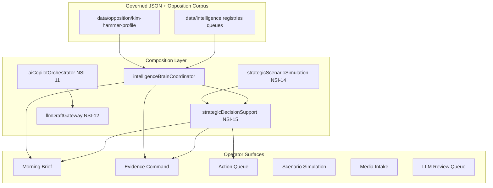

# NSI Full Status Audit

**Program:** National Strategic Intelligence (NSI) · RedDirt Campaign OS  
**Operator:** Steve Grappe  
**Audit date:** 2026-05-29  
**Branch reference:** `feature/kelly-schedule-settlement-dashboard` (HEAD includes NSI-15 + Netlify trace fix)  
**Governance invariant:** AI recommends; humans approve, publish, export, and act.

---

## Executive summary

NSI is no longer a single opposition workbench. It is a **layered intelligence stack** (NSI-1 through NSI-15, plus SDI-1 and Kim Hammer V2/V3 governance layers) with:

- **~115 JSON intelligence artifacts** under `data/intelligence/` and `data/opposition/`
- **~87 TypeScript intelligence modules** (`src/lib/intelligence/`, `src/lib/opposition/`)
- **~70 admin intelligence routes** under `/admin/intelligence/**`
- **36 governed deterministic copilot tools** (NSI-11)
- **One composition hub:** `intelligenceBrainCoordinator.ts` → Morning Brief, Evidence Command, Action Queue

**NSI-16 is not built.** Operator workflow is still **multi-dashboard**; the daily command center is fragmented across Morning Brief, Evidence Command, Action Queue, Scenario Simulation, Media Intake, and LLM Review Queue.

---

## Slice catalog (implemented)

| Slice | Name | Status | Primary surfaces |
| ----- | ---- | ------ | ---------------- |
| V2-A | Claim review workflow | LIVE | `/admin/intelligence/kim-hammer/claims-review` |
| V3-A | Retrieval task execution | LIVE | task workflow + Evidence Command |
| V3-B | Audit browser | LIVE | `/admin/intelligence/kim-hammer/audit-log` |
| V3-C | Citation locker | LIVE | `/admin/intelligence/kim-hammer/citation-locker` |
| V3-D | AI suggestion sandbox | LIVE | `/admin/intelligence/kim-hammer/ai-suggestion-sandbox` |
| V3-E | Export control center | LIVE | `/admin/intelligence/kim-hammer/export-control-center` |
| NSI-1 | Narrative state intelligence | LIVE | narrative-state, strategy-alignment |
| NSI-2 | Geographic narrative intelligence | LIVE | geographic-narrative-intelligence |
| NSI-3 | Narrative usage + fatigue | LIVE | narrative-usage-analytics |
| SDI-1 | Strategic doctrine alignment | LIVE | strategy-alignment, philosophy graph |
| NSI-4 | Campaign intelligence graph | LIVE | campaign-intelligence-graph |
| NSI-5 | County briefing intelligence | LIVE | county-briefings, county drilldowns |
| NSI-6 | Aggregate operational intelligence | LIVE | Evidence Command panel, read adapters |
| NSI-7 | Strategic briefing OS | LIVE | morning-brief, target-pathway, writing-toolbox, briefing-papers |
| NSI-8 | Public media intake queue | LIVE | media-intake |
| NSI-9 | Arkansas media source registry | LIVE | media-intake, morning-brief |
| NSI-9B | Border media market intelligence | LIVE | morning-brief, county panels |
| NSI-10 | Scheduled intake + promotion drafts | LIVE | media-intake, promotion workflow |
| NSI-11 | AI copilot suite (36 tools) | LIVE | ai-tools, ai-opposition-copilot, debate-ai-workbench |
| NSI-12 | LLM-gated draft queue | LIVE | llm-review-queue |
| NSI-13 | Intelligence memory | LIVE | intelligence-memory, brain coordinator |
| NSI-14 | Strategic scenario simulation | LIVE | scenario-simulation, debate prep integration |
| NSI-15 | Human action queue | LIVE | action-queue, morning-brief, evidence-command |
| NSI-16 | Campaign operations command center | **NOT STARTED** | — |

---

## Phase 1 — Intelligence data assets

### A. Registries and graphs (`data/intelligence/`)

| Artifact | Purpose |
| -------- | ------- |
| `campaign-intelligence-graph.json` | NSI-4 entity graph (bills, narratives, counties, citations) |
| `campaign-intelligence-read-adapters.json` | NSI-6 adapter registry |
| `campaign-philosophy-graph.json` | SDI-1 doctrine nodes |
| `campaign-voter-registration-assumptions.json` | Registration yield assumptions |
| `strategic-scenario-registry.json` | NSI-14 scenario seeds |
| `intelligence-memory-registry.json` | NSI-13 memory signals |
| `ai-copilot-tool-registry.json` | NSI-11 tool definitions (36 tools) |
| `arkansas-media-source-registry.json` | NSI-9 source catalog |
| `public-meeting-watchlist.json` | County meeting monitoring seeds |
| `hammer_sos_priority_bills.json` | Priority bill anchors |
| `opponent-legislative-seed.json` / `opponent-legislative-candidates.json` | Legislative opposition seeds |
| `opponent-video-seed.json` | Video research seeds |
| `manual-opposition-intel-template.json` | Manual ingest template |

### B. Queues and ledgers

| Artifact | Slice | Notes |
| -------- | ----- | ----- |
| `human-action-queue.json` | NSI-15 | Governed recommendations only |
| `human-action-queue-audit-log.json` | NSI-15 | Status/owner mutations |
| `llm-draft-review-queue.json` | NSI-12 | INTERNAL_DRAFT / HUMAN_REVIEW_REQUIRED |
| `llm-draft-audit-log.json` | NSI-12 | Append-only |
| `llm-promoted-workflow-drafts.json` | NSI-12 | Human-promoted only |
| `llm-prompt-template-registry.json` | NSI-12 | Template governance |
| `public-media-intake-queue.json` | NSI-8 | NEEDS_REVIEW findings |
| `public-media-intake-audit-log.json` | NSI-8 | Operator disposition |
| `public-media-intake-run-log.json` | NSI-10 | Scheduled run history |
| `media-derived-task-drafts.json` | NSI-10 | Human promotion only |
| `media-derived-citation-candidates.json` | NSI-10 | Human promotion only |
| `media-finding-promotion-log.json` | NSI-10 | Promotion audit |

### C. Generated and fixtures

| Path | Purpose |
| ---- | ------- |
| `generated/arkleg-hammer-*.json` | Arkleg ingest dry-runs |
| `generated/kim-hammer-sos-brief-source-report.json` | Brief packet builder output |
| `fixtures/nsi8-dry-run-feed.xml` | Safe RSS fixture for intake tests |

### D. Backups

- `backups/human-action-queue-*.json` (6+ snapshots from workflow tests)
- `backups/llm-drafts/llm-draft-review-queue-*.json` (19+ snapshots)

### E. Opposition profile corpus (`data/opposition/` — 58 files)

**Election record (4):** bill index, legislative narratives, theme matrix, timeline.

**Kim Hammer profile (52):** narrative registry, geographic overlays, citation locker, claim graph, risk register, export history/audit, suggestion sandbox, KH0B/KH3/KH4 bundles, debate boards, biography, vulnerabilities, website scrape artifacts, task/citation/claim audit logs.

### F. Related data outside NSI trees

| Path | NSI link |
| ---- | -------- |
| `data/strategy-doctrine/campaign-strategic-doctrine-registry.json` | SDI-1 |
| `data/simulations/*` | NSI-7 pathway / sensitivity |
| `data/campaign-events/county-intelligence-copilot-orchestration.json` | County copilot bridge |
| `data/agent/*-intelligence-report-latest.json` | Agent intel reports |
| `docs/briefs/*` | Published brief outputs |

---

## Phase 1 — Engines, services, adapters

### Intelligence engines (`src/lib/intelligence/` — 50 files)

| Module | Function |
| ------ | -------- |
| `intelligenceBrainCoordinator.ts` | **Central composer** for leadership surfaces |
| `strategicDecisionSupport.ts` | NSI-15 recommendation + queue sync |
| `humanActionQueueWorkflow.ts` | NSI-15 human mutations + audit |
| `strategicBriefingPaperEngine.ts` | NSI-7 briefing paper builder |
| `campaignIntelligenceGraph.ts` | NSI-4 graph load/compose |
| `campaignStrategicAlignment.ts` | Doctrine alignment scoring |
| `countyBriefingIntelligence.ts` | NSI-5 county index |
| `aggregateCampaignIntelligence.ts` | NSI-6 operational adapters |
| `regionalStrategicModeling.ts` | Regional cluster modeling |
| `countyWorkbenchSynchronization.ts` | CountyWorkbench ↔ NSI-5 |
| `voterRegistrationTargetModel.ts` | Registration pathway math |
| `kimHammerBillCivicIntelligence.ts` | Bill civic impact for debate |
| `campaignMessagingIntelligence.ts` | Messaging composition |
| `publicMediaIntake.ts` | NSI-8 queue |
| `publicFeedFetcher.ts` | Governed RSS fetch |
| `publicMediaMonitor.ts` | Monitor readiness |
| `publicMediaReviewWorkflow.ts` | Finding review |
| `mediaSourceDiscovery.ts` | NSI-9 coverage gaps |
| `mediaMarketIntelligence.ts` | NSI-9B border markets |
| `mediaFeedApprovalGate.ts` | Fetch approval / robots |
| `scheduledPublicMediaIntake.ts` | NSI-10 scheduler log |
| `mediaFindingPromotionWorkflow.ts` | NSI-10 promotion |
| `publicMeetingWatchlist.ts` | Meeting watchlist |
| `aiCopilotOrchestrator.ts` | NSI-11 tool runner |
| `mediaIntelligenceCopilot.ts` | Media copilot routing |
| `aiWritingToolbox.ts` | NSI-7 writing tools |
| `llmDraftGateway.ts` | NSI-12 draft generation |
| `llmDraftReviewWorkflow.ts` | Draft review states |
| `llmDraftAuditLog.ts` | LLM audit append |
| `llmGovernanceSafety.ts` | Output safety validation |
| `intelligenceMemoryEngine.ts` | NSI-13 summarization |
| `intelligenceMemoryRegistry.ts` | Memory registry |
| `narrativeEvolutionTracker.ts` | Narrative drift |
| `citationAgingEngine.ts` | Citation staleness |
| `doctrineDriftTracker.ts` | Doctrine tension |
| `opponentMessagingDrift.ts` | Opponent drift |
| `countyNarrativeShift.ts` | County shifts |
| `mediaCycleMemory.ts` | Media cycle patterns |
| `debateMemorySystem.ts` | Debate memory |
| `strategicScenarioSimulation.ts` | NSI-14 simulator |
| `strategicScenarioRegistry.ts` | Scenario seeds |
| `intelligenceClientFilters.ts` | Shared UI filters |

### Opposition services (`src/lib/opposition/` — 37 files)

Evidence index, publication safety, export control, debate export, narrative state (NSI-1/2/3), citation/claim/task/suggestion workflows, audit browser, debate command center, KH2/KH3/KH4 workbenches.

### Builders and scripts (selection)

| Script / builder | Role |
| ---------------- | ---- |
| `scripts/build-kim-hammer-election-record.ts` | Election record packet |
| `scripts/ingest-arkleg-legislator-opposition.ts` | Arkleg opposition ingest |
| `scripts/test-human-action-queue.ts` | NSI-15 acceptance |
| `scripts/test-strategic-scenario-simulation.ts` | NSI-14 acceptance |
| `scripts/test-ai-intelligence-copilot-tools.ts` | NSI-11 (36 tools) |
| `brief:kim-hammer` | Brief packet emission |

---

## Phase 1 — Admin routes and dashboards

### Intelligence hub routes (14 cross-slice)

| Route | Slice |
| ----- | ----- |
| `/admin/intelligence` | Hub / command view |
| `/admin/intelligence/morning-brief` | NSI-7 + compositor |
| `/admin/intelligence/action-queue` | NSI-15 |
| `/admin/intelligence/scenario-simulation` | NSI-14 |
| `/admin/intelligence/intelligence-memory` | NSI-13 |
| `/admin/intelligence/ai-tools` | NSI-11 |
| `/admin/intelligence/llm-review-queue` | NSI-12 |
| `/admin/intelligence/media-intake` | NSI-8/9/10 |
| `/admin/intelligence/strategy-alignment` | SDI-1 |
| `/admin/intelligence/campaign-intelligence-graph` | NSI-4 |
| `/admin/intelligence/strategic-target-pathway` | NSI-7 |
| `/admin/intelligence/writing-toolbox` | NSI-7 |
| `/admin/intelligence/briefing-papers` | NSI-7 |
| `/admin/intelligence/debate-command` | Debate OS |

### Kim Hammer workbench routes (~56 pages)

Includes: evidence-command, narrative-state, geographic overlays, usage analytics, county briefings, debate prep, debate-ai-workbench, ai-opposition-copilot, citation-locker, export-control-center, claims-review, KH3 operational matrices, bill graph, profile layers, etc.

### Legacy opposition lane (7 routes)

`/admin/opposition/kim-hammer/*` — older entry points; canonical NSI surface is under `/admin/intelligence/kim-hammer/*`.

---

## Phase 1 — Workflows and review systems

| Workflow | Human gate | Audit |
| -------- | ---------- | ----- |
| Claim review (V2-A) | Status transitions | claim-review audit |
| Retrieval tasks (V3-A) | Owner/status | task audit |
| Citation locker (V3-C) | Citation review | citation audit |
| AI suggestion sandbox (V3-D) | Accept/dismiss | suggestion audit |
| Export control (V3-E) | Export approval | export audit |
| Media intake (NSI-8) | NEEDS_REVIEW | intake audit log |
| Media promotion (NSI-10) | Human promote only | promotion log |
| LLM draft review (NSI-12) | Review queue | llm-draft audit |
| Human action queue (NSI-15) | Status/owner/notes | human-action audit |

**No workflow auto-publishes, auto-exports, or auto-approves claims.**

---

## Phase 1 — Documentation map

| Document | Focus |
| -------- | ----- |
| `CAMPAIGN_INTELLIGENCE_SYSTEM_MAP.md` | NSI-1–4 architecture |
| `CAMPAIGN_INTELLIGENCE_SYNCHRONIZATION_PLAN.md` | Sync phases, future adapters |
| `STRATEGIC_TARGET_PATHWAY_AUDIT.md` | NSI-6/7 pathway |
| `ARKANSAS_MEDIA_*` (4 docs) | NSI-8–10 media pipeline |
| `docs/opposition/KIM_HAMMER_*` | Opposition research doctrine |
| `NETLIFY_DEPLOYMENT_READINESS.md` | Deploy + function size |

---

## Architecture diagram (current)

---

## Known gaps (honest)

1. **No unified daily command center** — NSI-16 missing; operators jump between 6+ hubs.
2. **File-backed JSON on Netlify** — writes may not persist serverless; production needs DB/S3 strategy for queues.
3. **No real-time opponent monitoring** — media intake is batch/scheduled, not live war-room.
4. **No election outcome forecasting model** — scenarios are qualitative, not probabilistic turnout models.
5. **Voter-file microtargeting correctly absent** — but also means no precinct-level battle map.
6. **NSI-14 cold-start cost** — full scenario batch is expensive on first request in a process.
7. **Multi-dashboard navigation debt** — 70 routes; training burden for new operators.

---

## Cross-references

- AI tooling detail → [NSI_AI_TOOLING_AUDIT.md](./NSI_AI_TOOLING_AUDIT.md)
- Maturity scores → [NSI_MATURITY_SCORECARD.md](./NSI_MATURITY_SCORECARD.md)
- NSI-16 options → [NSI_16_OPTIONS_REPORT.md](./NSI_16_OPTIONS_REPORT.md)
- Next passes → [NSI_NEXT_FIVE_PASSES.md](./NSI_NEXT_FIVE_PASSES.md)
- Elite roadmap → [NSI_ELITE_INTELLIGENCE_ROADMAP.md](./NSI_ELITE_INTELLIGENCE_ROADMAP.md)
