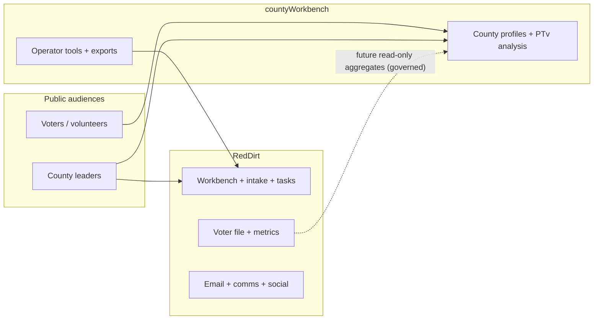

# Build audit: RedDirt campaign OS and county workbench

**Purpose:** Code- and doc-grounded assessment of what the **Kelly Grappe for SOS** technology stack can operationalize **today**, what is **partial**, and what remains **process-only** or **future build**. Sources: `RedDirt/docs/PROJECT_MASTER_MAP.md`, `RedDirt/docs/database-table-inventory.md`, `RedDirt/docs/REDDIRT_AI_BUILD_MASTER_HANDOFF.md`, `RedDirt/README.md`, `countyWorkbench/README.md`, `countyWorkbench/docs/COUNTY_WORKBENCH_MASTER_PLAN.md`, `countyWorkbench/docs/COUNTY_WORKBENCH_ROUTE_INVENTORY.md`, workspace `CURSOR_CODEX_COORDINATION_PROTOCOL.md`.

**Audit date:** 2026-05-08.

---

## 1. Workspace architecture (lanes)

| Lane | Folder | Role |
|------|--------|------|
| Campaign OS (this audit’s primary code) | `RedDirt/` | Next.js app, Prisma/Postgres, public + admin Workbench, voter file, comms, tasks, events, intelligence scaffolding |
| County portal | `countyWorkbench/` | Separate repo/site: **75-county** public + operator tools, **Pope** reference standard, **no voter PII** on public aggregates |
| Public SOS marketing slice | `sos-public/` | **Out of scope** for this manual’s build detail; coordination protocol restricts cross-lane imports |

**Hard rule for builders:** Do not import `RedDirt/src/**` into `sos-public` or merge Prisma/admin concepts into the clean public lane without an **approved integration packet**.

---

## 2. RedDirt — what the product is

From `PROJECT_MASTER_MAP.md`:

- **Campaign operating system**, not only a marketing site: public pages, forms, county storytelling, **large admin Workbench** (comms, social monitoring, events, content, finance/budget scaffolding, field units, email command center, voter tools).
- **Design philosophy:** queue-first and **human-governed** for sensitive paths; AI is **advisory** (RAG, intake classification, email interpretation), not autonomous campaign control.
- **Quality gate:** `npm run check` (lint + TypeScript + build).

---

## 3. RedDirt — mature or strong capabilities (operational value)

### 3.1 Workbench hub and campaign manager surfaces

- **`/admin/workbench`** — CM dashboard bands, unified open work (merged email workflow + intake + tasks + festival review patterns per docs), truth snapshot JSON, division grid.
- **Position and seats** — Read lens + seat metadata; not full HR/OS replacement but usable for **who covers what**.

### 3.2 Email command center and outbound governance

Documented packet lineage through **Gmail OAuth (metadata-focused paths), SendGrid webhook receipt, contact import staging, Audience Studio, Message Studio, send execution doctrine** — with explicit **no blind auto-send** postures on sensitive queues.

**Campaign implication:** You can run a **professional** email program with **review gates**, deliverability telemetry, and staged imports — **when** production env and approvals are green. Engineering handoff stresses **hosted proof** and **explicit unlocks** for live lanes.

### 3.3 Communications workbench (Tier 1 / Tier 2 patterns)

- Plans, drafts, sends, segments, threads — strong **operator** surface for coordinated messaging.

### 3.4 Data layer (voter file, metrics, election tabulation ingest)

- **`VoterRecord`** warehouse + county metrics (`CountyVoterMetrics`, `CountyCampaignStats`).
- **Registration goals:** `CountyCampaignStats.registrationGoal` as campaign-entered target; mirrored metrics behavior documented in master map (watch mirror drift).
- **DATA-4 / election ingest:** Canonical election JSON pipeline into relational tabulation tables — supports **honest** historical/planning context at county level (not a substitute for secret results or real-time official tab on E-Day).
- **VOTER-MODEL-1 + INTERACTION-1:** `VoterSignal`, `VoterModelClassification`, `VoterInteraction`, `VoterVotePlan` — **read-only admin** model surface at `/admin/voters/[id]/model`; **no** auto-classification jobs per doc honesty.

### 3.5 GOTV planning (read-only today)

- **GOTV-2** — Explainable buckets, review-only contact plan on `…/gotv` — **no** send/assignment/scoring automation in that packet line.

### 3.6 Field and events

- `CampaignEvent`, `EventSignup`, festival ingest patterns, tasks — **event-led** organizing is real in schema and routes.

### 3.7 Relational organizing (emerging)

- **REL-2** — `RelationalContact` model for volunteer-entered relationships with optional voter match; aligns with Power of Five / peer contact strategy — **not** yet full county cross-volunteer rollup in every UI.

### 3.8 Social, monitoring, content hub

- Social content items, owned media DAM, conversation monitoring and **opportunity routing** patterns — supports **digital war room** workflows with governance.

### 3.9 Finance and budget (early but present)

- `FinancialTransaction`, confirm flows, `BudgetPlan` / `BudgetLine` variance views — enough to **track** commitments if discipline is maintained.

### 3.10 Opposition intelligence (governed)

- INTEL-3 tables and read-only `/admin/intelligence` — **public record**, citations, human review; **no** scraping claims; aligns with “no unsourced opponent claims” workspace rule.

---

## 4. RedDirt — partial capabilities (plan around limits)

| Area | Reality | Campaign workaround |
|------|---------|---------------------|
| **Unified “Submission” triage** | `Submission` queue not fully merged into CM open work in all flows | Run explicit SOP: who checks form backend daily |
| **GOTV execution** | GOTV-2 is review/plan; GOTV-3+ assignment/field dashboard **future** | Manual assignment sheets + regional WhatsApp/phone tree **until** shipped |
| **Fundraising desk** | FUND-1 types; not full donor CRM story | Parallel spreadsheet + finance compliance process |
| **Youth program UI** | YOUTH-1 scaffold | Schools strategy uses events + relational hosts |
| **Precinct normalization** | PRECINCT-1 open; precinct often stringly | County strategy uses county-level and “best available” geography |
| **Native SMS blast** | Text foundation **readiness**; Twilio live path **gated** | P2P tools or approved vendor with compliance |
| **Content / author studio** | Powerful pieces but **fragmented** “single author product” | Named owner for narrative approval |

---

## 5. RedDirt — safety and production culture (strategic asset)

From `REDDIRT_AI_BUILD_MASTER_HANDOFF.md`:

- **Truthful readiness** — diagnostics describe what is safe, not aspirational.
- **No surprise safety** — live email/SMS/imports/workers gated until explicit approval.
- **Composable slices** — reduces “rewrite the world” risk.

**Strategic translation:** The OS **privileges trust and auditability** over speed-of-blast. That matches a **Secretary of State** brand centered on **integrity and transparency** — if operators **explain** why gates exist to impatient volunteers.

---

## 6. County workbench — what the product is

From `COUNTY_WORKBENCH_MASTER_PLAN.md` and `README.md`:

- **Permanent county interface** for Kelly SOS: **local context**, goals, election history, registration ambition, leadership paths, verified research.
- **Phased scale:** Pope proof → 75-county shell → fills → optional **read-only** feeds from operations DB where governance allows → post-election civic education framing as directed.
- **Public promise:** “This campaign has a plan, and **every county has a role**.”
- **Separate Netlify site** — env vars link back to **kellygrappe.com** for CTAs; **no** `DATABASE_URL` required for current public homepage pattern.

---

## 7. County workbench — route and operator highlights

From `COUNTY_WORKBENCH_ROUTE_INVENTORY.md`:

- **Regional rollups:** `/regions`, `/counties`, `/counties/regions/[regionSlug]`, intelligence and rollout planners.
- **Per county:** landing, path-to-victory **analysis**, intelligence **readiness**, calendar and **email draft** centers (**no send** — mailto/draft pattern).
- **Operator QA:** source intake validation, schedule validation, full-profile QA gate, data population plans, export centers.

**Strategic translation:** County workbench is the **public-facing county war map** + **operator-grade checklist engine**. It complements RedDirt’s **execution** DB.

---

## 8. Cross-system alignment (recommended operating model)

Until **approved** live integrations ship:

- Treat **county workbench** as **canonical county narrative + readiness**
- Treat **RedDirt** as **system of record** for operational objects (people, events, sends, metrics ingestion)
- **Humans** reconcile weekly: “Does Pope (and each pilot county) show the same goals and story in both places?”

---

## 9. Audit conclusions (executive)

| Theme | Rating | Notes |
|-------|--------|-------|
| **Comms + email sophistication** | ████████░░ Strong | Governance-first; unlock live sends with counsel + proof |
| **Data + voter warehouse** | ███████░░░ Strong / partial | Metrics real; modeling admin is read-only; no fantasy automation |
| **Field execution UI** | █████░░░░░ Mid | Events/tasks real; GOTV assignment layer emerging |
| **Fundraising depth** | ███░░░░░░░ Early | Needs process + possible FUND packets |
| **County storytelling scale** | ██████░░░░ Solid in architecture | Pope reference; rollout discipline determines impact |
| **Text / P2P at scale** | ████░░░░░░ Foundation | Readiness exists; activation is policy-gated |

---

## 10. Gaps to close for “full manual ↔ full product” parity

1. **Local event tip line → task** — productize “fair/council/local election” intel into `CampaignTask` templates (may partially exist via intake; standardize).
2. **Small gathering host pipeline** — volunteer journey from “host signup” → **RelationalContact** / event series tracking.
3. **Regional social lead roles** — map `TeamRoleAssignment` / seats to **countyWorkbench** regions for reporting.
4. **Youth program checklist** — tie `youth.ts` types to public “vote plan” pledges when policy allows storage.
5. **Commissioned fundraiser program** — finance + compliance documentation; optional ledger categories in RedDirt.

---

## 11. Targets ↔ systems mapping (strategic plan alignment)

**Authoritative numbers:** [`LANE-BUDGET-VICTORY-MATH-AND-TARGETS.md`](./LANE-BUDGET-VICTORY-MATH-AND-TARGETS.md).

| Strategic target (LANE) | RedDirt / workbench implementation |
|-------------------------|--------------------------------------|
| **Per-county `registrationGoal`** (integer, sums to ~50K statewide ambition) | `CountyCampaignStats.registrationGoal` + mirror check to `CountyVoterMetrics` after recompute (`PROJECT_MASTER_MAP` §10 source-of-truth) |
| **County tier (PTV)** | Operator spreadsheet + `countyWorkbench` readiness / rollout tools; **not** a single Prisma enum today — maintain **LANE §3** as canonical list |
| **Planning margin / vote goals** | Data team models external to public UI; **election results ingest** + truth snapshot inform **honest** historical context — no auto “win probability” |
| **GOTV cohort review** | `/admin/gotv` — **GOTV-2** explainable buckets; **no** auto-send per master map |
| **Vote plans** | `VoterVotePlan` where logged; **manual** GOTV sheets until GOTV-3+ |
| **Budget vs actual category mix** | `BudgetPlan` / `BudgetLine` + `FinancialTransaction` — map **LANE §4.2** category labels into `BudgetLine` names for variance reporting |
| **Field events → community intel** | `CampaignEvent`, `ArkansasFestivalIngest`, `CampaignTask` — align **LANE §6** GOTV inventory gates to **event completion** + **task** SLAs |
| **Relational capacity** | `RelationalContact`, volunteer profiles — compare counts to **LANE §5** molecule targets monthly |

**GOTV integration:** From **T-56**, Workbench reviews should include **open task** views filtered by **county tier** and **GOTV tag** (create task type convention if missing).

---

*End of build audit. Update this file when `PROJECT_MASTER_MAP.md` ledger materially changes.*
