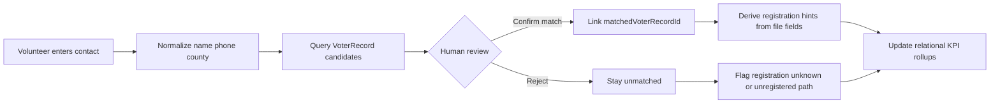

# Relational organizing ↔ voter file — integration (REL-1) (RedDirt)

**Packet REL-1 (Part D).** Expected **flow** for connecting relational contacts to **`VoterRecord`** and registration **awareness**—**concept only**; **no** new matching implementation in this packet.

**Cross-ref:** [`relationship-data-model-foundation.md`](./relationship-data-model-foundation.md) · [`identity-and-voter-link-foundation.md`](./identity-and-voter-link-foundation.md) · [`county-registration-goals-verification.md`](./county-registration-goals-verification.md) · `src/lib/volunteer-intake/match-entries-to-voters.ts`

---

## 1. Goals

1. **Search voter file for matches** — Given name + optional county + optional phone, suggest **`VoterRecord`** candidates (same general approach as volunteer intake matching).
2. **Confirm registration status** — **Authoritative** confirmation remains **state SOS / VoterView**; the warehouse reflects **last import** and **campaign-assisted** labeling, not legal certification.
3. **Flag unregistered contacts** — When file says **no match** or volunteer marks **not on roll**, system tracks **help-needed** paths (paper registration, deadline education) via public content + human follow-up.
4. **Suggest outreach priority** — Rank within a volunteer’s list using **Core 5**, **persuasion**, **registration gap**, and **last contact**—**suggestions** only; volunteer overrides.

---

## 2. Expected flow (volunteer adds a contact)

1. **Input** — Minimum viable: first/last name; **strongly recommended:** county and/or phone to reduce ambiguity (see existing intake matcher guardrails).
2. **Candidate query** — Reuse patterns from **`buildMatchCandidatesForEntry`**: latest completed file, normalized names, optional `countyId`, phone tie-breaker, **ambiguity** flag when many hits.
3. **Human confirmation** — Operator or volunteer confirms **one** `VoterRecord` or leaves unmatched; **no** auto-write to `matchedVoterRecordId` without policy (REL-2).
4. **Registration hint** — If matched, infer **likely registered** from file presence; **precinct** and party fields (if present) are **data**, not outreach scripts.
5. **Unregistered path** — If no match: label `registrationStatusKnown` / contact status for **follow-up**; link volunteer to **public** voter registration center (official URL handoff).

---

## 3. Boundaries and risks

- **False match** — Wrong `VoterRecord` is worse than no match; keep **ambiguity** visible.
- **Double counting** — Two volunteers naming the same person counts twice in naive KPIs; REL-3+ may dedupe by phone hash or voter ID where policy allows.
- **Consent** — Matching PII against a file is **sensitive**; log access for abuse review in REL-2 where feasible.
- **campaign-assist-lookup** — Future **person-facing** lookup remains **stub** until a dedicated packet defines rate limits and disclaimers (`campaign-assist-lookup.ts`).

---

## 4. Alignment with county goals

- **`CountyCampaignStats.registrationGoal`** remains the **campaign** target (GOALS-VERIFY-1).
- Relational metrics **explain volunteer contribution** (“contacts helped register” if tracked via intake/events) — **not** a second source of truth for the goal integer unless product defines a **verified** bridge.

---

*Last updated: Packet REL-1.*
