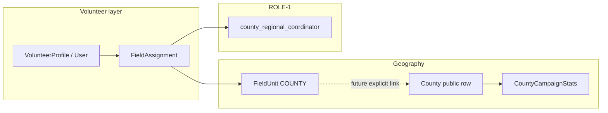

# Volunteer ↔ county integration (VOL-CORE-1) (RedDirt)

**Packet VOL-CORE-1 (Part E).** Defines how volunteers **belong to counties**, how **captains** aggregate people and story, and how **`registrationGoal`** connects to **relational effort**—honestly. **Docs only**.

**Cross-ref:** [`field-structure-foundation.md`](./field-structure-foundation.md) · [`geographic-unification-foundation.md`](./geographic-unification-foundation.md) · [`data-targeting-foundation.md`](./data-targeting-foundation.md) · [`county-registration-goals-verification.md`](./county-registration-goals-verification.md) · [`volunteer-role-system.md`](./volunteer-role-system.md) · [`relational-kpi-foundation.md`](./relational-kpi-foundation.md)

---

## 1. Volunteers belong to counties

| Layer | Mechanism | Honesty notes |
|-------|-----------|----------------|
| **Residence / self-ID** | **`User.county`** (string) on many signups | May **not** FK to **`County`**—GEO-1 documented gaps. |
| **Public geography** | **`County`** rows for pages, stats, goals | Canonical for **registrationGoal** display. |
| **Operational field** | **`FieldUnit` (`type = COUNTY`)** + **`FieldAssignment`** | FIELD-1 **parallel** operational node; optional future link to `County` FK. |
| **Volunteer record** | **`VolunteerProfile`** → **`User`** | No `countyId` on profile today—county flows through **User**. |

**Rule:** Rollups should **declare** whether they use **User.county**, **`County`**, or **`FieldUnit`** to avoid double-mapping.

---

## 2. County captains aggregate volunteers

- **Role:** **County Captain (Voter Registration)** maps to **`county_regional_coordinator`** + **`FieldAssignment`** to county unit ([`volunteer-role-system.md`](./volunteer-role-system.md)).
- **Functions:** onboarding support, POD health, **honest** progress narrative, escalation to **Field Director**.
- **Not automatic:** Captaincy is **staffing** (SEAT-1), not GAME-1 level-up.

---

## 3. County goals and volunteer effort

- **`CountyCampaignStats.registrationGoal`** — **authoritative** goal field in current verification docs ([`county-registration-goals-verification.md`](./county-registration-goals-verification.md)).
- **`CountyVoterMetrics.countyGoal`** — snapshot mirror from metrics recompute.
- **Volunteer relational work** informs **story** (“N organizers report M reached contacts in county”) per REL-1; **closing** the registration gap requires **attribution** discipline—do not equate **relational counts** with **file-based gap** without an explicit pipeline.

---

## 4. Connecting `FieldUnit`, `CountyCampaignStats`, and roles

- **Today:** `FieldUnit` ↔ `County` may be **implicit** (name) or **undocumented**—see FIELD-1 / GEO-1.
- **Captain** accountability: **`FieldAssignment`** ties **person + position + unit** so workbench futures can show **who** owns **which** county slice.

---

## 5. Integration checklist (for future builders)

1. Prefer **one** county resolution path per feature (User county vs County FK vs FieldUnit).
2. When showing **goal progress**, label **data source** (file metrics vs organizer-reported).
3. Align **captain** staffing with **`PositionSeat`** when SEAT-1 data exists.

---

*Last updated: Packet VOL-CORE-1 (Part E).*
