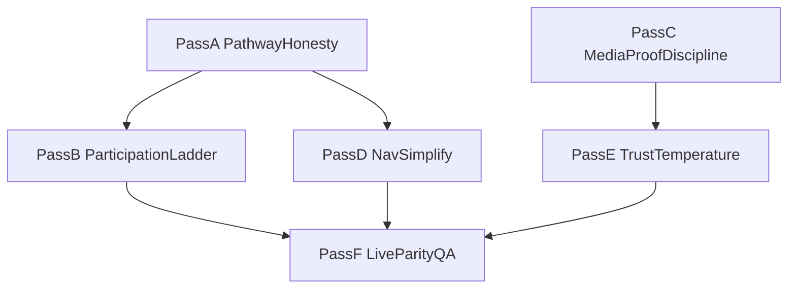

# CAMPAIGN EXPERIENCE REVIEW — Deep forensic pathway pass

**Pass:** `KELLY-PUBLIC-FORENSIC-PATHWAY-2.0`  
**Lane:** RedDirt public marketing only  
**Date:** 2026-07-30  
**Method:** Full code-path sandbox of ★-nav + redirects + homepage spine + cross-CTAs (local Next servers were down; live HTTP crawl deferred)  
**Authority:** [`PUBLIC_SITE_EDITORIAL_DOCTRINE.md`](./PUBLIC_SITE_EDITORIAL_DOCTRINE.md) · [`PUBLIC_SITE_MASTER_MAP.md`](./PUBLIC_SITE_MASTER_MAP.md) · [`PUBLIC_CORE_MESSAGE_MAP.md`](./PUBLIC_CORE_MESSAGE_MAP.md) · hardening CER [`CAMPAIGN_EXPERIENCE_REVIEW_PUBLIC_HARDENING_1.0.md`](./CAMPAIGN_EXPERIENCE_REVIEW_PUBLIC_HARDENING_1.0.md)

**Filter:** Easier to trust, understand, and use — without making the site bigger.

---

## Executive verdict

**Coherence for a first-time voter: ~84/100 — strong spine, muddy doors.**

A careful Arkansan who lands on `/` can answer who Kelly is, that the office matters, and that she wants them to participate. The trust-funnel order is locked and sound. What breaks the spell is **pathway bait-and-switch**: participation CTAs that soft-redirect to Meet Kelly, two “Volunteer” doors that don’t agree, admin language leaking into empty media slots, and a few civic-how-to pages wearing campaign media chrome.

We do not need more pages. We need **honest doors**, **one participation ladder**, and **proof-only media**.

---

## First-time visitor story (sandbox walk)

| Minute | Where | What they feel | Risk |
| ---: | --- | --- | --- |
| 0:05 | `/` hero | “Kelly Grappe · SOS · office belongs to people” | Soft |
| 0:20 | Government That Works | Competence — office touches life | Soft (“Explore →” still docs-y) |
| 0:45 | Primary video | Voice / human connection | Soft |
| 1:00 | Media bridge → Meet Kelly | Still text-heavy after film | Medium |
| 1:30 | Across Arkansas / photos | Shows up — if geography confirmed | Medium (Unknown stays thin) |
| 2:00 | Endorsements | Honest empty | Medium (cold trust) |
| 2:30 | Final Action | Want to join — two buttons may land same place | **High** |
| 3:00 | Nav → Direct Democracy early | Leaves trust funnel into petition process | Medium |
| 4:00 | Get Involved → “Power of 5” / Local organizing | **Lands on `/about`** via redirect | **Critical** |
| 5:00 | Empty media slot on inner page | Sees “Assign Owned Media in admin” | **High** |

**Do they get lost?** Yes — not in the homepage story, but in the **participation and OS-adjacent doors**.

**Is it coherent?** The *message* is coherent. The *map of doors* is not yet.

---

## Critical / High register (pathway)

| Sev | Finding | Evidence | Fix direction |
| --- | --- | --- | --- |
| **Critical** | `/local-organizing` → `/about` while still linked from get-involved, events, host, stories | `next.config.ts`; `get-involved/page.tsx` | Unlink **or** un-redirect to a real participation path — never bait to About |
| **Critical** | `/onboarding/power-of-5` → `/about`; CTA still advertised as walkthrough | `next.config.ts`; `powerOf5OnboardingHref` | Point to `/get-involved/bring-5` or remove CTA |
| **Critical** | Get Involved shows “Volunteer form coming soon” above a live form | `get-involved/page.tsx` ~282 | Delete contradiction copy |
| **High** | Join vs Volunteer can collapse to the same signup URL | `TrustFunnelFinalActionSection.tsx`; `external-campaign.ts` | Join → `#join`; Volunteer → `#volunteer` |
| **High** | Header “Volunteer” vs nav “Get involved” / `/volunteer` Field Team | `SiteHeader`; `navigation.ts`; `volunteer/page.tsx` | One public volunteer canon |
| **High** | Empty media slots expose admin instructions to voters | `PublicMediaSlotFrame.tsx` | Public microcopy only |
| **High** | `/campaign-calendar/[slug]` → bare `/events` (lose detail) | `next.config.ts` | Slug-preserving redirect + rewrite links |
| **High** | `/volunteerPage` → `/about` | `next.config.ts` | → `#volunteer` |
| **High** | `/counties` / `/dashboard/**` reachable without marketing chrome intent | public `(site)` trees | Soft-gate or de-index for voters |

---

## Medium / Low register (coherence & craft)

| Sev | Finding | Fix direction |
| --- | --- | --- |
| Medium | Office & News nav groups lack landing hrefs | Office → `/understand`; News → `/from-the-road` |
| Medium | “Campaign Calendar” label → `/events` | Rename label to Events |
| Medium | Duplicate nav (Videos in Meet + News; Invite duplicated) | One home per destination |
| Medium | MediaPageHero on ballot process / understand / voter-reg when media isn’t process-true | Prefer `PageHero` or labeled empty until proof still exists |
| Medium | Message map still cites `/updates` | Canon = `/from-the-road` |
| Medium | Too many reading doors (FTR / Press / Editorial / Explainers / Stories / Substack / Blog) | Collapse public reading to FTR + Press (+ Substack optional) |
| Low | Privacy “Legal · draft” eyebrow | Softer public wording after counsel OK |
| Low | Mobile Events-before-News vs desktop News-before-Events | Align or leave documented |

---

## What already works (do not reopen)

- Homepage trust-funnel spine and calm hero
- Message psychology compression (prove more, say less)
- `/get-involved` / host / local-team no longer soft-redirected to About (the **pages** — remaining **OS links** still are)
- Media slot infrastructure + MediaPageHero on ★ surfaces
- Legal pages without media spectacle
- Empty endorsements honesty
- Regnat Populus sacred at Final Action

---

## Design: six new improvement passes

These passes are ordered for leverage. Each pass must leave the site **smaller in confusion**, not larger in surface area.

### Pass A — `KELLY-PUBLIC-PATHWAY-HONESTY-1.0`

**Job:** Stop every bait-and-switch door.

**Scope**
- Retarget or remove public links to `/local-organizing`, `/onboarding/power-of-5`
- Fix redirects: Power of 5 → live Bring-5 path **or** drop redirect and ship page; local-organizing → `/get-involved` / `/start-a-local-team` (not `/about`)
- `/volunteerPage` → volunteer canon; `/watch` → `/kelly-speaks` or `/#primary-message`
- Slug-preserving `/campaign-calendar/:slug` → `/events/:slug` (or live detail)
- Delete “Volunteer form coming soon” on get-involved
- Smoke crawl: every CTA on get-involved, events, host, stories lands where the label promises

**Exit thought:** “Buttons tell the truth.”

---

### Pass B — `KELLY-PUBLIC-PARTICIPATION-LADDER-1.0`

**Job:** One clear ladder — Stay connected → Volunteer → Bring 5 → Local team → Donate last.

**Scope**
- Canonical volunteer URL env-gated once; 301 or deep-link the twin
- Final Action + hero: Join → `#join`, Volunteer → `#volunteer`
- Nav: rename/clarify Get Involved vs Volunteer utility
- Collapse Invite Kelly / Share an event into one hub with modes (nav labels as hashes)
- Microcopy ladder on get-involved only — no new pages

**Exit thought:** “I know which step is mine.”

---

### Pass C — `KELLY-PUBLIC-MEDIA-PROOF-DISCIPLINE-1.0`

**Job:** Media is proof or it is absent — never admin wallpaper.

**Scope**
- Public empty-slot copy (no “Owned Media / admin placements” on voter UI)
- Process/civic pages (`ballot-initiative-process`, optionally `understand` / `voter-registration`): revert to `PageHero` **or** labeled empty until process-true still assigned
- Operator checklist: fill about / journey / speaks / road / get-involved slots from FEATURE trail set
- Caption decisiveness pass on homepage FEATURE stills (one place/action clause)

**Exit thought:** “Photos prove the claim; empty means forthcoming, not unfinished CMS.”

---

### Pass D — `KELLY-PUBLIC-NAV-SIMPLIFY-1.0`

**Job:** Fewer doors, stronger landings.

**Scope**
- Office group landing → `/understand`; News → `/from-the-road`
- Deduplicate Campaign Videos / Invite / Explainers across groups
- Rename “Campaign Calendar” → “Events”
- Public reading set: From the Road + Press (+ optional Substack); demote Blog/Stories/Editorial from first-click weight
- Sync `PUBLIC_CORE_MESSAGE_MAP.md` (`/updates` → `/from-the-road`)
- Soft-gate or noindex `/counties` + `/dashboard/**` for anonymous marketing visitors

**Exit thought:** “I always know which menu item owns this topic.”

---

### Pass E — `KELLY-PUBLIC-TRUST-TEMPERATURE-1.0`

**Job:** Warm trust without inventing endorsements or geography.

**Scope**
- Endorsements: keep empty until confirmed; tighten hero so emptiness reads as policy
- One additional **confirmed** geography still into Across Arkansas / journey when Steve confirms (Unknown stays Unknown)
- Soften Meet Kelly band presentation only (crop/bridge/weight — no memoir expansion)
- GTW explore link language family (“See how elections work”)
- Optional quiet footer contact prominence check (already in Legal)

**Exit thought:** “I trust her because the site refuses to fake it — and still feels human.”

---

### Pass F — `KELLY-PUBLIC-LIVE-PARITY-QA-1.0`

**Job:** What we sandboxed in code must match what voters see.

**Scope**
- Quiet production build + Netlify (or alternate) publish of polished binary
- Crawl checklist: every ★ route 200; every primary CTA destination matches label; no admin strings in public HTML
- Forms smoke: join, volunteer, contact, invite
- Accessibility spot-check: focus, reduced motion, skip link
- Publish CER with remaining hesitations

**Exit thought:** “Local and live tell the same story.”

---

## Pass dependency graph

**Recommended order:** A → B → C → D → E → F  
(A+B unblock trust in buttons; C+D polish doors and proof; E warms; F ships.)

---

## Hesitations removed by this forensic pass (clarity only)

1. Ambiguity about whether the homepage spine is the problem — **it is not**
2. Ambiguity about whether we need more sections — **we do not**
3. Ambiguity about the next craftsmanship order — **six passes above**

## Hesitations remaining for Steve

1. Un-redirect and ship `/local-organizing`, or permanently fold into get-involved / start-a-local-team?
2. Is `/volunteer` Field Team onboarding the public canon when native form is on, or always `/get-involved#volunteer`?
3. Confirm next FEATURE geography still for Across Arkansas (county + place)

---

## Related

- Hardening shipped: `CAMPAIGN_EXPERIENCE_REVIEW_PUBLIC_HARDENING_1.0.md` · commit lineage on `feature/kelly-schedule-settlement-dashboard`
- Slot map: `PUBLIC_SITE_MEDIA_SLOT_MAP.md`
- Prior forensic launch: `CAMPAIGN_EXPERIENCE_REVIEW_FORENSIC_LAUNCH_1.0.md`
